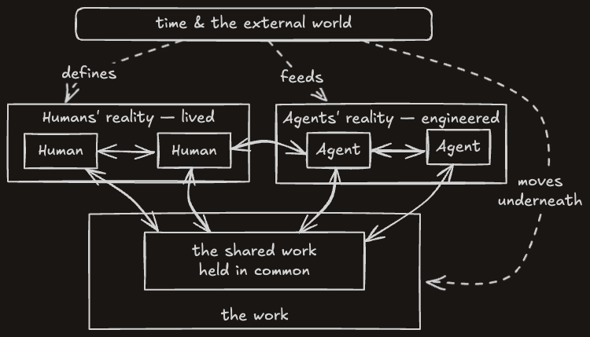
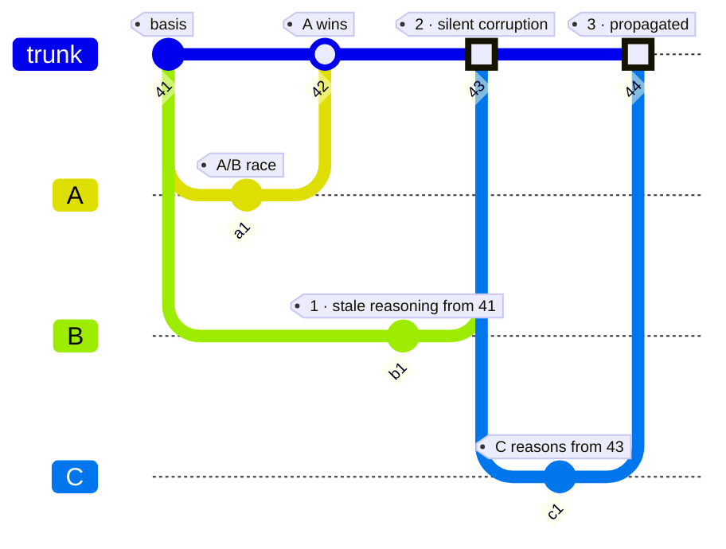

> **Working draft** — comments welcome via [issues](https://github.com/robotfutures/sigma-architecture/issues); please don't cite or quote yet.

# **The Sigma Architecture**

**A substrate for concurrent collaboration with reasoning intelligence**

_Draft — Robot Futures SAS, September 2026_

## **1. A new data flow architecture**

The **Sigma Architectural Pattern** — *Sigma* hereafter — arises from a now ubiquitous problem: we have human and non-human reasoning actors working on increasingly unstructured problems. These are humans, agents, and their delegates working in parallel on shared-work products which are semi-structured at best, and against evolving goal posts.

The scope is **virtual collaboration** — participants who do not share a world: digital human-to-human(s) and human-to-agent(s). Hereafter, *collaboration* is reference to *virtual collaboration*.

Collaboration requires a reconciled shared context: is my contribution appropriate to the current state? Is a new state consistent with my goals? Are other's changes appropriate and consistent? Shared state requires coordination.

Historically, our efforts in computer science have leaned to coordination machinery, and collaboration as an app on top. Humans as the reasoners acted through these apps which coordinated schema mutations, as with CRDTs, or just improvised like red-lined word documents over email. Sophisticated non-deterministic reasoning almost never entered the picture, with notable exceptions such as the blackboard from classic AI (Erman et al., 1980; Nii, 1986), or game AIs. However in both of those cases, we achieve collaboration _through_ synchronized coordination.

That synchronization loop is out of reach while humans and agents are contributing to shared work-products, and world–state is increasingly complicated, along with the criticality of _gated_ contributions and data partitioning for privacy and context management - all happening in parallel and unpredictably. Sigma as an architectural pattern is a response to collaboration's intrinsic pressures.

"We have version control and forges like GitHub and GitLab, isn't that enough?" No.

To be clear: Sigma aims squarely at the problem of evolving shared-work of semi- and barely-structured sorts, where context is precious, the external world is evolving, inter-actor collaboration is a structured contract, and visibility of information is role-based. The sections below set out what collaboration means here, the criterion success is measured against, and the forces the domain imposes on the response.

What follows is a **pattern** in Alexander's sense (_A Pattern Language_, 1979): forces, and a resolution judged by how it holds them. The claim is that six constraints, held together, resolve the seven forces of the domain (§1.4), and that removing any one collapses a capability the rest depend on (§4, §6.1). Three things are not claimed:
- coherence itself, which is assessed and never computed (§1.2);
- novel primitives, since every element has a well-worn precedent and the pattern emerges from composition (§2); and
- measurement, which does not apply to a pattern; instead we point to fitness of our implementation to different problems. There are lessons rather than metrics (§6.3).

Sigma is to collaboration what REST is to HTTP: it names the primitives and the discipline for composing them, extracted from where they already work (Fielding, 2000). As with REST, the novelty is in the coupling and not the parts (§2). The case is made by construction and against prior art.

## **1.1 Collaboration**

Virtual collaboration is:

> Two or more parties working together virtually to create or achieve a goal in overlapping-but-distinct realities, with time and the external world pressuring the work and collaborators themselves.

 
<i>
Figure 1.1: Collaboration, redefined. Each party reasons inside its own reality — the human's lived, the agent's engineered – subject to time and the world.
</i>

Time and the external world are the third party. They steer both and move underneath the work, consulting neither: weather, locations, prices, external systems, and critically, shifting goals (§3.1). They never reason and never ask. They only write.

## **1.2 Coherence**

Coherence here is the linguistic sense — a continuity across the whole (de Beaugrande & Dressler, 1981): the work holds together. Three **conditions** held all at once:

1. **Non-contradiction** — the parts do not conflict with one another.
2. **Grounded premises** — the premises each part rests on still hold.
3. **Purpose** — the goals it serves have not moved.

Coherence is judged from a view, and views differ — work coherent to its author can be incoherent to a judge who sees otherwise. It is assessed, and thus "by whom" is a first class concern. Observe that Sigma cannot deliver coherence itself. As REST is to cacheability (Fielding, 2000) — it does not guarantee caching; it provides a deliberate path to it — so Sigma is to coherence.

A second axis to the conditions is what a group must do to keep them true: a condition is assessed on the artifact, a **capacity** is something the group either exercises or lacks. Below are seven essential **capacities**, and the failures their absence produce:

1. **Grounding** — establishing and repairing common ground, so evidence can be told from assertion (Clark & Brennan, 1991). Fails as staleness, and as ungrounded material recirculated until it hardens into fact.
2. **Recomposing** — parts produced apart assembling into an artifact that still functions, and still means, as one whole. Not a merge step at the end: dependencies evolve as the parts do, so two contributions can each be right alone and wrong together (Grinter, 2003). Fails as integration debt, surfacing at assembly (Herbsleb et al., 2001).
3. **Mutual awareness** — each contributor knows what others did that bears on their work (Dourish & Bellotti, 1992). Fails as silent movement.
4. **Timely reckoning** — what moved is dealt with while the context that produced the work is still warm. Postponed, the same reckoning is performed at low context or not at all — even by its own author.
5. **Attributed judgment** — every consequential decision carries a named owner. Fails as anonymity.
6. **Rules of engagement** — the group's norms about who may do what are known rather than assumed, so work can be coherent with the social structure and not only with the goal. Fails as ad hoc authority, and as disputes about who decides.
7. **Accountability** — a name carries consequence, and standing is real. Fails as role and trust erosion.

The conditions and constraints meet:
- Grounding (capacity 1) produces grounded premises (condition 2).
- Recomposing (capacity 2) is where non-contradiction and purpose are held together at once – which is why requirements drift is a recomposition problem.
- Capacities 3–5 are what make those two possible at all: notice, act while it is still cheap, own the call.
- Capacities 6-7 knit the social fabric that upholds judgment.

 
<i>
Figure 1.2: Coherence and what upholds it. The three conditions are properties of the work and must hold at once, so coherence is their intersection. The rings are capacities — what a group exercises or lacks.
</i>

These are old problems in a new context. What is new is holding all seven at machine pace, under the forces of §1.4, with agents who are intrinsically unaccountable, for work-products no compiler can check.

## **1.3 Trust**

Capacities 6 and 7 are the group's — a group either has known rules and real consequence, or it does not. What changes with agents is what has to carry them. Collaboration is social, and social activity runs on **guardrails**: assurances that protect the shared product and make it rational to participate. Violations have real world consequences.

That was acceptable while contributors were human, because whoever misused the bare layer was accountable in person: reputation, sanction, standing. Agents break it. Highly capable and fully unaccountable — no persistent self, nothing to lose, nothing a sanction can grip — they contribute at superhuman volume and pace, and neither rules of engagement or accountability reach them.

The social structure goes missing too, and not for want of writing it down. ACLs, RBAC, etc. Those encode capability over resources — *may you write this file* — and never standing in the work — *does your call settle this question*? That travels the periphery: who decides, who reviews, whose sign-off counts. An agent has no periphery. So a substrate carries not only the data the periphery used to carry but the authority structure with it, which is what makes standing a property of the medium rather than a convention of the team (§3.8).

Accountability therefore anchors where it still can: on the **principal**, the party a contribution belongs to — usually a person, sometimes a system, in either case something durable enough to be reached by a consequence (§3.1). The rest must be structural — carried by the substrate rather than asserted around it, through provenance, gates, and traces detailed enough for retroactive accounting (§3.7). This is not the trustless project. Judgment is the content of this work, and no mechanism proves judgment beyond more judgment (§6.7).

## **1.4 The forces**

The domain has intrinsic pressures against the capabilities which complicate any solution. These pressures are **forces** in Alexander's sense — not requirements to satisfy but competing pulls, and a pattern is judged by how it resolves them (1979). A pattern has no arbitrary parts: each element is present at some force's demand, so a configuration missing one leaves a force in conflict. Validity is therefore functional rather than definitional (§2). The major forces are:

1. **Concurrency, volume, and pace.** Actors reason and act in parallel, and a reasoning act is discrete against a world that moves while it runs. Agentic speed and volume accelerate this inherent drift – and accelerate the domain's failure cascade (§1.4.1).

2. **Variable trust and reliability.** Participants are trusted differently and on an evolving continuum. At one end is an agent with no persistent self and nothing a sanction can grip (§1.3). At the other a human with full reputation and authority. Between them are ordinary fallibility cases: an agent steered imperfectly, a human missing a critical detail, hallucination by either.

3. **Delegation.** A principal acts through things — apps that do exactly what was clicked, and agents acting on its behalf. The "who" and "how" matters much more now, because intention and execution can be very different.

4. **Partial visibility.** Privacy law and security dictate that no single actor sees everything.

5. **Absence of ambient context.** Humans coordinate through a periphery of informal channels — a corridor, a glance, a shared history nobody had to state. An agent has none, and perceives exactly what a channel serves it. The social structure travels that same periphery, so it goes missing too (§1.3).

6. **Bounded attention.** Information saturation degrades human judgment and model reasoning alike. Context clarity is a scarce resource, spent by everything irrelevant that stays in view.

7. **Quadratic awareness.** $W$ collaborators attending to one another is $W(W-1)/2$ pairwise relationships (Brooks, 1975). No design repeals it, leaving only questions of how to manage it toward linearity.

The forces pull against one another: partial visibility argues for narrow views; mutual awareness argues for wide ones; bounded attention argues for less; grounded premises argue for more; etc. There are many almost-Sigma-shaped solutions in the world today which address or ignore these forces to different degrees. Git with Git-forges best approximate a robust solution, but not without gaps, and not as a general purpose solution.

Sigma lays out a pattern to competently address all of them.

### **1.4.1 The domain's failure cascade**

Where real-time collaborative editors solved physical line and cursor collisions at human pace, agentic workflows are plagued by a systemic **three-stage failure cascade** (§4.1):

1. **The extended TOCTOU window (temporal gap).** The time-of-check-to-time-of-use question (Bishop & Dilger, 1996), asked at collaboration scale. The classic file-access race is narrow; this window spans **minutes to hours** between an actor reading context (*check*) and submitting work (*use*), and is the ordinary case.
2. **Silent corruption (local failure).** Standard merge mechanisms check for structural or textual line overlap. When an actor works across a wide TOCTOU gap, it produces non-overlapping edits that are syntactically valid and semantically incoherent, and no one is informed. Checking for coherence is a duty, not an enforcement.
3. **Silent propagation (systemic blast radius).** Once corrupted state lands on an authoritative history, downstream actors ingest it as ground truth, compounding and propagating into other work products, undetected (Hochschild et al., 2021; Dixit et al., 2021).

<i>
Figure 1.3: The cascade. Two contributors work from the same state. A lands first; B, still reasoning from 41, lands work that never overlaps A's lines and contradicts it anyway. C then reasons from the result and carries it further.
</i>

Between two collaborators in a closed world of give-and-take, this is manageable. Above $W=2$ it becomes a paramount concern (§6.4.2), and the cascade is interrupted at one place only: the moment of entry, by asking a different question of the contribution than whether its lines collided.

## **1.5 The current art**

Every medium of collaboration in use today answers some of the forces. None answers the whole of it: for non-code work-products, mixed human and machine pace, partial visibility. We examine four media below against the seven capacities.

### **1.5.1 Shared editors and version control**

The **shared editor** — Google Docs, and the OT/CRDT family of algorithms beneath it — addresses mutual awareness and timely reckoning outright: every keystroke is visible in realtime, or in local-first designs, these are algorithmically merged at a later time. Here is a gap: asynchronous awareness is unaddressed, and merging in this fashion misses clean-but-incoherent, even when direct conflict is preserved (§6.4.1).

**Version control** — git and its kin. This addresses grounding exactly: every commit names the state it was made from, durably and by construction. It addresses recomposing through mechanical three-way merge, which surfaces conflict rather than dissolving it, and hands the judgment to a person. What it leaves open, it leaves open by design: non-mechanical conflicts, mutual awareness.

### **1.5.2 The forge**

The forge — git + GitHub et al. – support five of the seven capacities: grounding in the parent, recomposing by three-way merge with a compiler for a referee, attributed judgment at review, rules of engagement in protected branches and code owners, accountability in blame and the fork-propose-maintain ladder. It fails two capacities: mutual awareness and timely reckoning (§1.2), as it has no reader state. Nothing durable records that anyone read anything; `git log @{1}..` is local. Timely reckoning has no clock on it. Further, the forge is an application for a specific kind of work-product, not a pattern.

The forge's acknowledged strengths are why Sigma's vocabulary rhymes with the forge deliberately. As a pattern, Sigma points to *how to balance the forces of collaboration*, without committing to an exact domain subject.

### **1.5.3 Products for regulated industries**

Where incoherence kills, regulators weigh in and tools to maintain coherence are mandated.

Aerospace and defense run **configuration management** (EIA-649; DO-178C): work is made against a named **baseline**, changes pass a control board, and status accounting keeps the running record of what is approved and what is pending. Requirements management tools adds the **suspect link**: change a requirement and every artifact traced to it is flagged; the flag clears only when a person re-examines the pair and says so. The obligation to look is created by the change itself, and it is discharged by a named act rather than by anyone's diligence.

Regulated life sciences use quality systems (ISO 13485; 21 CFR Parts 11 and 820). Records answer to **ALCOA+**: Attributable, Legible, Contemporaneous, Original, and Accurate. Electronic signature binds an act to a person, and the audit trail is immutable and inspected by regulators — attributed judgment and timely reckoning arriving as legal obligation rather than as design choice.

These systems exercise all seven capacities, but they fall short of Sigma: they are human-paced by construction (usually Windows apps); an agent at machine pace has no seat – meaning teams in these industries adopting AI must solve this same problem again locally, outside of these tools. Second: they are enterprise products in niche domains; Sigma provides a pattern which can be adapted and adopted widely.

### **1.5.4 New agent-first entrants**

The spate of resonating entrants point to Sigma's relevance.

- Block's **Buzz** (July 2026) unifies chat, forge and agents on one event log. **Addresses** mutual awareness and attributed judgment, against an artifact rather than a feed. **Leaves open** grounding — a log records what happened, not what a contributor reasoned from — nor timely reckoning, and rules of engagement, with approval gates not yet baked (per author).
- **Cloudflare OS** (August 2026) takes a security-first position: agents start at zero access, resources arrive as typed capability bindings, and opening a gadget is gated on independent entitlement to everything it has read. **Addresses** attributed judgment, rules of engagement and accountability. **Leaves open** mutual awareness (future work, per author) and timely reckoning by design: an unapproved action is *simulated* so the agent may continue, and the human approves in bulk, later.
- **Zed's Delta** (2026) records each edit as it happens — who made it, and where it falls in the thread's history — rather than at a commit, and keeps every participant's checkout in sync from that store. **Addresses** mutual awareness and timely reckoning, and attributed judgment finely: work is reviewable and commentable mid-turn. **Leaves open** grounding — because no write is required to name what it was reasoned from, and the checkout moves underneath an actor while it thinks (§6.4.1).

Each reaches for version control. Buzz integrates a forge. Delta requires the project to be a git repository and leaves commits in git, moving them between machines itself. Cloudflare OS keeps code as real git objects — expressly so that agents may later mount arbitrary repositories with the same tools.
