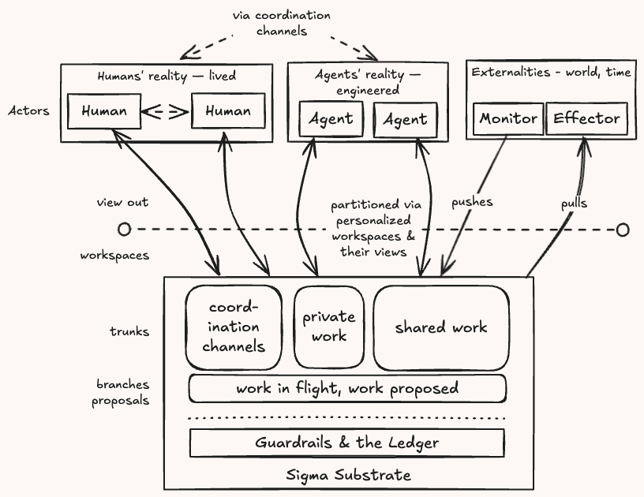
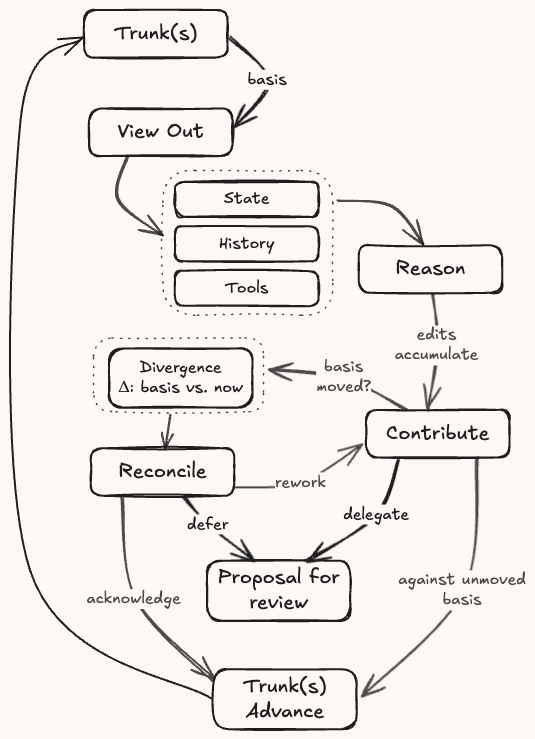
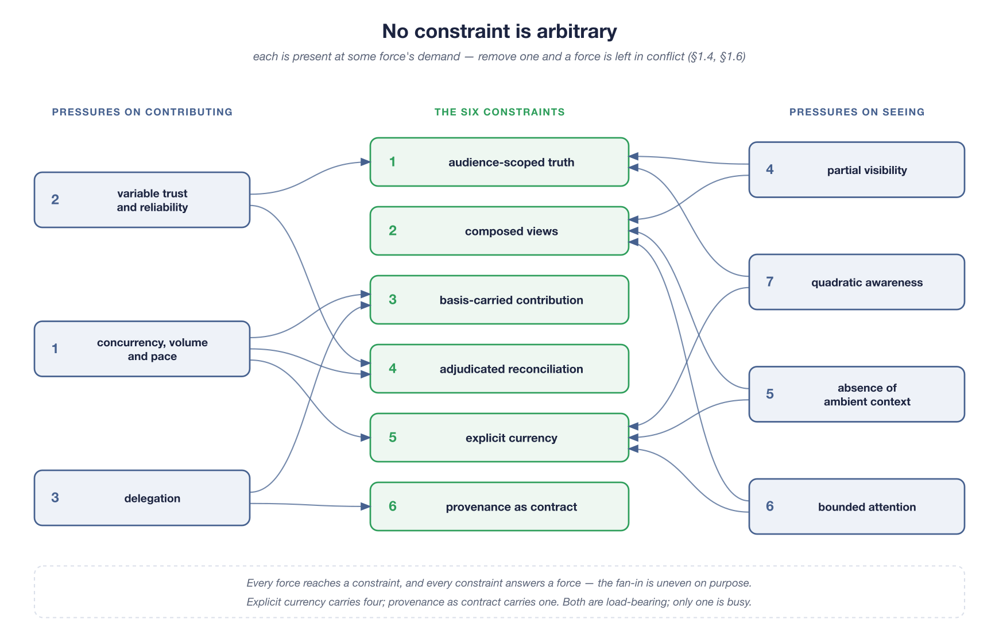
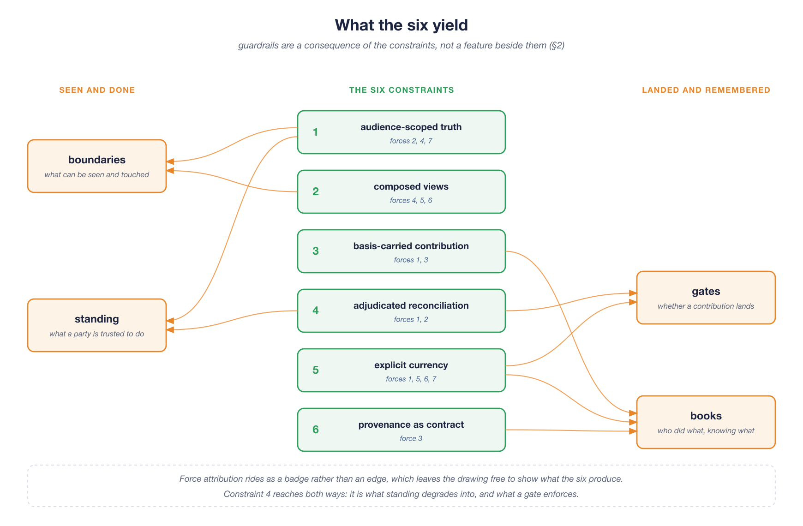
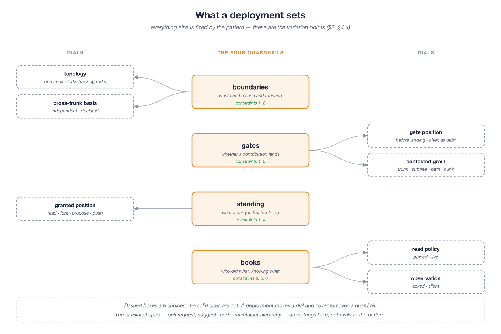

> **Working draft** — comments welcome via [issues](https://github.com/robotfutures/sigma-architecture/issues); please don't cite or quote yet.

## **2. Sigma**

**Truth is the reconciled sum of contributions, each carrying the basis it was reasoned from.**

Work happens in **workspaces**, against composed **views** of shared, audience-scoped histories — **trunks** (§3.2). Inter-actor collaboration is through the substrate – with trunks serving as coordination channels, as well as spaces for private or shared work artifacts. Externalities mirror in and out via monitors and effectors, also contributing to, and driven off, shared trunks within scoped workspaces, all accounted for.

 
<i>
Figure 2.1: Collaboration on a Sigma substrate. Every party attaches to trunks via workspaces; trunks serve many purposes, audience-bound. The world joins — in and out — via monitors and effectors.
</i>

Views flow out; work accumulates against them freely, scoped to individual workspaces — edits are cheap, never interrupted by the world or peers moving. Reconciliation is owed only at the boundaries: when work is offered back, or when a view deliberately catches up. The offer carries its **basis** — *here is my work, and here is what I knew when I did it* — and truth advances only through an explicit, attributable act (§3.5). The loop:

**view out → reason → contribute against basis → reconcile → truth advances → views update.**

 
<i>
Figure 2.2: Sigma's core loop. Data flows bidirectionally, and the return path is transactional. Sigma (Σ) is a summation — truth as the running, _reconciled_ sum of everyone's contributions.
</i>

The **pattern** is the list of constraints below and the discipline for composing them. The pattern applies to a **collaboration substrate**: a logical system between infrastructure and application code, which agents — and humans through apps — work through. A **system** is one deployment of a substrate, with its variation points chosen. The pattern declares a minimal contract on whatever supplies it: an addressable namespace, atomic compare-and-swap at every mutable pointer, durable history, and an authenticated principal bound to every workspace, leaving the rest open (§5.7).

Stated as constraints — the pattern is this list:

1. **Audience-scoped truth.** One authoritative history per audience: many trunks, not one world (§3.2) — nothing outside the trunk's audience can reach it. Topology derives off trunks — forks that track an upstream, branches in a workspace, hierarchies that aggregate — and is where contention and partitioned attention are expressed (§3.8).
2. **Composed views.** Every actor reads and writes through a view: a scoped, policy-bearing composition of mounts on the trunks it is entitled to (§3.2). Both the entitlement and the policy are external to the actor's working surface.
3. **Basis-carried contribution.** Every push declares the basis it was reasoned from (§3.3). The write is a transaction: work plus premises. Where premises span trunks, so does the basis — what is reasoned about together is pinned together (§3.8).
4. **Adjudicated reconciliation.** A divergent contribution meets the gate (§3.5): the basis-to-now delta is served, nothing merges silently, and truth advances only through an explicit, attributed act.
5. **Explicit currency.** The books hold, per workspace and trunk, a high-water mark of what each actor has acknowledged (§3.3). Currency is never the default state, checked in constant time, and only an acknowledgment moves it (§3.4).
6. **Provenance as contract.** Every landing records the principal, the acting agent, the workspace, and the basis (§3.7) — asserted by the substrate, consumed by its own machinery.

 
<i>
Figure 2.3: The constraints set against the forces that demand them (§1.4). Pressures on contributing enter from the left, pressures on seeing from the right. The fan-in is uneven by design: explicit currency answers four forces, provenance as contract answers one.
</i>

Held together, the six yield the **guardrails** §1.3 says the substrate must now carry. They take four forms, and each is a consequence of the constraints rather than a feature beside them:

- **Boundaries** — what a participant can see and touch. What is not reachable cannot be leaked or damaged, and revocation is the withdrawal of a view rather than an appeal to anyone's good behavior. A boundary is a capability, and not only over data: tools arrive as mounts too, so what a participant may *do* and may *see* are one grant (constraints 1–2).
- **Gates** — whether a contribution lands, and how it is received once it has: reviewed before it enters, or landed in the open as a visible debt that every affected reader owes an acknowledgment (constraints 4–5).
- **Standing** — what a participant is trusted to do, held as a granted, graduated, revocable position: read, fork, propose, push. Under distrust the structure degrades rather than expels — an untrusted actor is not removed, it simply works behind more gates (constraints 1, 4).
- **Books** — what is remembered: who contributed what, through which actor, on whose behalf, knowing what. No assurance holds without answerability after the fact (constraints 3, 5, 6).

 
<i>
Figure 2.4: The guardrails as consequences. Each is produced by named constraints rather than added beside them, and constraint 4 is the only one reaching both ways — what standing degrades into, and what a gate enforces.
</i>

The machinery that enforces these runs inside them. A referee, a validator, a watcher is an actor with a view, a standing and a ledger position like any other — there is no privileged plane from which the guardrails are applied.

After the constraints defining the pattern, everything else is a **variation point**, chosen per deployment and per path: where the review gate sits (before a contribution lands, or after it, as tracked debt); how audiences are arranged (one trunk, or forks tracking forks); how far a writer is trusted (push rights, or proposal-only until verified); how coarse a contribution is.

 
<i>
Figure 2.5: The variation points, held per guardrail. A deployment moves a dial and never removes a guardrail — the dashed boxes are the whole of what it chooses. The familiar shapes, the pull request and suggest-mode and the maintainer hierarchy, are settings here (§5.4).
</i>

§3 states the model — the cast, the objects, the algebra, the verbs, the gate, the record, and the topologies they compose into — as definitions. §4 grounds the constraints in the forces of §1.4 and makes the argument. The familiar machinery of collaboration — the pull request, suggest-mode, the maintainer hierarchy — reappears as dials on the variation points (§5.4).

### **2.1 Claims**

Sigma's novelty is principally combinatorial, assembling well established mechanisms in a unique way to address the forces of modern virtual collaboration. Borrowed ideas are credited throughout.

Sigma does not invent new primitives, but two couplings are novel:

**Tracking both state- and read-position in history with a high-water mark**: all VCS require position-in-history tracking. Sigma tracks a second pointer which advances only on an explicit, attributed act — a named claim to have looked — so the gap between the two measures work taken into an actor's premises and never examined. That gap is debt (§3.3), held per workspace. This is novel.

**Gate placement as a position rather than a property:** a forge's protected branch is review-before, a wiki is review-after, and in each the choice is built into the tool. Here the ledger is unconditional and only the gate moves (§5.4).

### **2.2 Non-claims**

The following claims are rejected:
- Consensus and Byzantine tolerance;
- Conflict-free editing, and real-time co-editing;
- An alternative to streams;
- A better GitHub (or code forge).

The grounds for rejection are argued in §6.2.
