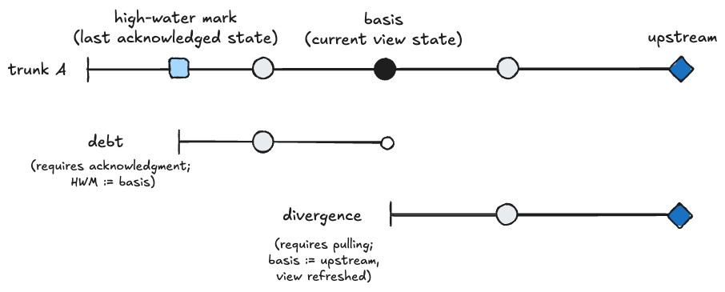
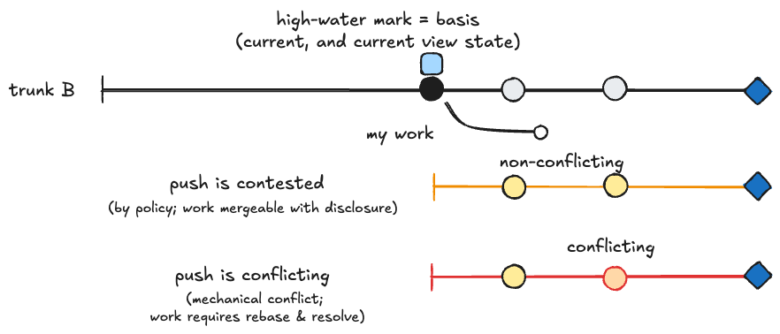
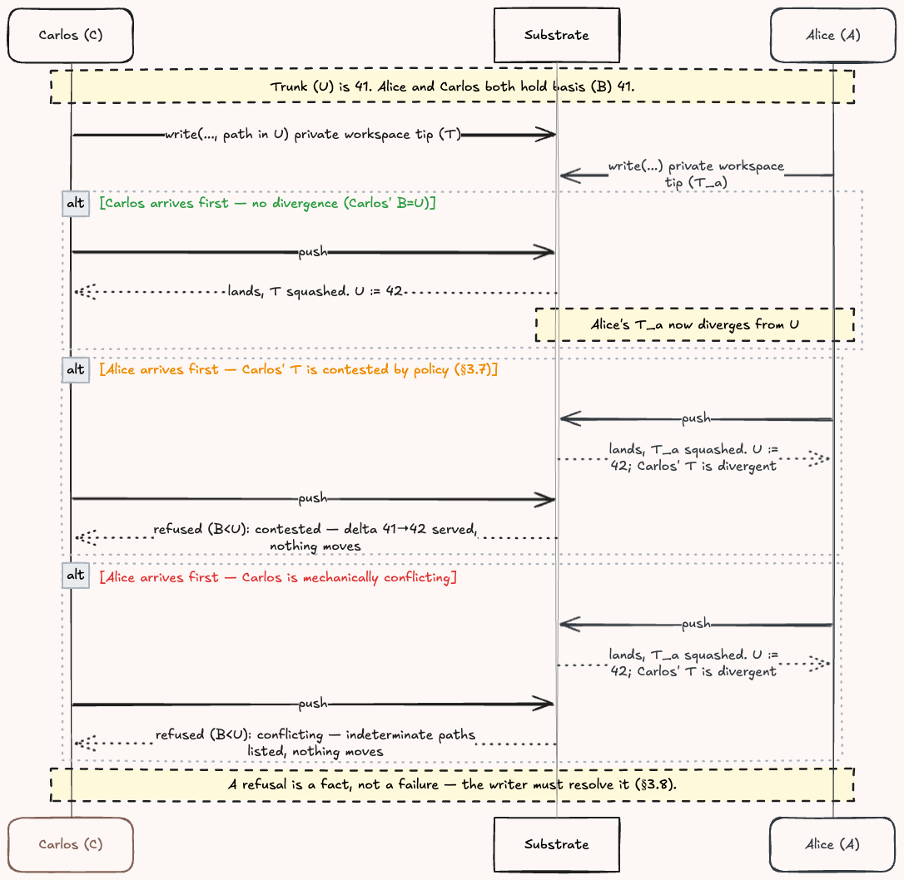
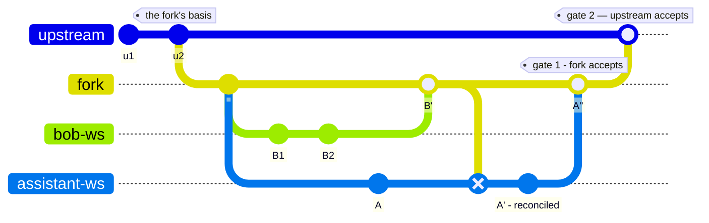

> **Working draft** — comments welcome via [issues](https://github.com/robotfutures/sigma-architecture/issues); please don't cite or quote yet.

## **3. The model**

Definitions, grouped: who collaborates (§3.1), what they touch (§3.2), the pointers that track them (§3.3), the verbs that move the pointers (§3.4), the gate that guards truth (§3.5), the obligations and records it leaves (§3.6–3.7), and the shapes it composes into (§3.8). Each is a statement. The argument for each is §4's.

### **3.1 The cast**

- An **actor** is anything that reads and writes through a workspace — an app, an agent, a notifier, a clock. A **collaborator** is an actor with intent in the work. Every collaborator is an actor; the world is not.
- A **principal** is a responsible party — usually a human, sometimes a deployed system — with **durable answerability**: it can be sanctioned and/or ejected from the collaboration.
- A principal acts through things: **apps** — forms, editors, buttons — deterministic, doing exactly what was clicked; and **agents**, delegated and acting on the principal's behalf. *Agent* is meant in its plain sense: a trusted delegate, which a form is as much as a model (§3.7).
- **Shifting reality** — the world and time: weather, prices, locations, external systems, shifting goals. It changes without consultation, and nothing about it is ambient here: an actor perceives exactly what a channel serves it, and every awareness channel is built (§4.5).
- The shifting reality joins the collaboration as a **write-only participant**: a monitor deposits facts as attributed contributions, landing where they are seen and owed (§3.6). Whether facts arrive by monitor or are pulled on demand by a tool in the workspace is a deployment choice.

### **3.2 Objects and interface**

- A **trunk** is $t = (\mathcal{C}, \mathcal{A}, t_{policy})$: one authoritative history $\mathcal{C} = \langle c_0 \dots c_n \rangle$ — an append-only chain of immutable commits, each minted by a landing (§3.5), its head $U = c_n$ — inseparably, one **audience** $\mathcal{A}$ — the answer to "who may see this history?" — and the write policy $t_{policy}$ (§3.3, §3.5). Private material stays private by construction: there is no visibility flag to forget, only an audience that was never granted — nothing outside $\mathcal{A}$ can reach $\mathcal{C}$.
- **Membership is a record, not a computation.** $\mathcal{A}$ lives in the trunk's own namespace — principals with roles, path-scoped and inherited. A trunk is created with its first grantor, seeded via the control plane; a workspace opens against membership that already exists. Admission and revocation are writes to $\mathcal{A}$ that append to $\mathcal{C}$ like any landing — attributed commits — and the right to make them is itself a grant: a write mount on the membership slice, floored by $t_{policy}$ (§3.3, §4.2).
- The **control plane** is the deployment's live configuration surface: defining trunks and workspaces, seeding membership, audit. It configures the primitives, and is outside any view or workspace — no mount reaches it. It is not a write path into the work: an intervention that touches a trunk's records lands as an attributed commit like any other. **Authentication lives at this boundary**: a workspace is bound to its (principal, agent) when it is opened, and every act inside carries the binding because it arrives through the workspace (§3.7). How a principal proves itself is the deployment's choice; the pattern requires only that the binding hold.
- A **mount** is $m = (t, s, m_{policy})$: a trunk, a slice $s$ of its namespace, and a mount policy $m_{policy}$ — read or write, pinned or unpinned (§3.6), and a grain no looser than $t_{policy}$'s floor. Each **mount is a capability** — a grant that both names and authorizes. Authority is reachability; revocation is unmounting; attenuation is composing less. Tools arrive as mounts through the same authority, so operational capability and data access are one grant. The substrate cannot police capabilities a harness grants outside it — that remains a platform-security problem (§4.4, §4.5).
- A **view** is $V = \{ m_1 \dots m_k \}$: a composed, scoped projection of one or more trunks — a mount table assembling exactly the slices this actor, in this role, needs. What the actor can reach is exactly $\bigcup_i s_i$.
- A **view out** $V_B = V @ \vec{B}$ is the materialization of the view at its bases, where $\vec{B}$ holds one basis per mounted trunk — held for a pinned mount, riding $U$ for an unpinned one (§3.6). A view out is a pure read: it mutates nothing and claims nothing (§3.4).
- A **branch** $\beta_t$ is a vector of pointers $(B, H, T)$ per writable trunk $t$ (§3.3).
- A **workspace** is $w = (V, \{\beta_t\}_{t \in V_{rw}})$: a view an actor works in, holding per writable trunk the durable state.
- A **write** mutates branch state — durable, private to the workspace, accumulating toward a commit. A **commit** seals accumulated writes into an immutable unit with a durable identity, author and message: identity equality is history equality, so every $O(1)$ comparison in §3.3 is an identity comparison. **Content addressing** — the identity as a hash of content and parent — supplies it coordination-free (§5.7). The **chain** $D$ is the workspace branch's sequence of commits $\langle d_0 \dots d_n \rangle$ since $B$, its tip $T = d_n$ (§3.3). A chain may be reminted against a new basis $B'$, mutating $T := d_n'$, or dropped, until it lands (§3.4). Landing the chain onto a trunk appends $c_{n+1}$.
- A **fork** is a trunk minted from a commit of another: $t' = (\mathcal{C}', \mathcal{A}', t'_{policy})$ with $\mathcal{C}'$ extending some $c_i \in \mathcal{C}$, holding its own audience and write policy, and retaining a tracking relationship to $t$ (§3.8). $\mathcal{A}' \subseteq \mathcal{A}$ unless $t_{policy}$ grants widening.
- A **proposal** is a branch landed onto a new fork's $\mathcal{C}'$: offered for judgment ahead of the landing (§3.5, §5.4). No pointer moves until it is accepted; acceptance lands it as one attributable act.
- The **ledger** $L$ is an append-only record, per $(w, t)$, of every pointer movement and the claim that moved it — an acknowledgment or a landing, with its optional qualifier or disclosure (§3.5). A record is $\langle \text{verb},\ \text{pointer moves},\ \text{note} \rangle$, written $L \overset{+}{\leftarrow} \text{verb}(\dots)$. The pointers are $L$'s current state; audit reads its history (§3.7).
- **The view is the whole interface.** Everything the substrate says to an actor arrives as objects in its view: truth, computed material — summaries, indexes, checks (§5.3) — **tool endpoints** and their metadata, and the artifacts of reconciliation: a served delta, a refusal with its grounds, a conflict awaiting resolution (§3.5). All of it is governed by the same mounts, permissions, and currency as raw truth. Everything the actor says back is a write in its workspace — the verbs of §3.4 are such writes — so a client's tool surface collapses to two operations (§4.4, §4.5). A delta is a first-class object with a basis. A tool is an object in the view: invoking it is a write to that object, its result a read — one grant, one channel, one record. How objects are laid out is the interface question, deferred to §5.7.
- The substrate is **coordinated for truth, partition-tolerant for work**: a contribution is a transaction against a basis no matter when it arrives, and only the landing needs the coordinator (§4.4).

An agent's working set, a notifier's read-only feed, an app's read-write for UI controllers, and a human's editing view are each a dedicated workspace, $w_a$. The **accessible surface** and the **view out** are different things: policy may entitle a view to more trunks than it composes, the extras excluded for attention rather than security, and included on request.

### **3.3 The algebra**

Every workspace $w$ tracks, for each writable trunk in the view:

1. a basis ($B$) — the trunk state the view came from, which work is computed against;
2. a **high-water mark** ($H$) — the last trunk state this actor has acknowledged seeing in a view out; and
3. a tip of the chain of commits for work in progress ($T$).

The trunk's head ($U$) is not tracked by the workspace.

The pointers live on the **ledger** $L$ (§3.2).

**Invariant:** $H \le B \le U$ and $B \le T$, ancestor-or-equal on the trunk's history. No verb produces a state that violates it. One basis per writable trunk is the default; a workspace holding several checks each independently. Where premises span trunks, a mount may declare its premises $P$ and the basis becomes a vector over the declared set (§3.8.3).

**Conditions** — each a pure function of the pointers:

| condition | predicate | a fact about |
|---|---|---|
| current | $H = B$ | my awareness |
| **debt** | $H < B$ | changes absorbed into my premises, not yet reckoned with |
| **divergence** | $B < U$ | the trunk, upstream of my basis |
| **divergent** work | $B < U \land T > B$ | my work |

Thus, "am I current with my view?" is an $O(1)$ comparison, $B = H$. Debt is recognizable as the "unread" indicator in messaging histories — with the key difference: seeing a rendered view out at $B$ does not discharge it. Discharge requires an acknowledgment (§3.4) and optionally a **qualifier** (§3.6).

How the debt review and discharge experience is handled is a client application's choice: for agents, usually folded into prompts by the harness and discharged at the end of a completed turn; for humans, dependent on the content and application gestures.

 
<i>
Figure 3.1: Debt against divergence, on one trunk. Behind the basis, what was absorbed and not yet examined — discharged by acknowledgment; ahead of it, what moved and is not yet absorbed — discharged by pulling.
</i>

Divergent work ($B < U \land T > B$) falls into three categories — two ruled by the trunk's policy, the third by mechanics when the actor tries to land the work on the trunk $t$:

- **Uncontested** ($t_{policy}(T) = \text{ok}$): the changes are mechanically ruled disjoint at the mount's grain.
- **Contested** ($t_{policy}(T) = \text{contested}$): the changes are flagged by policy as *possibly conflicting*.
- **Conflicting** ($\Delta(U-B) \perp T$): the changes are mechanically unmergeable.

Independently of divergence, a push may also be refused outright by policy — **non-conforming**, $t_{policy}(T) = \text{denied}$ — a gate on landing, not a category of divergence (§3.5).

**The grain** is the per-mount contest policy: trunk (default — any movement contests) · tree · path · hunk · never. It answers: how close do edits have to be to contest? The trunk's write policy sets the floor and a granted mount may only tighten it, so no actor softens its own gate (constraint 2). At a finer grain, uncontested drift absorbs at the push and arrives as debt rather than as a refusal, and the guarantee degrades from *nothing lands over unseen work* to *nothing lands over contested unseen work*. Hunk grain — a line-differ deciding — is defensible only where position carries no meaning: append-only logs, inboxes, per-key world state. Never supports write-only participant mounts (§3.6). A conflicting path trips the gate at every grain — the prose treats the categories as disjoint; the mechanics apply the strictest one that holds.

 
<i>
Figure 3.2: Contested against conflicting, from a current basis. Contested is policy — the work still merges, and may land with a disclosure (§5.5); conflicting is mechanics — no determinate result until rebase and resolution. No disclosure applies to indeterminacy.
</i>

### **3.4 The verbs**

The workspace supports nine verbs.

1. **ack** — discharges debt ($H < B;\ H := B$) — the only verb that moves the high-water mark;
2. **pull** — absorbs the trunk cleanly iff no work is in flight ($T = B;\ B := U$);
3. **rebase** — absorbs divergence with work in flight ($B < U \land T > B$), reminting the work chain ($B := U;\ T := T'$), deferring conflicts for reconciliation;
4. **resolve** — picks content where a merge is indeterminate during reconciliation;
5. **write** — edits content in the workspace: durable branch state, private to the workspace, accumulating toward a commit;
6. **commit** — seals accumulated edits into a commit on the chain ($T$ advances), each with its author and message;
7. **push** — squashes the chain to a commit $c_T$ and lands it on the trunk ($U := c_T$); the ledger rides a clean landing ($B, H := U'$) — an actor's own landing is never its own debt (§3.7);
8. **abandon** — drops the work in flight chain ($T := B$);
9. **propose** — push's sibling: the same squashed unit, offered rather than landed — chosen deliberately where review should lead, and what a refused push becomes. No pointer moves; the chain acquires an audience (§5.4).

**Read** is deliberately not a verb. A read is the view out (§3.2): it mutates nothing and claims nothing — no pointer moves on it, and no record captures it (§3.7). Seeing is never discharge; awareness is claimed only by **ack**.

The chain (§3.2) is a unit: a push lands it squashed as one attributable act, and a rebase remints it — commit for commit, author and message preserved — so a catch-up never collapses the items.

### **3.5 The gate: acceptance, refusal, reconciliation**

**Accepted.** A push lands in exactly two ways:

1. **Clean** — current, conforming, and uncontested: debt acknowledged ($H = B$) and no contested divergence at the mount's grain (§3.3). At the default trunk grain this is $H = B = U$; below it (tree, path, hunk), uncontested drift absorbs at the push and arrives as debt. The landing mints a commit on the trunk, $U'$, and the ledger rides: $L \overset{+}{\leftarrow} \text{push}(c_T;\ B, H := U')$ — an actor's own landing is never its own debt (§3.7).
2. **Disclosed** — the push may carry a **disclosure** (defined below) accepting its contested divergence. The work lands loudly: $L \overset{+}{\leftarrow} \text{push}(c_T, \text{disclosure};\ B := U')$ — the absorbed span arrives as debt.

**Refused.** Four grounds, each with its own discharge:

1. **Open debt** ($H < B$) — the change may rest on premises never reckoned with. Discharged by **ack**.
2. **Non-conformance** ($t_{policy}(T) = \text{denied}$) — the push violates the trunk's write policy, which a grant may only tighten (§3.3): a path outside the grant, standing short of push, a required check unmet. No disclosure satisfies it. Discharged by rework to conformance, by **propose** where standing demands review, or by **abandon**.
3. **Contested divergence** ($B < U;\ t_{policy}(T) = \text{contested}$) – the change is flagged by trunk policy at the mount's grain. Discharged by rework, or stepped over by a **disclosure** — a writer-supplied, structured note acknowledging the divergence, attached to the act and riding the landing onto the books.
4. **Conflicting divergence** ($B < U;\ \Delta(U-B) \perp T$) — refused regardless of any disclosure. Discharged only by **resolve** — the indeterminate paths are served as objects in the view, each carrying both sides and the basis, and the resolution is written back in the workspace.

Nothing moves under a refusal, and the basis-to-now delta is served with it. The refusal is recorded as a fact, not a transient failure — $L \overset{+}{\leftarrow} \text{refuse}(\text{ground},\ \Delta(U{-}B))$ — it leaves the writer an obligation in that workspace. The four grounds differ in kind: open debt and a conflict are **facts**; non-conformance is a **prohibition**; contested is a **warning**. The rule follows from these kinds — a disclosure discharges exactly one refusal, the warning: it converts policy's flag into an accepted risk, loud, on the books. It cannot lift a prohibition, produce a merge, or stand in for an acknowledgment.

**The dials.** Two, set by the deployment: the **grain** (§3.3), which decides the granularity that contests; and the **gate position** (§5.4), which decides whether judgment sits ahead of the landing — a proposal — or after it, as every affected reader's debt.

**Reconciling refusals**

The table below summarizes the mechanics of reconciliation, based on the state and the actor's ruling.

| state | the ruling | the response | on the books |
|---|---|---|---|
| Open debt | N/A | ack(qualifier?) | $L \overset{+}{\leftarrow} \text{ack}(H := B,\ \text{qualifier?})$ |
| Contested | No conflict: the delta does not touch my premises | push, with a disclosure accepting $B \to U$ | $L \overset{+}{\leftarrow} \text{push}(c_T, \text{disclosure};\ B := U')$ — the span stays open as debt |
| | Overrule: cannot reckon now but work should land anyway | rebase; push with a disclosure | $L \overset{+}{\leftarrow} \text{push}(c_{T'}, \text{disclosure};\ B, H := U')$ — loud, on the record |
| Conflicting | Fix & land: conflicts can be clearly resolved | resolve each; rebase; ack; push | $L \overset{+}{\leftarrow} \text{push}(c_{T'}, \text{resolution};\ B, H := U')$ — attributed |
| | Fix & defer: conflicts are resolvable; needs other eyes | resolve each; rebase; ack; propose | $L \overset{+}{\leftarrow} \text{propose}(c_{T'}, \text{resolution})$ — a new fork |
| Any | Defer: judgment belongs to others | propose | $L \overset{+}{\leftarrow} \text{propose}(c_T)$ — no pointer moves (§5.4) |
| Any | Rework: the refusal details mandate re-reasoning | rebase; re-reason $T' \to T''$; ack; push | $L \overset{+}{\leftarrow} \text{push}(c_{T''};\ B, H := U')$ — clean, from the new basis |
| Any | Superseded: my work no longer applies | abandon | $L \overset{+}{\leftarrow} \text{abandon}(T := B)$ — nothing landed |

We now walk the gate end to end. Alice and Carlos — one may be human, one an agent; the model does not distinguish them — share a working trunk at head 41, and both hold basis 41. They edit the same trunk, possibly the same file, and while Carlos works, the trunk moves.

 
<i>
Figure 3.3: Concurrent editors.
</i>

The substrate blocks the TOCTOU race and CAS forces ordering; the late party reconciles a contested or conflicting change. This is the ordinary case: Carlos was doing a job, then the world moved. Doing the job *diligently* means reckoning with the movement before contributing. The substrate does not make Carlos diligent — it makes the reckoning an obligation and keeps the record.

### **3.6 Obligation to the books**

Debt requires an acknowledgment on the ledger; no ledger can force a reader to think, but the acknowledgment establishes a logged claim. When a change lands with known divergence, that claim is logged the same way.

This obligation needs dials. It is not always possible to attest full knowledge and full understanding, and work must continue — so a qualified statement, a **qualifier**, is legal and recorded: "I am acknowledging this, but I do not fully grok it, so my inbound changes are also qualified." These statements (recorded with an ack or push) have two uses: a recorded claim for retrospective audit, or evidence for a policy that blocks a submission and lands it as a proposal instead.

The **obligation is a property of the mount, not of the change.** $m_{policy}$ (§3.2) tunes the ledger on two dials: **pinned** (default) vs. **unpinned**, and the grain (§3.3). Unpinned suits mounts that are read-only and ambient — acknowledging their debt would be noise, and the basis moves freely with the view out (a continuous, implicit pull).

An actor whose every mount carries the *never* grain is **write-only**: it contributes, and it never owes anyone a look. That is what lets externalities take a seat (§3.1) — a monitor deposits a price, a forecast; its landings raise debt for whoever mounted that trunk *pinned*; it acknowledges nothing in return because it observes nothing in the substrate's world. It is a full participant on the write path and absent from the read path — an unequal peer, and the books record it as such. At the opposite setting, an actor whose every mount is *pinned* never meets a change it has not consciously taken on — expensive, and appropriate for content where drift is intolerable.

### **3.7 The record**

Sigma records, on every change: the **principal** — who the work belongs to and answers for it; the **agent** — whatever acted on the principal's behalf, a deterministic app or an autonomous one; the **workspace** it came through; and the **basis** the write declared (§3.3). The four together are **basis provenance**: what state the work was produced against, and on whose authority.

- The guarantee is at the grain of the landing — the grain at which the change was judged (§3.5). Anything finer is retrievable, not contracted: the landing keeps the chain it was made from as a second parent — a **provenance edge**, not a merge — so pre-landing work stays reachable, and acceptance is derivable from ancestry rather than asserted.
- A VCS *can* store this information; Sigma makes it obligatory. A commit arrives through a workspace to a trunk, and the agent is authenticated through the workspace (§4.3).
- The record is consumed by the model's own machinery: enforced permissions (§3.2); the reconciliation of inbound change — who am I colliding with, human or delegate? (§3.5); and the calculation of debt — if only your changes are new, you are not out of date (§3.3).

**Provenance is not endorsement.** Knowing who made a change tells nothing about whether anyone else has accepted it (§3.8, §5.4).

### **3.8 Topology**

#### **3.8.1 Structure**

Sigma assumes one or more trunks, composed into a workspace, with read-only or read-write permissions (§3.2). Every writable trunk in a workspace acquires a workspace-local branch, and its own basis, on its first write (§3.3).

The **fork** (§3.2) extends the same machinery one level. The containment $\mathcal{A}' \subseteq \mathcal{A}$ is what keeps fork-and-share from routing around the boundary, and membership being a record is what makes it checkable. Movement of $U$ is the fork's debt; its chain goes upstream as any chain does — pushed, or proposed (§3.8.2, §5.4). Two differences from a source forge: tracking is an obligation on the books — a fork cannot silently fall three hundred commits behind, because the gap is debt — and forking is the ordinary process, not an exceptional act.

Concretely: Bob is a participant in a shared project. Bob gets a fork of the plan trunk; its audience is Bob's side of the table — Bob, Bob's agents, Bob's notifiers. His assistant branches off *his fork*, not off the shared trunk. Everything in flight on Bob's side is invisible upstream by construction: privacy is the audience boundary itself, not a visibility flag.

 
<i>
Figure 3.4: Hierarchical topology. Bob's fork, his workspace, and his assistant's, each branching from the fork rather than from the shared trunk.
</i>

#### **3.8.2 Mechanics**

Work crosses a trust boundary by landing again — with its own basis and its own gate — never by being replicated across it. Write $t$ for the shared trunk with head $U$, and $t'$ for the fork with head $U'$. The fork stands toward $t$ as a workspace stands toward its trunk: it holds $(B, H)$ against $t$, and movement of $U$ is its debt (§3.3).

- **Downstream — the pull.** When $U$ moves, the fork's side reconciles once: the span $\Delta(U - B)$ lands on $t'$ as one attributable act, minting $U'$. The $M$ workspaces on the fork's side then catch up against $U'$ locally — one reconciliation at the boundary, $M$ cheap ones below, none of them touching $t$.
- **Upstream — the push, or the proposal.** The fork's chain goes to $t$ as any chain does (§3.4): **push** where $t_{policy}$ grants standing, **propose** where it does not (§5.4). Same work, same gesture — $t_{policy}$ decides how it lands.

**Trust is a write policy.** An unverified party gets the same fork and works normally — everything attributed, everything private to its side — with proposal-only rights upstream. Its work accumulates as a standing proposal, and verification opens the gate the work was waiting at. There is nothing to stash or replay, and no second-class mode.

The relation nests: a fork of a fork aggregates its own side's work and reconciles once at each boundary, so a large collaboration integrates in tiers instead of contending on one trunk. Keeping $W$ small becomes an operation on the topology rather than a reorg (§6.4.2).

<i>
Figure 3.5: Working on forks. The upstream never sees the interstitial commits, never holds an actor's half-finished reasoning, and answers to exactly one contributor — the fork owner itself. That is what "every hop a gate" buys, and it is the same push machinery.
</i>

When a fork's work is stale against its upstream ($B < U$), the reconciliation lies with the fork's side — the obligation is a property of the mount, and the fork is what tracks (§3.6). Who may discharge it is read from $\mathcal{A}'$, never wider than $\mathcal{A}$ allows. The rework lands as one attributable act with the chain riding as its provenance edge (§3.7). Each landing then leaves every workspace below with $B < U'$, and the same rule applies one hop down: debt travels one boundary at a time, and no hop reaches past its neighbor — the topology's cost stays linear (§6.4.2).

#### **3.8.3 Premises spanning trunks**

The topology above runs vertically. Sibling trunks in one workspace are the horizontal case, and by default they are unrelated — each carries its own basis (§3.3), so a push checks one basis against one trunk and says nothing about the others.

A mount may declare its premises $P \subseteq V$, and the basis becomes a vector $\vec{B} = (B_t)_{t \in P}$ — taken from one consistent read, checked as one predicate at the gate, landed in one transaction.

This is a variation point, and it requires atomic commit across the declared refs and a consistent read to take the vector from; trunks declared together share a transaction domain. The deployment sets this, never the actor — an actor declaring its own premises is self-reporting (constraint 2). Independence stays the default because coupling costs: contention returns along the declared edges (§6.4.2). DOORS reaches the same conclusion in its **baseline set**: pin the whole relationship or pin nothing (Aragon et al., 2014).
