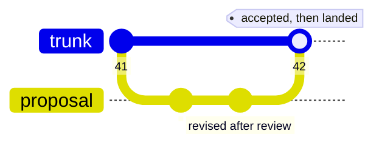
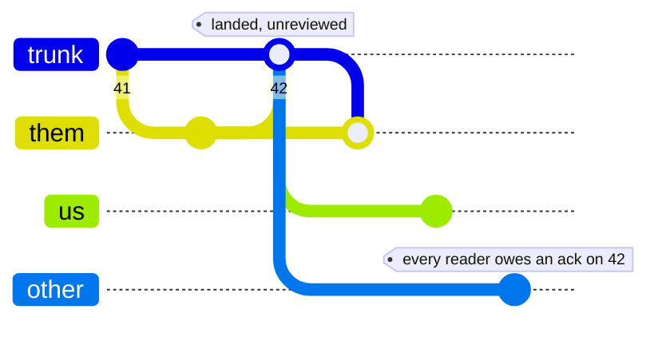

> **Working draft** — comments welcome via [issues](https://github.com/robotfutures/sigma-architecture/issues); please don't cite or quote yet.

## **5. Operations**

## **5.1 Sigma as databus**

Sigma functions as a databus, in response to the domain. The standard messaging shapes fall out of mount configuration:

- Broadcast is a trunk many actors mount, with fan-out as one push arriving on the books of every mounting workspace — divergence to absorb, debt to reckon, per each mount's policy (§3.3, §3.6).
- One-to-one is a trunk whose audience is two.
- A queue is a trunk mounted *pinned*, one consumer, consumption recorded as acknowledgment.

Each shape rides on the accounting the pattern already guarantees: provenance on every message, basis on every write, a per-consumer ledger of what has been seen.

A caveat: these structures are not conceived for high throughput — a reasoning actor's consumption rate is bounded by thinking, not by the bus; for tick streams, use a stream (§6.2).

## **5.2 W=1 and so on**

Sigma is relevant at $W=1$: a single reactive agent and its changing world are already a collaboration — the world writes with no judgment, and owing no look (§3.1, §3.6), while the agent reasons over moving premises. On the substrate: monitor mounts *pin* for the duration of a reasoning episode, so the agent thinks against a consistent snapshot while change accrues as divergence; at episode's end, one constant-time check — does the divergence intersect my premises? — decides whether to re-reason, over the delta rather than the world. A killed agent resumes as a collaborator with a stale basis — interruption, resumption, and collaboration are one operation — and every act is a basis-carrying push: what it did, and what it knew. A reactive *system* is message-driven; a reactive *reasoner* is basis-driven. (Deliberative band only: episodes of seconds to minutes, not millisecond control loops.)

Interacting safely with the world, like through a tool that sends mail or moves money, is addressed by splitting the work. One actor lands the command as an object/commit on a shared trunk. A second, an effector, absorbs command as debt, and acts on it, using the shared trunk as response channel - work in progress is on the effector's branch in the event of a crash, and can resume directly. Thus: the effect becomes a contribution first and an action second, at the expense of one hop and the loss of immediacy.

It scales from there: a shared truth per audience; a scoped, composed view per actor; contributions carrying what they were reasoned from; divergence surfaced as information; reconciliation as a decision; history kept, with provenance.

## **5.3 Content derivatives**

When every object carries a basis, every change is attributed, and every actor's currency is on the books — then the commit graph becomes a reliable trigger surface. Sigma's VCS patterns allow for CI-style derivative artifacts to be created and served back into the namespace as governed views (§3.2). Pre-commit, the substrate can gate on conformance; post-commit, it can derive — summaries, indexes, embeddings, projections; continuously. We think this active layer — watchers, summarizers, referees living over the trunks — is where the pattern compounds, and it is where our future work points (§7).

## **5.4 Where did the pull request go?**

Nothing replaces it. A pull request is three things — a place to show work, a review of it, and a gate before it lands — and the model takes them apart into settings. What follows is only the diff from the forge's version.

**The gate is a dial, not a property** (§3.5, §2). Review-before-landing is the protected branch: propose, be accepted, land. Review-after-landing lands on contact, and the judgment gate-before spent in advance is owed by every reader as debt (§3.3). Both positions are reviews; the ledger is unconditional either way — only the gate moves. And the policy sets where review is *mandatory*, never where it is *possible*: push rights never revoke the propose gesture (§3.4). Suggest-mode and direct-edits-with-history are the same dial in Docs.

Gate-before — nothing reaches the trunk unjudged:

Gate-after — the obligation did not disappear; it moved downstream of the landing:

Choosing a position is a question of blast radius, and can be enforced by policy. Live, loud, cheaply reverted content wants gate-after: a project under active discussion, where an agent's edit should appear immediately and its principal should edit right on top of it. Durable, quiet, compounding content wants gate-before: an agent proposing long-term memory, where a wrong entry corrupts silently.

**A gate may refuse, land, or land with notice — never re-target.** Quietly landing the work somewhere narrower than it was offered would survive the write and land silently to its author: constraint 4's silent merge, mirrored onto the write path.

**Nothing about the place is authored.** The substrate mints the proposal's fork in the trunk's own namespace, and its audience is computed from membership at the paths proposed (§3.2) — which is what keeps propose and push one gesture. Accepting it is an ordinary landing upstream, and the fork persists either way; acceptance is read off the ancestry (§3.7), while rejection and retraction are not — the absence of a landing is not a decision.

**Approvals pin.** Reviewers hold acknowledgment state against the proposal's head, so an approval records exactly what it endorsed, and when the proposal moves, stale approvals identify themselves — the forge's "dismiss stale reviews" checkbox, as bookkeeping. Zed's Delta repairs the same failure the opposite way, by *anchoring*: the comment tracks the moving code and stays looking current. Anchoring preserves the comment's **location**; pinning preserves the reviewer's **claim** and lets the drift surface. An anchored comment on drifted code reads as endorsement of work its author never saw — the silent absorption the pattern refuses — so of the pair, only pinning needs to be a substrate guarantee. The review page — diff, out-of-date warning, mergeability, approvals — is a computed view over facts the substrate already holds (§5.3).

Review needs a conversation to live somewhere. The model extends naturally: annotations attached to a proposal's heads — git-notes-like — themselves versioned, attributed, and carried with the object they discuss. We treat the feedback channel as an extension of the pattern, not a seventh constraint.

## **5.5 Operating under contention**

What happens when the trunk is busy? Contention is a feature of collaboration: stepping on toes, too many cooks in the kitchen, etc. Addressing contention here is recognizably human.

First: a collision costs one of two things.

- (a) If the landed change does not touch what was relied on, you take the served delta, rule it, and push again — the retry costs a ruling plus an acknowledgment (§3.5, §6.4.2): milliseconds at best; in complex cases the check may be significant and a point of optimization; a livelock would need landings arriving faster than that round-trip.
- (b) If the landed change does touch what was relied on: re-process immediately, postpone, or push with open disclosure (note to others or to self to check later). If reprocessed immediately or postponed, the catching up costs the size of the *net* change, not the number of landings: ten edits to one paragraph read as one paragraph.

The pattern will not prevent an overcrowded trunk. The books measure landing rate and delta sizes — and from there, there are six dials:

- **Small-audience trunks.** A deployment may have many collaborators, but few share any one subject — and subject boundaries are natural trunk boundaries (constraint 1). A trunk with two writers has no fan-out problem.
- **Batch.** Land coherent units, not keystrokes; catch up once per episode, not once per landing.
- **Wait.** An actor may simply delay while churn is high — what a considerate human does when a document is under active rework. Delay is legal because nothing forces activation.
- **Vary the activation.** A landing wakes nothing by itself: the pattern does not declare exact activation mechanics. Whether an actor reacts to every landing, on a schedule, or whenever it next looks — push, poll, or pull — is an application decision, made per consumer. Huberman showed in _Ecology of Computation_ that resource competitive processes will find equilibrium if there is diversity in their optimization behaviors (1988).
- **Move the gate, or redesign the flow.** A surface too hot for review-before-landing runs review-after as debt (§5.4). Topologies can aggregate locally and flow one direction (§3.8, §5.1), so a hot trunk never fans out to a large audience.
- **Choreography.** Leveraging all of the tools above, use explicit choreography (signal turn taking, honor-system locks, etc) to prevent races.

A reasoner that is always in debt because relevant change outpaces thinking means it is past what engineering can absorb — see §6.4.2 for further exploration of practical limits.

## **5.6 Authentication and authorization**

The contract requires an authenticated principal behind every workspace (§2). Identity and authority then live in different places, and the split into two planes derives from the pattern.

**Authentication is configuration.** Identity is bound via the control plane, when workspaces are minted as $(principal,\ agent)$ (§3.2). A workspace opens to an identity bearing that tuple, so inside the model, identity is never negotiated; it is a fact of the workspace. How an actor proves itself to the deployment is the deployment's choice – OIDC tokens, etc.

**Authorization is data.** Authority is reachability: the mount is the capability, standing is read from membership at the landing, and membership administration is itself a granted write mount (§3.2, §3.5). Authorization therefore lands as attributed commits — auditable like any other work — while authentication sits outside any view. And authority composes downward: a delegate — the $(principal,\ agent)$ binding — holds at most its principal's permissions, narrowed by its workspace's mounts, and $m_{policy}$ only tightens (§3.2). A delegate that can only propose back to its principal is a mount table setting, not a feature.

The two planes follow. What must sit outside the model — identity, minting, policy — is the **control plane**: provisioning, exercised at the edges of work, not during it, and it is unmountable. What the model itself carries — authority, its grants and its exercise — is the **data plane**: the namespace, the entire surface an actor ever touches. An actor does its *work* on the data plane (§3.1), typically through a thin client (AI) or application (human).

## **5.7 The interface**

The pattern commits to no representation. It requires only the contract of §2 — an addressable namespace, compare-and-swap at every mutable pointer, durable history, authenticated principals — and any store meeting it can serve the objects of §3.2: a filesystem, an object store, a database of blobs.

Two choices are obvious, not required. **Files**: for reasoning actors, semantic-carrying paths that every model and every tool already speak; in this shape the verbs of §3.4 are writes to control files in the workspace's own namespace, and a client's tool surface collapses to two operations — read a view, write branch state. A REST surface projects the same shape. An agent may mount its view as a virtual filesystem; that is client topology. **Content addressing**: commits need durable, immutable identities that hold across trunk and deployment boundaries — forks, provenance edges, and vector bases all reference commits from outside their own trunk — and a content address, the hash of content and parent, is the only identity that needs no naming authority. A deployment could substitute ordinals without a change to its guarantees.

Transport is deliberately unspecified; our implementation happens to serve both planes over ordinary HTTP.
