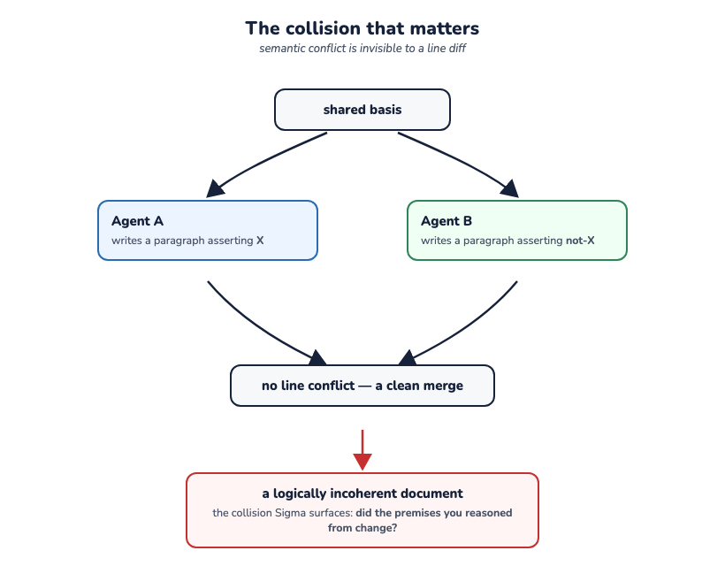

> **Working draft** — comments welcome via [issues](https://github.com/robotfutures/sigma-architecture/issues); please don't cite or quote yet.

## **The Sigma Architecture: ABSTRACT**

---

### **What it Is & What it Targets**

The **Sigma Architecture** is a data flow pattern designed for concurrent collaboration among reasoning entities (humans, autonomous agents) and a dynamic world. It specifically targets **semi-structured, evolving shared-work products, across data segments with varied visibility**. Sigma steps in where real-time syncing mechanisms (like CRDTs) fail due to semantic drift, and traditional version-control forges prove too heavy and rigid for scalable operations. It is conceived to support complex privacy and tenancy models in a cloud-native ecosystem.

At the collaboration level, its design target is **coherence**: the shared work holding together as a whole — free of contradiction, resting on premises that still hold — rather than mere consistency of replicated state. Sigma claims no guarantee of coherence – it lives in meaning and only judgment can check it. Instead, it declares the bookkeeping of shared, evolving state a substrate concern — not the agent's, not the application's — making coherence affordable to pursue at near-realtime pace. The substrate delivers:

* every contribution traceable to the exact state (*basis*) it was reasoned from;
* every divergence surfaced and auditable at the moment it lands;
* repair made simple for every actor: the delta served, the books already open.

One does not have collaboration without a model for **trust**. Collaboration runs on guardrails, and the substrate is the one layer that has historically shipped without them — exactly where agents, highly capable and fully unaccountable, now operate. Sigma's constraints give shape to guardrails appropriate to the layer: **boundaries** (mounts, audiences), **gates** (write policy, before or after landing), **books** (provenance plus per-reader currency), **standing** (a granted, graduated, revocable position: fork, propose, push). Sigma is not trustless — judgment cannot be mechanized. Instead, it provides primitives for managing it.

### **How it Functions**

Sigma operates on a continuous, bidirectional transactional loop:

$$\text{View Out} \rightarrow \text{Reason} \rightarrow \text{Contribute Against Basis} \rightarrow \text{Reconcile Divergence} \rightarrow \text{Truth Advances}$$

It enforces six structural constraints:

* **Audience-scoped truth:** Data is segmented into authoritative histories ("trunks") assigned to specific audiences, handling privacy by design.
* **Composed views:** Actors read data through a personalized workspace assembled via Plan 9-style mount tables, protecting finite attention budgets. The view doubles as a capability: data and tools arrive through the same revocable grant.
* **Basis-carried contributions:** Writes are transactions declaring the exact trunk state (*basis*) the actor looked at when reasoning.
* **Adjudicated reconciliation:** If the trunk moves, the push is blocked based on *staleness* (shifted premises), forcing explicit, attributable human or machine resolution rather than silent merges.
* **Explicit currency ledger:** The substrate tracks an actor's "debt" (unseen upstream changes) in constant time.
* **Provenance as contract:** Every mutation immutably records the principal, the acting agent, and the workspace.

### **Applicability & Novelty**

Sigma acts as a high-context databus for everything from single-actor systems reactive to a moving world ($N=1$) to complex, multi-actor collaborations. Further, the design's rich data partitioning provides critical leverage toward security and privacy in multi-tenant environments.

Its **novelty is combinatorial**. It doesn't invent new primitives and aims for boring by design. Instead, it synthesizes version control, Plan 9 namespaces, optimistic concurrency, and streaming offsets into a unified layout with deep resonance to language models' training priors. By treating gate placement as a moveable "dial" (allowing review *before* and/or *after* a contribution lands), it uniquely reframes data divergence as vital semantic information rather than a mechanical error.

### **Gravity**

Sigma diagnoses a critical pain point of the agentic era: **semantic conflicts are far more destructive than line conflicts.** Two AI agents can write perfectly non-overlapping paragraphs that completely contradict each other logically.

By shifting the definition of a collision from *"did we edit the same line?"* to *"did the premises you reasoned from change?"*, Sigma introduces a vital immune system for human-AI workflows. It treats Git-like collaboration not merely as a developer tool, but as a foundational runtime pattern for software itself.

---

**Read further:** [Why Sigma — the position paper](position.md) · [The Sigma Architecture — the whitepaper](whitepaper.md)
