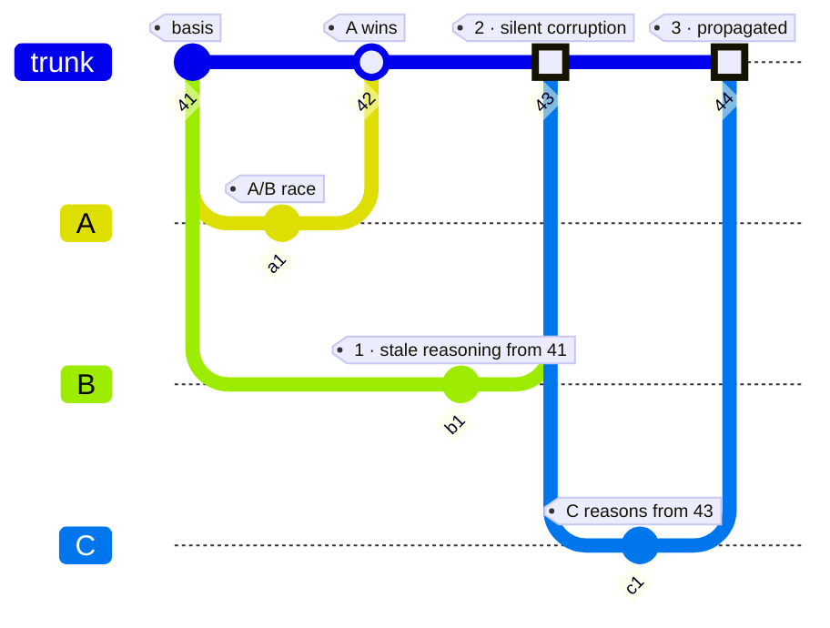
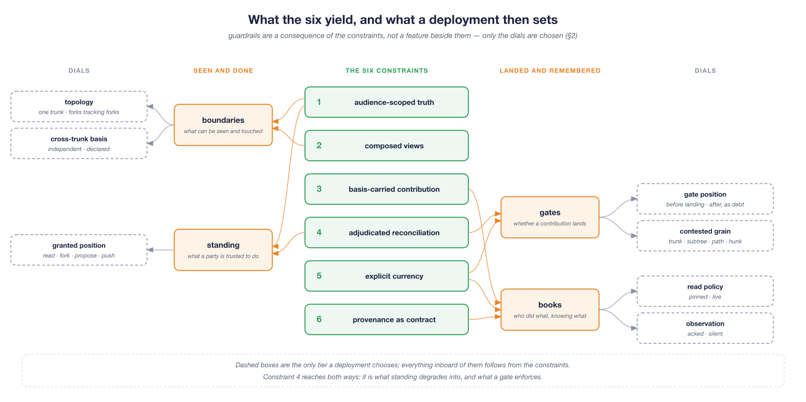
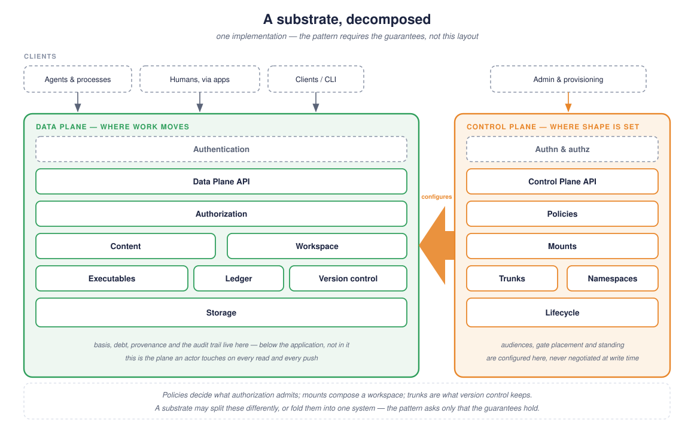

> **Working draft** — comments welcome via [issues](https://github.com/robotfutures/sigma-architecture/issues); please don't cite or quote yet.

## **The Sigma Architecture: ABSTRACT**

---

The **Sigma Architectural Pattern** — *Sigma* — is a pattern for collaboration substrates—the underlying medium supporting concurrent work among reasoning actors (humans and autonomous agents) and an evolving world. The scope is **virtual** collaboration — participants who do not share a world. Hereafter, *collaboration* means the virtual kind. It is thus:

> Two or more parties working together virtually to create or achieve the same goal in overlapping-but-distinct realities, with time and the external world pressuring the work and collaborators themselves.

 
<i>
Figure 1: Collaboration. Each party reasons inside its own reality — the human's lived, the agent's engineered — and the shared work exists only in the overlap. Time and the external world steer both and move underneath the work, without asking either.
</i>

Sigma's design target is maximizing **coherence** in this collaboration — coherence in the linguistic sense, a continuity of senses across the whole (de Beaugrande & Dressler, 1981): the shared work holding together, rather than replicas agreeing on a value. Work is coherent when three things hold at once (§1.2):

* **Non-contradiction** — the parts do not conflict with one another.
* **Grounded premises** — the premises each part rests on still hold.
* **Purpose** — the goals it serves have not moved.

Coherence is always judged *from a view*, and views differ: work coherent to its author can be incoherent to a judge who sees otherwise. So it is assessed and never computed (§3.5, §6.5), which makes "by whom" a first-class concern. Sigma does not deliver coherence and does not claim to. As REST is to cacheability (Fielding, 2000) — it does not guarantee caching, it provides a deliberate path to it — so Sigma is to coherence.

The conditions describe coherent work. What a group must do to keep them true are **capacities**, which a group either exercises or lacks (§1.2). Two are about the work: **Grounding**, establishing and repairing common ground, produces grounded premises; and **recomposing** is where non-contradiction and purpose are held together. Three make those possible at all — **mutual awareness**, **timely reckoning**, **attributed judgment**: notice, act while it is still cheap, ownership. The last two shape the participation dynamic itself — **rules of engagement** and **accountability**.

**Sigma**, like its mathematical namesake $\Sigma$, is a summation: truth is a running sequence of summed and reconciled contributions, each carrying the basis it was reasoned from (§2), and coherence is judged at each step.

 
<i>
Figure 2: Coherence and what upholds it. Grounding produces grounded premises; recomposing spans non-contradiction and purpose together. Capacities 3–5 are what make those possible; 6 and 7 maintain the structure that upholds judgment (§1.2).
</i>

### **The Forces**

The domain applies pressures that any system must address all at once. These are **forces** in Christopher Alexander's sense — not requirements to satisfy but competing pulls (1979; §1.4):

1. **Concurrency and volume.** Actors reason and act in parallel, and a reasoning act is discrete against a world that moves while it runs. Speed and volume accelerate the drift.
2. **Variable trust and reliability.** Trust runs on a continuum and is revocable: at one end an agent with no persistent self; at the other a human with full reputation and authority; between them ordinary fallibility.
3. **Delegation.** A principal acts through things — apps that do what was clicked, and agents on their behalf. Intention and execution can differ, so *who* and *by what means* become first-class facts (§3.7).
4. **Partial visibility.** Privacy law and security dictate that no single actor sees everything (§3.2).
5. **Absence of ambient context.** Humans coordinate through a periphery of informal channels along with social structure; an agent has none, only those engineered (§3.1).
6. **Bounded attention.** Saturation degrades human judgment and model reasoning alike.
7. **Quadratic awareness.** $W$ collaborators attending to one another is $W(W-1)/2$ pairwise relationships (Brooks, 1975) - a geometric scaling challenge.

These pull against one another - and existing art in theory and application address these incompletely or is bound to the domain. Sigma's claim is that these are **best addressed by the substrate** (§1.4), the medium of collaboration itself, and provides a pattern toward it.

#### **The Essential Failure: TOCTOU, Corruption, and Propagation**

Where real-time collaborative editors solved physical line/cursor collisions at human pace, agentic workflows are plagued by a systemic **3-stage failure cascade** (§4.1):

1. **The Extended TOCTOU Window (Temporal Gap):** The time-of-check-to-time-of-use question (Bishop & Dilger, 1996), asked at collaboration scale. The classic file-access race is narrow and is an exploit; this window spans **minutes to hours** between an actor reading context (*check*) and submitting work (*use*), and is the ordinary case.
2. **Silent Corruption (Local Failure):** Standard merge mechanisms check for structural/textual line overlap. When an agent acts across a wide TOCTOU gap, it produces non-overlapping edits that are syntactically valid but semantically incoherent, and the authors are not informed. Checking is duty, not enforced.
3. **Silent Propagation (Systemic Blast Radius):** Once corrupted state lands on an authoritative trunk, downstream autonomous agents blindly ingest it as ground truth, compounding and propagating into other work products, undetected (Hochschild et al., 2021; Dixit et al., 2021).

<i>
Figure 3: Two contributors race from the same basis. A lands first; B, still reasoning from 41, lands work that never overlaps A's lines and contradicts it anyway. C then reasons from the result and carries it further.
</i>

The question is no longer *"can we interleave this raw data?"* but **"does what I reasoned from still hold?"**. The failure cascade can be interrupted at this point of entry by shifting the collision test from *"did we edit the same line?"* to *"might the premises you reasoned from have moved?"*. Between two collaborators in a closed world of give-and-take, this is a manageable issue. Above $W=2$, it becomes a paramount concern (§6.4.2).

#### **Why Bare Substrates Fail: The Security & Trust Problem**

Traditional storage substrates (filesystems, relational databases) ship **bare**: a database validates schema shape, not reasoning or judgment. Historically, bare substrates functioned because human contributors were held accountable through external social, institutional, and legal layers (reputation, sanctions, standing).

**Autonomous agents break this model.** Highly capable yet fully unaccountable—possessing no persistent self and nothing to lose—agents contribute at superhuman speed and volume. Because that external accountability layer does not reach them, the substrate must carry it: maintaining provenance, gating behavior, guarding against corruption, and keeping traces detailed enough for retroactive accounting.

### **How Sigma Functions**

Sigma enforces six structural constraints (below) to create a continuous, transactional loop for contributions. No constraint is arbitrary: each answers a force, and a substrate that drops one leaves that force unresolved (Alexander, 1979). The claim is thus falsifiable rather than definitional — exhibit a deployment that omits one and loses nothing (§2, §6.1).

$$\text{View Out} \rightarrow \text{Reason} \rightarrow \text{Contribute Against Basis} \rightarrow \text{Reconcile Divergence} \rightarrow \text{Truth Advances} \rightarrow \text{Views Update}$$

The View Out derives from:
* Constraint 1: **Audience-scoped truth:** Data is segmented into authoritative histories ("trunks"), each with an *audience* — the set of actors entitled to it (§3.2). Trunks compose — forks that track an upstream, branches that never leave a workspace, hierarchies that aggregate before they publish — and that **topology** is where audience shape, contention and partitioned attention are expressed (§3.8).
* Constraint 2: **Composed views:** Every actor reads and writes through a *view* — a scoped, policy-bearing composition of the trunks it is entitled to, assembled via Plan 9-style mount tables (Pike et al., 1993). A view an actor *works in* — accumulating branch state, a basis, a ledger position — is its **workspace**. Thus the view *is* the permission: an actor can reach only what is mounted (§3.2). When tools arrive as mounts, what an actor may see and what it may do are a single mechanism rather than two systems kept in agreement.
* Constraint 3: **Basis-carried contribution:** Writes are transactions declaring the trunk state (*basis*) the actor reasoned against (§3.3). A basis is one pointer — a single trunk commit, held independently per mounted trunk.

Constraints 1, 2 & 3 yield a bounded workspace with basis, history, capabilities, and an **attention budget** (§3.2). An application will have different views out by principal and purpose. Reasoning happens against a view. Writes land in durable branch state — not a dirty buffer — and are pushed in batch against the declared basis (§3.2). In the event a trunk moved between the view out and the write, Sigma forces reconciliation:

* Constraint 4: **Adjudicated reconciliation:** If the trunk moves, the push is refused on *divergence* — the premises may have shifted — forcing explicit, attributable human or machine resolution rather than a silent merge (§3.5).
* Constraint 5: **Explicit currency:** The substrate tracks how much absorbed upstream state an actor has not yet acknowledged — a **high-water mark** against the workspace's basis, so "am I current?" costs one comparison however large the world has grown. The gap is *debt*, retired only by an explicit acknowledgment (§3.3).

Together, constraints 4 & 5 mean nothing lands silently (§3.5). At the very least, a contributor has to look at what moved and attest they looked. Diligent contributors will: read the change, hold it against the work they were about to submit, and choose — acknowledge and merge as-is, rebase and rework, land it anyway with open disclosure, propose for review instead of landing. Exactly how this adjudication unfolds — by reasoning, by policy, or both — is up to the deployment. These are **gates-as-dials** — one of the pattern's **variation points**, the choices a deployment makes within it (§2, §5.4).

The gate distinguishes five conditions, each discharged differently. **Divergence** — the trunk moved past the declared basis ($B < U$); discharged by pulling or rebasing. **Contested** — the part of a divergence flagged by the mount's grain (§3.5); refused unless the push carries a disclosure accepting the divergence. **Non-conforming** — the push violates the trunk's write policy: a path outside the grant, standing short of push, a required check unmet; no disclosure applies — discharged by rework, a proposal, or abandonment (§3.5). **Conflicting** — mechanically unmergeable; no disclosure applies here either — discharged only by attributed resolution of the content. **Debt** — movement absorbed but not yet acknowledged ($H < B$); no push lands over it — discharged by acknowledgment (§3.3). The rule: **a disclosure discharges the warning — the contested condition — and nothing else.** It does not lift a prohibition (non-conforming, conflicting), does not produce a merge, and does not replace an acknowledgment.

Trunk boundaries (constraint 1) are therefore the concurrency dial — unrelated work belongs on different trunks (§5.5) — and a false positive (constraint 4) costs an acknowledgment to merge
as-is (constraint 5).

The ledger is also how collaborators maintain mutual awareness (capacity 3; §3.6). Debt is retired only by an explicit **acknowledgment** — a named, timestamped claim to have looked, which is more than a delivery record and less than proof of thought. How this debt is presented, consumed, etc., is a deployment decision and coded into the application and agents.

Work in progress is a different matter: changes live in the actor's workspace, and are invisible to others (constraints 1 & 2). Publishing a branch to an audience makes it a fork; proposing is pushing where the gate sits ahead of the landing (§3.8, §5.4). Every landing keeps the chain it was made from as a second parent, so acceptance is read off the ancestry rather than asserted, and cannot be denied.

Finally, work which lands in any form is attributed:

* Constraint 6: **Provenance as contract:** Every change immutably records the **principal** — the party that answers for the work, usually a person and sometimes a deployed system (§3.1) — the **acting agent**, and the **workspace**. This is *basis* provenance: what state the work was produced against, and on whose authority (§3.7). It is not a record of what the agent actually read, still less of what it reasoned over; those are not obtainable (§7), and Sigma does not claim them.

 
<i>
Figure 4: The transactional loop. A contribution carries the basis it was reasoned from. If truth moved, the delta is served *before* anything lands, and the contributor either re-reasons, explicitly acknowledges, or defers judgment to another via a proposal.
</i>

These constraints hand a deployment four **guardrails** — the trust and security posture that makes collaboration safe, maintains confidentiality, and maximizes the integrity of the work:

1. **Boundaries (Audiences & Mounts):** Define what an actor can see and touch — including **tools**, which unifies data reachability and operational capability into a single grant — for capabilities that arrive through the substrate (§3.2).
2. **Gates (Adjudication Points):** Control how contributions become truth (§5.4). These are policies and processes defined by the deployment and enforced by the substrate.
3. **Books (Provenance & Debt Ledgers):** Record immutable **basis provenance** (Principal ID, Agent ID, Workspace, Basis Commit) on every change, and track debt for every workspace (§3.6–3.7).
4. **Standing (Graduated Authority):** Represents an actor's granted, revocable trust position (fork, propose, push). Under distrust, actors operate behind more restrictive gates (§3.8, §6.6.2).

 
<i>
Figure 5: What the six yield, and what a deployment then sets. Guardrails follow from named constraints rather than sitting beside them; only the dashed dials are chosen (§2, §5.4).
</i>

Scaling is a property of the topology. Workspaces narrow attention (§3.2), and partitioning by topic, audience and privacy bounds contention and the cost of pairwise attention without eliminating either (§3.8, §6.4.2).

 
<i>
Figure 6: Figure 1 redrawn against a Sigma substrate. Every party attaches to trunks via workspaces. Trunks serve many purposes, audience-bound. Scratch, memory, sessions are a trunk(s) held in common between humans and their agents; shared work is shared by many. The world – in and out – via monitors and effectors, all driven by debt on the ledger, and protected by guardrails.
</i>

### **Pattern vs. Substrate vs. System**

The Sigma pattern sits above the filesystem, database, and messaging technologies that are composed into a collaboration substrate implementing Sigma. The pieces may each supply part of the machinery; the substrate may not — a constraint dropped is a force left unresolved.

- As a **pattern**, Sigma's constraints define a set of primitives that combine to address the domain's inherent challenges.
- The pattern applies to **collaboration substrates** — the connective execution layer between infrastructure and application code on which collaboration runs. It is what agents, and humans (through apps), work through.
- A substrate delivers guarantees on the data and on the mechanics of the collaboration process, by implementing the constraints of the pattern.
- A substrate is a single logical system, and may be singular or a composition of systems. The pattern dictates a minimal contract — an API surface, support for atomic compare-and-swap (CAS) — leaving the underlying implementation open.

 
<i>
Figure 7: A reference decomposition of a substrate, split into a data plane — where work moves — and a control plane, where its shape is set. The control plane configures the data plane and is never negotiated at write time. The pattern does not prescribe this layout; it requires only the guarantees these pieces deliver.
</i>

### **Applicability & Novelty**

Sigma acts as a high-context databus (§5.1) for everything from single-actor systems reactive to a moving world ($W=1$) to complex, multi-actor collaborations. The design's data partitioning mechanics provide essential leverage toward security and privacy in multi-tenant environments.

A world-reactive system ($W \ge 1$) needs visibility onto the world and time, which are ambient by nature — and ambient is absent to an agent unless a channel is engineered for it (§3.1). In Sigma, "ambient" joins the collaboration as a **write-only participant** (§3.6) — depositing facts into explicit view, attributed, seen, and owed like any other contribution.

In spirit, Sigma has similar aspirations to Jon Doyle's **Truth Maintenance System (TMS, 1979)**. Those systems maintained fine-grained dependency graphs over logical predicates and assumptions, with *client-declared* justifications — free and complete for a deductive problem solver, whose inference is its own justification.

Sigma keeps the division of labor Winograd and Flores drew (1986) — the substrate holds the structure of acts, the actor holds meaning — and keeps Doyle's justification tracking too, at trunk grain rather than predicate grain: the basis *is* the justification. What it drops is the assumption that a fine-grained dependency graph is obtainable from stochastic actors, and that revision **propagation** can be automatic. Even where a graph is available, Sigma does not retract on its own, because an authorless change to shared truth is what constraint 4 forbids, correct or not (§3.5). Where a TMS propagates a *verdict* — this node is now OUT, delivered by machinery to no one — Sigma propagates an **obligation**: you owe a look at what moved, delivered to a name, and possibly owing rework. Dependency graphs remain **useful, as a variation point** (§2): a deployment may carry declared dependencies as metadata on a write, to inform a reconciliation or to narrow the blast radius (§7) when a bad or changed premise must be traced downstream.

de Kleer's **Assumption-based TMS** (1986) has a direct parallel in Sigma: it declines to reduce N contexts to one value, holding each assumption set alongside its own derived beliefs. That is audience-scoped truth (§3.2) and concurrence-rather-than-consensus (§6.5) — hard divergence *mine* vs. *yours* not *ours* is a topology artifact with Sigma.

Its **novelty is combinatorial**, the parts deliberately familiar: version control, Plan 9 namespaces, optimistic concurrency, forge-style adjudication and streaming consumer offsets, cited to their owners and laid out as files, which every model already reads (§5.7). Two couplings are ours, because neither lineage can express them alone.

**The pair of pointers is not new; the meaning of the second one is.** Others do pair a basis with an upper pointer — a consumer offset, a merged-mainline check — but theirs records what machinery absorbed. Sigma's advances only on an explicit, attributed act, a named claim to have looked, so the gap between the two measures work taken into an actor's premises and never examined. That gap is debt, and it is held per reader rather than per branch (§2, §3.3).

**And gate placement becomes a position rather than a property.** A forge's protected branch is review-before, a wiki is review-after, and in each the choice is built into the tool. Here the ledger is unconditional and only the gate moves (§5.4).

### **Gravity**

For nearly all work – from book chapters, legal documents, to construction documents and more – **incoherence is far more toxic than trivially detected line conflicts due to its silence under standard merge methods.** While Sigma claims no ability to detect incoherence — coherence lives in meaning, and only judgment can check it (§3.5) — a substrate implementing Sigma's constraints offers a robust suite of mechanics for managing this, in real time and retrospectively to maximize coherence. Shifting the collision test from *"did we edit the same line?"* to *"might the premises you reasoned from have moved?"* is an essential pivot for human-AI workflows, and it extends the Git-forge-like collaboration as a runtime pattern for complex heterogeneous collaborations (§1.5.2).

An easy critique of Sigma is that it is complex. We agree. The forces are many and they pull against one another, balancing them is a daunting task, and this pattern is not small. In return we point to the void: nothing treats coherent collaboration as first class, save a few highly specialized enterprise products in regulated industries (§1.5.3). We have built toolchains and workflows that do the job and still fall short of what agents demand — rigor, alignment, traceability, in behavior and in the work products themselves. Ad hoc answers will keep being found, each bound to the niche that produced it.

Systems shipped in the last few months — Block's **Buzz**, **Cloudflare OS**, Zed's **Delta** — are validation that this is the direction, and each reaches for version control as the foundation under human-agent work (§1.5.4). For all they innovate, they leave the full spectrum of forces wanting, and none keeps a ledger of what a reader has reckoned with. By their own declarations they are still reaching. **That pull is what §8 calls gravity.**

/Σ

---

**Read further:** [The Sigma Architecture — the paper](00_index.md)
