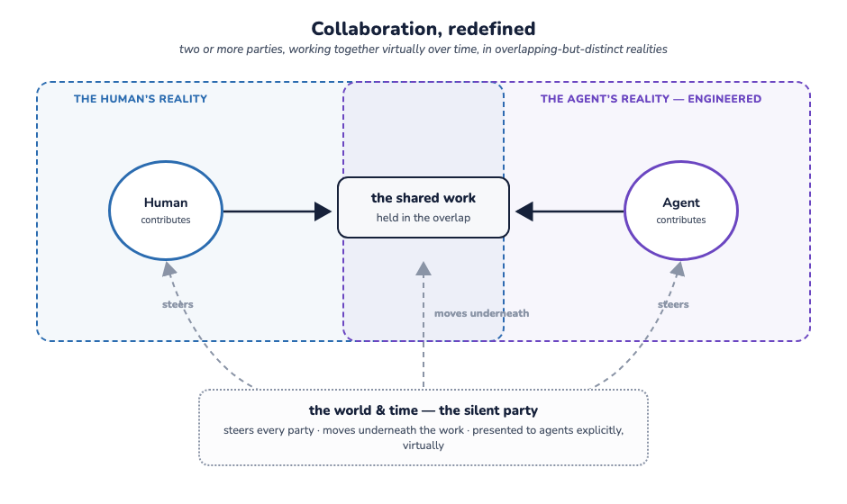
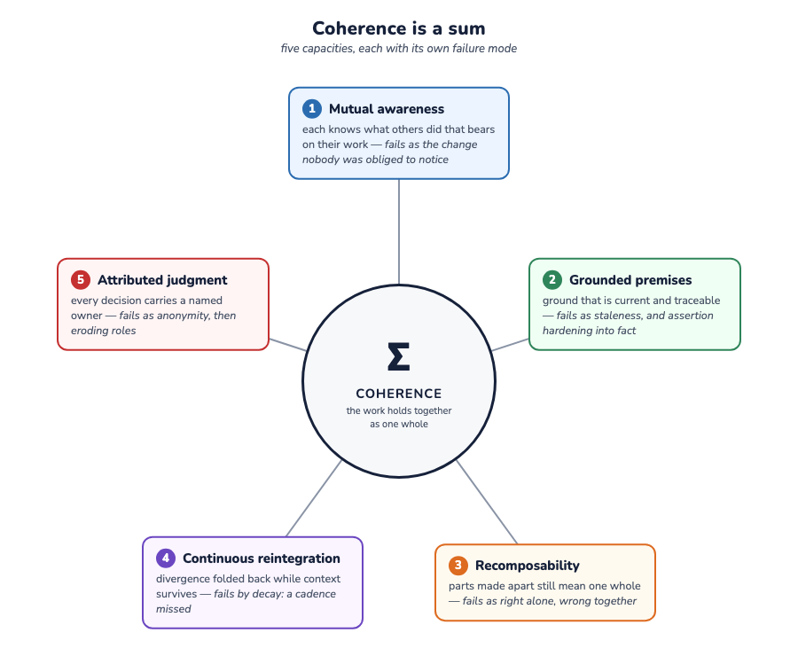
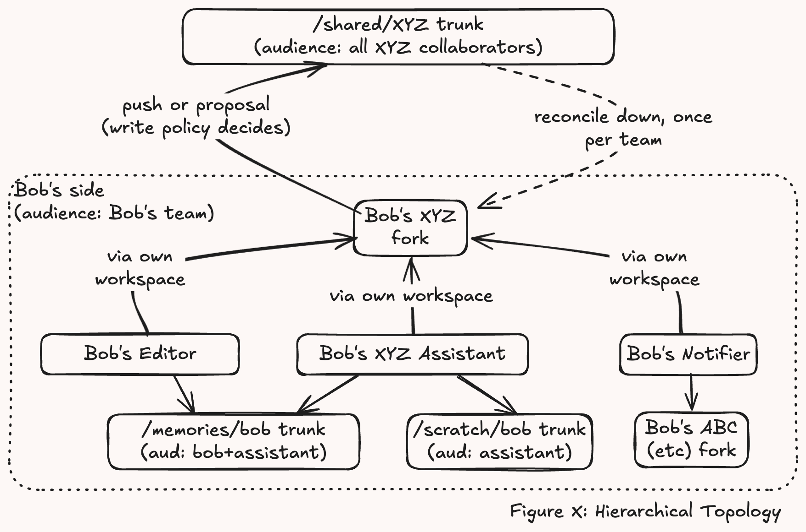
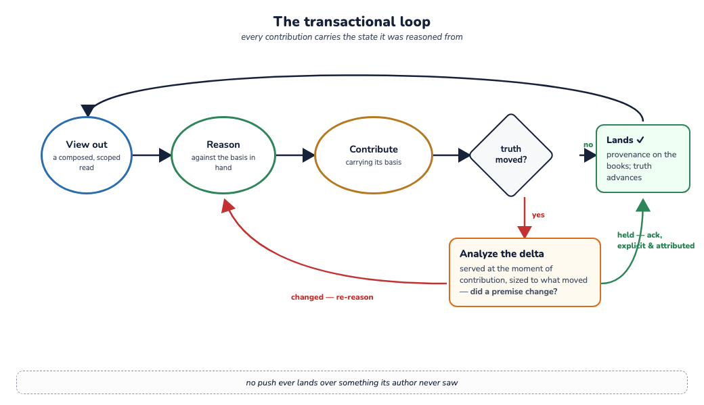

> **Working draft** — comments welcome via [issues](https://github.com/robotfutures/sigma-architecture/issues); please don't cite or quote yet.

# **Why Sigma**

**A position: coherence and trust in shared work among humans, agents, and a moving world**

_Draft — Robot Futures SAS, July 2026. Companion to [The Sigma Architecture](whitepaper.md): the whitepaper derives the pattern and its machinery; this paper argues for needing it._

**Call to reviewers**: This is intentionally bold. It merits harsh critique: nits, dismissals, counter-factuals, etc. Incomplete, over-claimed, imprecise, sloppy, erudite? Tell us more.

## **1. The position**

AI forces us to rethink how we work together, now humans and non-humans, to create shared work on an evolving timeline and evolving virtualized world. This collaboration – an exercise of many hands in creating artifacts – is fraught with two fundamental challenges:

- Keeping this work **coherent**; and
- Keeping this work **safe to contribute to**.

Our position is that these are *substrate* obligations - we must address them not in the design of agents or apps, or harnesses, but through the medium of collaboration itself to support state sharing, artifact building, and knowledge accumulation.

Chat rooms, Slack channels, code repositories, shared drives, and complex merge algorithms all fall short on these two challenges. Sigma presents a pattern of a robust solution.

## **2. Collaboration**

From the Cambridge Dictionary:
> *Collaboration*: the situation of two or more people working together to create or achieve the same thing

For the era, we need to generalize this to include non-humans. Then we need to explicitly acknowledge time and world as a potentially silent party. Why? The time and the world (aka external realities) steer collaborators and goals. As humans, we share roughly the same world, but the world and time must be presented to AI systems explicitly and virtually. So comprehensively redefined:

> *Collaboration*: the situation of two or more parties working together virtually over time to create or achieve the same thing in overlapping-but-distinct realities.

From this, four constraints define this domain:

- **Visibility is partial.** Roles and privacy law mean no party may see everything.
- **Attention is finite.** Information saturation degrades humans and model reasoning. Clarity of context is precious.
- **Awareness is quadratic.** _Awareness is an understanding of the activities of others, which provides a context for your own activity_ (Dourish & Bellotti, 1992). $W$ collaborators attending to one another is $W(W−1)/2$ relationships to maintain (Brooks, 1975). Thusly, awareness can only be partitioned to linearize this curve.
- **Nothing is ambient.** Human collaboration degrades with the loss of informal channels (Herbsleb et al., 2001); agents never had them — an agent's context is engineered. Out-of-band context channels can exist (via the network, host) but with those come security liabilities. In this domain, awareness is either carried by the medium or it is a security exploit waiting to happen.

Whatever substrate keeps virtual shared work whole must do so under all four: partial sight, bounded attention, pairwise scaling costs, explicit awareness channels.

## **3. Coherence: the work must hold together**

The evolving work holding together as a whole — free of unintentional contradiction, resting on premises that still hold — is **coherence** in the linguistic sense. Coherence is not one property. It is a sum of five capacities, each having specific failure modes:

1. **Mutual awareness.** Each contributor knows what others have done that bears on their work (Dourish & Bellotti, 1992). Failures arise from *silent movement* and *lack of attention* — the change nobody was obliged to notice.
2. **Grounded premises.** Work rests on ground that is current and traceable, so evidence can be told from assertion (Clark & Brennan, 1991). Collaboration-specific failures arise from *staleness* and ungrounded material recirculated until it hardens into fact.
3. **Recomposability.** Collaboration begins by dividing the work; recomposability is the capacity to put it back together — parts produced apart assembling into an artifact that still functions, and still means, as one whole. This is not a merge step at the end: the dependencies between parts evolve as the parts do, so two contributions can each be right alone and wrong together, and the fitting-together is continuous work of its own (Grinter, 2003). Failures accumulate silently as integration debt and surface at assembly (Herbsleb et al., 2001).
4. **Continuous reintegration.** What diverges must be folded back in continuously — emphasis on *re-*: integration is a cadence, not an event. The forcing fact is decay: the context behind a change — what its author knew, weighed, and rejected — starts evaporating the moment the work is done, in humans and agents alike. This is "reintegration" because resolving divergence requires rework. Rehydrating a current context later is expensive at best, impossible at worst, and error-prone always (ask a stochastic parrot why). Reintegration postponed is therefore reintegration performed with low-context — *even by the original author* — and judgment risks its own decay.
5. **Attributed judgment.** Every consequential decision carries a named owner, and the record shows who. The failure is a chain: anonymous or ambiguous ownership breeds confusion and unaccountability; unaccountability decays roles and responsibilities — eroding the structure that divided the work in the first place.

Old problems, new context: what is new is having to manage all five at machine pace, under the domain's four constraints, for work-products no compiler can check.

## **4. Guardrails: the collaboration must be safe to enter**

Collaboration is social, and social activity runs on shared **guardrails**: assurances that protect the collaborators, the product, and make it rational to extend trust. It is not the "trustless" project. *Judgment is the content* of this kind of work, and no mechanism "proves" judgment beyond more judgment (if at all). In other words: meaning lives in the practice of the collaborators, not in any formalism (Winograd & Flores, 1986). A substrate that promises to eliminate trust can guarantee only mechanistic collaboration.

Guardrails support trust among participants. They belong at every layer: humans have social conventions and hierarchies; law has contracts; institutions have controls and review boards; processes have four-eyes rules; applications have permissions; LLMs and agents are steered through training, prompting, filters (and more). Every layer except one: the substrate — the layer that actually holds the work — ships bare. A file store enforces nothing about how work lands. A database checks shape, not judgment. As long as contributors were human, the upper layers held, because whoever misused the bare layer was accountable in person: reputation, sanction, standing.

Agents break all of this. Highly capable and fully unaccountable — no persistent self, nothing to lose, nothing a sanction can grip — they contribute at superhuman volume and pace. Accountability anchors where it still can: on the **principal**, the human a contribution belongs to. The rest must be structural. At the substrate, guardrails take four forms:

- **Boundaries** — what each participant can see and touch. What isn't reachable can't be leaked or damaged, and revocation is the withdrawal of a view, not a lawsuit. A boundary is a capability, and not only over data: tools arrive as mounts too — what a participant can *do* and can *see* are one grant.
- **Gates** — whether a contribution lands, and how it is received once it has: reviewed before it enters, or landed in the open as a visible debt that every affected reader owes an acknowledgment.
- **Books** — what is remembered: who contributed what, through which actor, on whose behalf, knowing what. Answerability after the fact is half of what makes an assurance real.
- **Standing** — what each participant is trusted to do, held as a granted, graduated, revocable position: fork, propose, push. Under distrust the structure degrades gracefully — an untrusted actor is not expelled; it simply works behind more gates.

## **5. Current art**

Shared work is hardly new, and every medium we do it in today is an answer to part of the problem. What none of them answers is the whole of it — non-code work-products, mixed human and machine pace, partial visibility. Considered against the five capacities and four guardrail forms, we examine what each medium delivers and where it stops:

- **The shared machine** — one human, n agents at one host — delivers awareness through the filesystem (stat file) and does reintegration in the moment, if noticed at all. It offers nothing else — no boundaries (root or nothing), no books, no standing — except when VCS is layered on.
- **The shared editor** (Docs, and the OT/CRDT family) solved interleaving at human pace: recomposition flawless at the character grain, and totally clueless where meaning lives. If merge is automatic, nothing is ever actually reconciled — no premises are consulted, no judgment is exercised. Multiverse solutions (DefraDB) beg for judgment, but can only be realized at read time when context entropy is at its peak. Apps' suggest-mode offers a gating mechanism, version history offers audit — each on a whole document, each optional.
- **The forge** (git and GitHub) is the most mature medium. Every commit names its parent — a basis. Standing is its social ladder: fork, propose, maintain. Books live in every blame, gates on protected branches. But it was built for one work-product: with a compiler for a referee. Boundaries stop at the repository — inside, everyone sees everything — and awareness is "remember to fetch" and review the upstream (maybe).
- **Team chat** (Slack and kin) contributes one strong guardrail: an audience boundary at the channel — drawn around no artifact at all. The work lives elsewhere, what the feed holds decays with scroll distance. Premises, reintegration, and judgment are socially bound (shaming as the most common mechanism).

A recent entrant, Block's **Buzz** (July 2026), points to industry co-genesis around Sigma's pattern. It unifies chat, forge, and agents on one cryptographically signed event log. Its launch text argues that productive work happens when humans and agents are "in the same room, working on the same thing, with shared context." They land on the same requirements: shared context, mutual awareness, attributable actors. Work in progress that it leaves open — what an agent should see, agents flooding shared threads, approval gates not yet baked — are boundaries, attention, and gates: questions Sigma answers.

## **6. Sigma**

What answers the whole problem is not a medium but a pattern beneath them all. Sigma is to collaboration what REST is to HTTP: it names the primitives and the discipline for composing them, extracted from where they already work. Its outline follows from the two stakes:

- **Topology first.** Truth kept per audience; sized to the people entitled to them; forks that track; work aggregated locally and reconciled at boundaries, once per boundary. This move answers recomposability, quadratic awareness, partial visibility, and standing together — (partition, keep $W$ small) as a first-class operation and privacy as construction rather than flags.
- **A transactional loop.** Every contribution carries the state it was reasoned from; when truth has moved, the divergence surfaces with the delta, and diverged changes land only through an explicit, attributed resolution. This mechanic feeds grounded premises, attributed judgment, and — because the delta is served at the moment of contribution, sized to what actually moved — reintegration while context is still in hand.
- **Books throughout.** Provenance (principal and actor) on every change; a per-reader ledger of what has been acknowledged. Awareness stops being a courtesy and becomes an account; audit stops being forensics and becomes a read.

The whitepaper derives this shape as six constraints and shows the machinery; the abstract compresses it to a page. One credence note in passing: the guardrail machinery itself — referees, validators, watchers — runs inside the same boundaries, gates, and books it enforces.

We believe this shape is discovered, not invented. The problems of the era point to Sigma's specific composition, and Sigma as a pattern captures the point of gravity that Buzz and others are circling.
