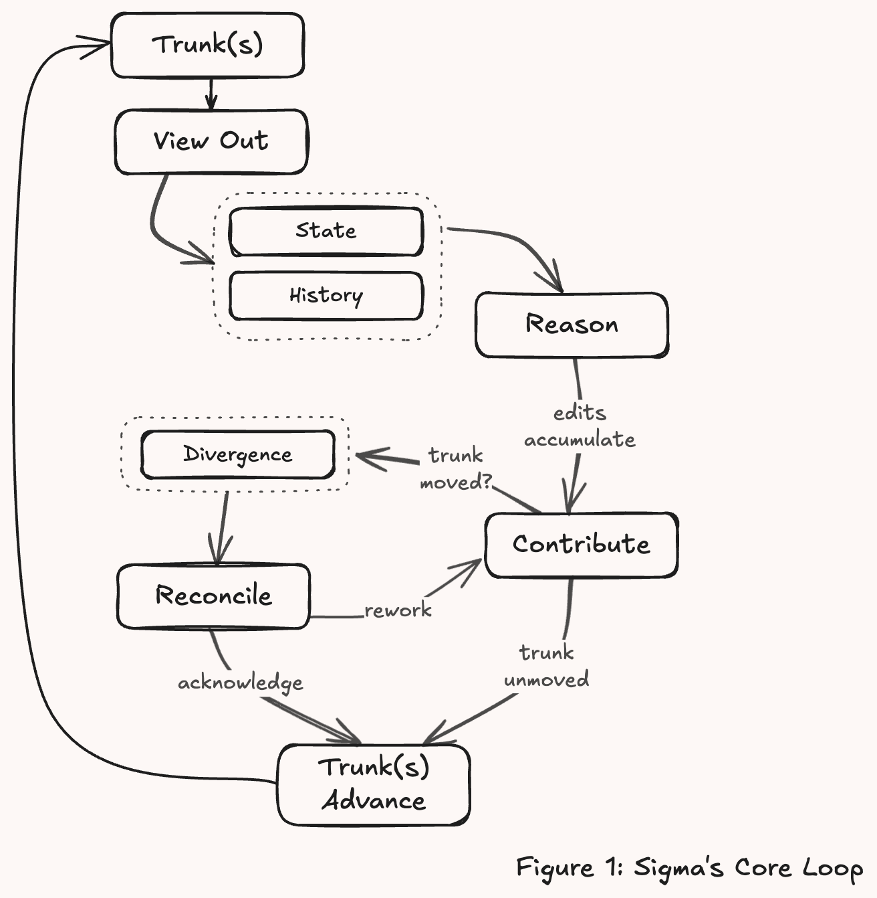

> **Working draft** — comments welcome via [issues](https://github.com/robotfutures/sigma-architecture/issues); please don't cite or quote yet.

# **The Sigma Architecture**

**A substrate for concurrent collaboration with reasoning intelligence**

_Draft — Robot Futures SAS, July 2026_

## **1. A new data flow architecture**

The Sigma architecture arises from a very new and ubiquitous problem: more than ever before, we have many reasoning actors working on increasingly unstructured problems. These are humans, agents, and their delegates working in parallel on shared-work products which are semi-structured at best, and evolving goal posts.

Collaboration requires a reconciled shared context: is my contribution appropriate to the current state? Is a new state consistent with my goals? Shared state requires coordination.

Historically in computer science, our efforts have been dedicated towards coordination machinery, and collaboration as an app on top of coordination mechanisms. Humans as the reasoning actors acted through these apps which realized deterministic mutations, as with CRDTs, for example. Changes were reduced to schema, and we coordinated rules over them. Sophisticated non-deterministic reasoning virtually never entered the picture, with notable counter-examples as the blackboard from classic AI, or game AIs. However in both of those cases, we achieve collaboration _through_ synchronized coordination.

That event loop is dead while humans and agents are now joining at the hip, as we are contributing to shared work-products, and world–state is increasingly complicated as our ambitions grow, along with the criticality of _gated_ contributions and data partitioning for privacy and context management - all happening in parallel and unpredictably - and a reasoning act is discrete against a continuous world. Sigma as an architectural pattern is a response to these pressures.

"We have version control and forges like GitHub and GitLab, isn't that enough?" No. We _could_ leverage these systems to get close to our goals, and many of the constructs adopted here derive from them. To be clear:

Sigma aims squarely at the problem of evolving shared-work of semi- and barely-structured sorts, where context is precious, the external world is evolving, inter-actor collaboration is an ad hoc contract, and visibility of information is role-based. Success in this space must be measured by **coherence** in the linguistic sense: do incremental contributions hold together as a whole — free of contradiction, resting on premises that still hold (§3.3)? That question requires judgment — often by the only actor capable of assessing it, the contributor itself, though not exclusively: work coherent from the actor's own view can be incoherent to another judge with a different view. The domain is rife with these nuances, and thus Sigma: an architecture — a substrate at the heart of collaboration — built to support maximizing coherence and these nuanced interactions between reasoning actors and their visible world.

Observe that Sigma cannot deliver coherence itself. As REST is to cacheability (among many) — it does not guarantee caching; it provides a deliberate path to it — so Sigma is to coherence.

Parallel to coherence are the rules of engagement: **trust**. Collaboration is social, and social activity runs on guardrails — assurances that protect the shared product and make it rational to participate. Sigma necessarily positions here too.

This is a gap unfilled across the bleeding edges of version control, synchronization, storage, and orchestration. As such, Sigma represents novel art widely applicable to anything a reasoning actor builds — with others, or against a moving world.

## **2. Sigma**

**Truth is the reconciled sum of contributions, each carrying the basis it was reasoned from.**

There are shared, authoritative lines of history for each audience — **trunks**. Every actor works against a **view**: a composed, scoped projection of one or more trunks, and the system remembers which trunk state the view came from — the actor's **basis**. Views flow out, and work accumulates against them freely — edits are cheap, local, and never interrupted by the world moving. Reconciliation is owed only at the boundaries: when an actor offers work back (a push, a proposal) or deliberately catches its view up (a rebase). The offer carries its basis, which makes it a transaction: _here is my work, and here is what I knew when I did it_. If truth hasn't moved, the contribution lands. If it has, the system does not guess: the divergence surfaces, with the full delta from basis to now, and truth advances only through an explicit, attributable resolution. That is the whole loop:

**view out → reason → contribute against basis → reconcile divergence → truth advances → views update.**

Data flows bidirectionally, and the return path is transactional. Sigma (Σ) is a summation — truth as the running, _reconciled_ sum of everyone's contributions.

Stated as constraints — the pattern is this list:

1. **Audience-scoped truth.** One authoritative history per audience; many trunks, not one world.
2. **Composed views.** Every actor reads and writes through a scoped, policy-bearing composition of the trunks it is entitled to. Both the entitlement and the policy are external to the actor's working surface.
3. **Basis-carried contribution.** Every write declares what it was reasoned from. The write is a transaction: work plus premises.
4. **Adjudicated reconciliation.** Divergence surfaces with the full basis-to-now delta, and truth advances through an explicit, attributable resolution — never a silent merge.
5. **Explicit currency.** The substrate keeps books on what each actor has acknowledged seeing. Currency is never the default state; it is an explicit act, and the books answer in constant time.
6. **Provenance as contract.** Every change carries who it belongs to (the principal) and what it came through (the actor) — asserted by the substrate, consumed by its own machinery.

After the constraints defining the pattern, everything else is a **variation point**, chosen per deployment and per path: where the review gate sits (before a contribution lands, or after it, as tracked debt); how audiences are arranged (one trunk, or forks tracking forks); how far a writer is trusted (push rights, or proposal-only until verified); how coarse a contribution is.

The sections that follow justify each constraint from the use cases that force it — and show that the familiar machinery of collaboration, the pull request, suggest-mode, the maintainer hierarchy, reappears as configurations of the variation points rather than rivals to the pattern.

## **3. Deriving Sigma from first principles**

> In the following sections we unpack the forces, patterns, and use cases which are _drivers_ of the pattern

## **3.1 The collaborators**

Today's collaborators are not a mesh of equal peers.

**Humans are the principals.** They act on the work-product _through_ things: through **apps** — forms, editors, buttons — which are deterministic and do exactly what was clicked; and through delegated **agents** acting on a principal's behalf. **Other agents are first-class**: a standing researcher, a monitor, referee, etc.

Then there is the world itself — the **moving data substrate** the collaboration stands on: weather, locations, prices, upstream systems. It changes on its own schedule, and may be critical to reasoning.

These actors resist virtually all synchronization techniques, while needing to maintain a consistent (if specific) view of world state and behave reactively, often to the _exact_ substance of changes.

And nothing about their coordination is ambient. Humans in one space may coordinate through a periphery of informal channels; an agent has none — its context is engineered, and it perceives exactly what a channel serves it. Out-of-band channels can exist, but what arrives through them is invisible to compliance, debugging, reproduction, and attribution. In this domain every awareness channel is built, and awareness the medium doesn't carry is a liability.

## **3.2 Interface**

It has been argued that "files are all you need" for agents. We agree in part: you need files.¹ The justification is economic, not aesthetic. Teaching a language model a novel interface or schema is prohibitively expensive; the filesystem is natively understood across virtually every model — the path of least resistance and of best performance at once. They serve AI and non-AI equally: semantic-carrying paths, readable and writable with simple tools, arbitrarily structured to the use case.

In this, we take the principle to Plan 9's conclusion: **everything is a read or a write.** A read is a read of a view — scoped, composed, policy-bearing (§3.4). A write lands in durable branch state. A delta is a first-class object with a basis, not the output of an ad-hoc diff. And the verbs — push, reconcile, acknowledge — are writes to control files in the workspace's own namespace, which collapses a client's tool surface to the two operations.

## **3.3 Divergence is information; checking has a price**

Two requirements fall out of the collaborators' chaotic realities.

**First: divergence is information, and reconciliation is a decision.** We typically think of conflict resolution as row-level or line-level, and ideally a mechanical problem. A conflict between reasoning actors may not be localizable mechanically at all, thus the resulting requirement is to make divergence visible, keep its history with metadata, and require a judge — human or machine — at the moment it lands.

**Second: the collaboration unit is the reasoned revision, and the obligation is the lookback.** Real-time editors solved collision avoidance at human pace: your cursor is here, mine is there, we won't collide, with rules by data-type for who wins if we do. The first-class question stops being "can we interleave this data?" and becomes **"does what I reasoned from still hold?"** (The solution is not algorithmic, it is workflow much like a source forge's "dismiss stale reviews" policies.)

Economics anchor both requirements. A critical measure of contributions to shared work-products is coherence: the work holding together as a whole — free of contradiction, resting on premises that still hold, serving goals that haven't moved. Two paragraphs that never touch can contradict each other, and no line diff will say so. Thinking over the whole world is often too expensive to spend at every change. The affordable question is smaller: _"what changed since I last looked, and does my work still hold?"_ — drift in the world is drift toward incoherence, and the integration boundary is often the cheapest place to catch it. Timing sharpens the economics: the context behind work — what its author knew, weighed, and rejected — starts decaying the moment the work is done, in humans and agents alike. Rehydrating it later is expensive at best and error-prone always, so a reckoning postponed is a reckoning performed with low context, *even by the original author*. Reintegration is a cadence, not an event.

Reconciliation is not automatic or freely discharged in this pattern. We recognize that incoherence is corruption with the potential to amplify, compounding and propagating into other work products, and scaling in harm similarly while undetected. Rather than assume corruption as a cost of doing business, or reconciliation as mechanically dischargeable as in conflict-free architectures (examined in §5.4.1) — Sigma places an explicit governance point at the cheapest position on that cost curve: the boundary, where the divergence is measurable, so the cost of discharge can be known in advance. What standard to enforce at that point — reasoned reconciliation, digest review, a mechanical rule, or graceful degradation to re-reading from now — is the implementer's to set against their own cost structure (§3.7). The pattern's demand is only that the point exists, and that whatever governance is exercised there lands on the books.

## **3.4 Audience-scoped truth and composed views (constraints 1–2)**

**Why truth is per-audience (constraint 1).** A collaboration is not one room. The organizer's shared plan, a participant's private preparation, an agent's long-term memory of its principal — each is authoritative for someone, and none is entitled to the others. Splitting truth by topic multiplies coordination; splitting it by audience bounds it. A trunk is one authoritative history and, inseparably, one answer to "who may see this history?" Private material stays private by construction — there is no visibility flag to forget, only an audience that was never granted.

**Why views are composed (constraint 2).** A reasoning actor's quality is bounded by what is in front of it: context windows are finite, attention is finite, relevance decays. Handing every actor the whole world is sabotage and untenable for security. Plan 9 abandoned the one-global-filesystem view for exactly this shape of reason: every process can be given its own view, assembled per purpose, via a private mount table. _Everybody gets the right namespace._ Sigma adopts the tenet wholesale: an actor's view is composed — a mount table assembling exactly the slices of shared truth this actor, in this role, needs, from one or more trunks. And a view an actor _works in_ — accumulating branch state, a basis, a ledger position — is its **workspace** (§3.6).

This mechanism thus yields:

1. **An attention budget.** The actor reasons over _its_ representation of the world, not _the_ world — and its token bill reflects exactly that.
2. **A security boundary.** Permissions live on the mount. What isn't mounted can't be read, leaked, or damaged; a view can be revoked without ceremony.

Each mount is a **capability** — a grant that both names and authorizes; the composed view bundles them into one, grantable, attenuable, and revocable as a unit. Authority is reachability — no ambient authority anywhere; revocation is unmounting; attenuation is composing less. A workspace grant is not only data: verbs are writes to control files in the workspace's own namespace (§3.2), and the substrate can serve executables the same way (§3.5) — so tools arrive as mounts through the same authority. This collapses a split every agent deployment lives with today: operational capability granted in harness code, data access policed on another plane, the two drifting apart. Here, what an actor can do in a context is exactly what its view composes, gated by write policy. (To be clear: the substrate cannot police capabilities the harness grants outside it — that remains a platform-security problem.)

From this point, we can treat an agent's working set, a notifier's read-only feed, an app's read-write for UI controllers, and a human's editing view as configurations of this one primitive.

> In practice, the view is a high-leverage instrument which can be combined with policies governing lifecycle, trunk tracking and acknowledgment, sub-tree visibility, data masks, and others. For example: the **accessible surface** and the **view** are different things. Policy on a workspace may entitle a view to more trunks than it composes — the extras excluded by default not for security but for attention, and included dynamically or by request.

## **3.5 Centralized, local-second**

Git is local-first: every clone is a full replica, the network is an occasional inconvenience. With Sigma, this is considered a liability - and replaced in favor of the security affordance of workspaces and mounts, and shallow replicas (§3.4).

Actors are networked by default — non-human reasoning lives where the compute is, delivered via the network.

However, it is possible for a client of a workspace to replicate shallowly locally, and generate a long-disconnected accumulation of changes. Thus Sigma is **partition-tolerant for work, coordinated for truth.** A contribution is a transaction against a basis no matter when it arrives. Only one operation ever needs the coordinator: advancing shared truth, the reconciled push.

Being centrally served also generalizes what the view can carry. Because everything an actor sees arrives through its view, the substrate can serve _computed_ material the same way — summaries, indexes, checks, Plan 9-style controls, derived from the state the actor stands on — governed by the same mounts, permissions, and currency as raw truth.

## **3.6 The basis-carried contribution (constraint 3)**

The write path has two distinct acts, and the distinction carries the constraint.

**Writing to the workspace.** An actor works in its workspace continuously. Edits accumulate on the workspace's local branch of each writable trunk, against the recorded basis. These writes are cheap, private to the workspace, and durable — work-in-progress is real state, not a dirty buffer that dies with the session. Nothing about them touches shared truth.

**Pushing to the trunk.** The push is the transaction, following standard VCS convention. It declares: "here is my accumulated work, **and here is the trunk state I made it from**" — the basis. The declared basis turns the landing into a checkable claim. If the trunk still stands where the writer stood, the push lands — a pointer advance, compare-and-swap, no locks. If the trunk has moved, the push is refused — and note what triggers the refusal: a stale _basis_, not colliding regions. Two writers may have touched entirely different paragraphs; the second still reconciles, because its premises moved even if its lines didn't. No push ever lands _over_ something its author never saw.

Staleness, not collision, triggers reconciliation, as explained below in §3.7.

## **3.7 Reconciliation is a decision (constraint 4)**

If the trunk has moved under the proposed contribution, the substrate holds everything reconciliation needs, mechanically in hand: basis, mine, and trunk — a true three-way comparison, surfaced at a useful granularity (regions, not lines). Be precise about the claim: **the substrate never detects semantic conflict.** Detection is deliberately mechanical — a stale basis is a pointer comparison, standard optimistic concurrency (§5.1) — and we claim no clever merge. What Sigma adds is not smarter detection but an owed response: nothing merges silently; the full basis-to-now delta is served, and truth advances only through an explicit, attributable act of resolution. _Who_ performs that act — a human, an agent, a policy — is a variation point. That it is performed, recorded, and attributed is not.

Resolution does not demand forcing agreement. A legitimate outcome — the acting policy's call — is that both writes stand: an intentional tension the collaboration chooses to keep, landed with notice rather than by accident. And because letting-it-stand is an explicit act, it affords compensations automatic merges never gets: flag the inconsistency, annotate the tension for the next reader, by the original author.

**The obligation is constant; the standard of discharge is policy.** Discharge may be mechanical and/or reasoned, and which is appropriate is an implementation decision. Three scenarios illustrate the trade-offs:

- **A group simulation.** Two actors "act" a second apart — like humans starting to talk at once, a mechanical rule (an ordering, both-preserved, a tie-break) discharges. The same collision after a longer stretch of visible debt is different: the actor had notice, and thus should have reflected. The right policy scales with Δt — and because the ledger records what each writer could have known (§3.8), which standard applied is auditable after the fact.
- A legal brief. Coherence is the product: reason at every reconciliation regardless of timing.
- Bots maintaining independent world state. Weather per city, prices per ticker: writers never overlap semantically, and their work embodies no reasoning to lose. Policy may be: land now, or re-derive against now and land.

In each case the substrate's demand is identical: discharge is explicit, attributed, and never silent — and the books show which policy was exercised.

We doubly underline: there is no mechanic in Sigma to enforce "reasoning"; the gate obliges at least performative action. Just as Golang forces error handling ad nauseam and shirks invisible failures, so goes Sigma for conflicts and reconciliation. Thus it is on the actor (and maybe its implementer) owning the workspace to take appropriate action.

## **3.8 The currency ledger (constraint 5)**

Lookback (§3.3) needs bookkeeping. Every workspace tracks a **high-water mark**: the last trunk state this actor has acknowledged seeing. The gap between the high-water mark and the trunk's head is the actor's **debt** — the delta it must reckon with before its context is trustworthy again. Both are pointers, so "am I current?" costs a comparison, in constant time, however large the world has grown. Debt is retired by an explicit **acknowledgment** — never automatic, attributed to the actor that made it, and refused outright while conflicts stand. An acknowledgment can be shallow — no ledger can force a reader to think — but it is never invisible: currency is always someone's named, timestamped claim.

Together, reconciliation-as-decision (§3.7) and the currency ledger carve out a Goldilocks zone between CRDTs and pull requests. CRDT-style sync is too fast: changes interleave at wire speed and nobody is obliged to notice. Likewise, it aims for self-policing rather than intra-team policing like a pull request (addressed in §4.4). Between them, Sigma lets contributions land at machine pace while tracking every actor's obligation to notice — cheap to check, impossible to discharge silently.

The mount policies mentioned in §3.4 tie here, as variation points on the ledger. A view may be _pinned_ — frozen at basis until the actor deliberately advances, right for the artifact being edited — or _live_ — always current, right for reference material. Observation may be _acked_ — inbound change demands acknowledgment — or _silent_, for material where staleness is tolerable and attention is better spent elsewhere.

### **Concurrent editors**

We now walk the machinery of §3.6–3.8 end to end. Editors A and B — one may be human, one an agent; the pattern does not care — share a working trunk at head 41, and both hold basis 41. They edit the same trunk (possibly the same file), and while B works, the trunk moves. Access to the trunk is moderated through a centralized system holding the respective workspaces (§3.5).

Note what the walkthrough does not contain: a race. Ordering decides only who reconciles — never whether, and never silently. The editor arriving second is refused with the exact basis-to-now delta, owes exactly one explicit acknowledgment, and lands through an attributed resolution; had A and B swapped places, the same obligations would have fallen the other way. No interleaving goes unrecorded, no outcome hangs on the clock, and the books read the same under every schedule.

This is the ordinary case, and it should look unremarkable: B was doing a job; the world moved; doing the job _right_ means reckoning with the movement before contributing. The substrate does not make B diligent — it makes the reckoning an obligation and keeps the receipt.

Conflicts and contention are addressed further in sections §4.5 and §5.4.

## **3.9 Provenance as contract (constraint 6)**

Our diverse crew of actors and modes requires _who_, _for whom_, and _by what means_ as first class information. A human editing a plan via a form, the same human directing an assistant, and an autonomous agent making the same edit are three different facts, and downstream actors need all three kept straight. Sigma records these on every change: the **principal** — the human the work belongs to — the **actor** — the app or agent — and **the workspace** it came through.

Whereas VCS commits can store this information, Sigma makes this obligatory. A commit arrives through a workspace to a trunk — the actor is authenticated through the workspace. This information flows back into:

- Enforced permissions — an actor can only write to its principal's trunk(s) (§3.4).
- An actor's reconciliation of inbound changes — "Who am I colliding with? Human or delegate?" (§3.7)
- The calculation of debt – "Am I out of date?" If only your changes are new: no. (§3.8)

One rule we had to learn: **provenance is not endorsement.** Knowing who made a change tells you nothing about whether anyone else has accepted it. This leads to the next sections (§3.10 and §4.4).

## **3.10 Topologies: trunks, branches, forks, and hierarchical integration**

Sigma assumes one or more trunks, composed into a workspace, with read-only or read-write permissions (§3.4). Writes are tracked by the workspace, which maintains its basis and its head (§3.6). A push attempts to append the workspace's changes to the trunk, and falls back to reconciliation if the trunk head has moved beyond the workspace's basis (§3.7). Seen this way, every writable trunk in a workspace acquires a workspace-local branch on its first write.

A **fork** extends the same machinery one level. A fork is a trunk created from another trunk, retaining a tracking relationship to it. It has its own audience and its own write policy. Upstream movement arrives as the fork's debt, reconciled down by the fork's side (§3.8); the fork's accumulated work goes upstream as a push or a proposal, exactly as a workspace's does (§3.6, §3.7). This is a near analog to source forges: a fork is your own copy, your own permissions, a pull request to carry work back. Two differences in Sigma: tracking is an obligation with bookkeeping — a fork cannot silently fall three hundred commits behind, because the gap is debt on its books — and forking is not an exceptional act but the ordinary process.

Concretely: Bob is a participant in a shared project. Bob gets a fork of the plan trunk. The fork's audience is Bob's side of the table — Bob, Bob's agents, Bob's async notifiers. His assistant branches off _his fork_, not off the shared trunk. Everything in flight on Bob's side is invisible upstream by construction: privacy is the audience boundary itself (§3.4), not a visibility flag.

This looks like git, because git works, and we have added bookkeeping:

- **Downstream — the pull.** When the shared trunk moves, Bob's fork reconciles it down _once_, and everyone on Bob's side catches up against the fork, locally. With them, N reconciliations at the top and M cheap local ones below. This is analog to the Linux kernel's maintainer tree.
- **Upstream — the push, or the proposal.** Bob pushes if he holds write rights on the shared trunk; he proposes if he doesn't (§4.4). Same work, same fork, same gesture — the trunk's write policy decides how to land it.

Thus, Sigma delivers **trust as a write policy.** An unverified party gets the same fork and works normally — everything attributed, everything private to their side — but with proposal-only rights upstream. Their work accumulates as a standing proposal, and verification simply opens the gate it was waiting at. Nothing to stash, nothing to replay, no second-class mode to build.

## **4. Usage**

## **4.1 Sigma as databus**

Sigma surpasses industry solutions for collaboration precisely because it functions as an effective databus with the affordances needed for reasoning actors.

The standard messaging shapes fall out of mount configuration, delivered through a network filesystem. Broadcast is a trunk many actors mount live, with fan-out as one push landing as debt across every workspace that mounts the trunk. One-to-one is a trunk whose audience is two. A queue is a trunk observed _acked_, consumption recorded as acknowledgment.  Each shape arrives with the bookkeeping the pattern already guarantees: provenance on every message, basis on every write, a per-consumer ledger of what has been seen.

A caveat: these structures are not conceived for high throughput — a reasoning actor's consumption rate is bounded by thinking, not by the bus; for tick streams, use a stream (§5.2).

## **4.2 N=1 and so on**

Sigma is relevant at N = 1: a single reactive agent and its changing world are already a collaboration — the world writes with no judgment and no basis (§3.1), while the agent reasons over moving premises. On the substrate: sensor mounts _pin_ for the duration of a reasoning episode, so the agent thinks against a consistent snapshot while change accrues as debt; at episode's end, one constant-time check — does the debt intersect my basis? — decides whether to re-reason, over the delta rather than the world. A killed agent resumes as a collaborator with a stale basis — interruption, resumption, and collaboration are one operation — and every act is a basis-carrying push: what it did, and what it knew. A reactive _system_ is message-driven; a reactive _reasoner_ is basis-driven. (Deliberative band only: episodes of seconds to minutes, not millisecond control loops.)

It scales from there: a shared truth per audience; a scoped, composed view per actor; contributions carrying what they were reasoned from; divergence surfaced as information; reconciliation as a decision; history kept, with provenance.

## **4.3 Content Derivatives**

When every object carries a basis, every change is attributed, and every actor's currency is on the books — then the commit graph becomes a reliable trigger surface. Sigma's VCS patterns allow for CI-style derivative artifacts to be created and served back into the namespace as governed views (§3.5), not bolted beside it. Pre-commit, the substrate can gate; post-commit, it can derive — summaries, indexes, embeddings, projections; continuously, it can watch. We think this active layer — watchers, summarizers, referees living over the trunks — is where the pattern compounds, and it is where our future work points.

## **4.4 Where did the pull request go?**

A pull request is not a primitive in Sigma, it is three things - a place to show proposed work, a review of it, and a gate before it lands.

**The gate became a dial.** In Sigma, gate placement is a write policy, set per mount: **review-before-landing** — propose, be accepted, land, like a protected branch — or **review-after-landing** — the push lands immediately, and every reader owes it an acknowledgment; the landing is reviewed as debt (§3.8). Both positions are reviews. The difference is whether judgment sits ahead of the landing or behind it, and the ledger is unconditional either way — only the gate moves. Note the asymmetry in what the policy governs: it sets where review is _mandatory_, never where it is possible. An actor holding push rights can still propose — publish the workspace branch instead of pushing it. Asking for eyes is always available; the gate is about when the substrate insists.

Consider Google Docs as a model: suggest-mode is gate-before; direct edits with visible history are gate-after.

Choosing a position is a question of blast radius. Live, loud, cheaply reverted content wants gate-after: a project under active discussion, where an agent's edit should appear immediately and its principal should edit right on top of it. Durable, quiet, compounding content wants gate-before: an agent proposing long-term memory, where a wrong entry corrupts silently.

**The proposal is a branch that acquired an audience.** Publish your workspace to reviewers and it behaves as a small trunk: reviewers hold acknowledgment state against it, so an approval records the exact head it endorsed — and when the proposal moves, stale approvals identify themselves. (Forges offer "dismiss stale reviews" as a checkbox; here it is bookkeeping.) The review page itself — the diff, the out-of-date warning, the mergeability check, the approvals — is a computed view over facts the substrate already holds.

Review needs a conversation to live somewhere. The model extends naturally: annotations attached to a proposal's heads — git-notes-like — themselves versioned, attributed, and carried with the object they discuss. We treat the feedback channel as an extension of the pattern, not a seventh constraint.

## **4.5 Operating under contention**

What happens when the trunk is busy? Contention is a feature of collaboration: stepping on toes, too many cooks in the kitchen, etc. Addressing contention here is recognizably human.

First: a collision costs one of two things.

- (a) If the landed change does not touch what was relied on, you acknowledge it and push again — the retry costs an acknowledgment: milliseconds at best; in complex cases the dismissal check may be significant and a point of optimization; a livelock would need landings arriving faster than that round-trip.
- (b) If the landed change does touch what was relied on: re-process immediately, postpone, or push with open disclosure (note to others or to self to check later). If reprocessed immediately or postponed, the catching up costs the size of the *net* change, not the number of landings: ten edits to one paragraph read as one paragraph.

The pattern will not prevent an overcrowded trunk. The books measure landing rate and delta sizes — and from there, there are five dials:

- **Small-audience trunks.** A deployment may have many collaborators, but few share any one subject — and subject boundaries are natural trunk boundaries (constraint 1). A trunk with two writers has no fan-out problem.
- **Batch.** Land coherent units, not keystrokes; catch up once per episode, not once per landing.
- **Wait.** An actor may simply delay while churn is high — what a considerate human does when a document is under active rework. Delay is legal because nothing forces activation.
- **Vary the activation.** A landing wakes nothing by itself: the pattern does not declare exact activation mechanics. Whether an actor reacts to every landing, on a schedule, or whenever it next looks — push, poll, or pull — is an application decision, made per consumer.
- **Move the gate, or redesign the flow.** A surface too hot for review-before-landing runs review-after as debt (§4.4). Topologies can aggregate locally and flow one direction (§3.10, §4.1), so a hot trunk never fans out to a large audience.
- **Choreography.** Leveraging all of the tools above, use explicit choreography (signal turn taking, honor-system locks, etc) to prevent races.

A reasoner that is always in debt because relevant change outpaces thinking means it is past what engineering can absorb — see §5.4.2 for further exploration of practical limits.

## **4.6 Integration**

Two integration surfaces exist. The **data plane** is the namespace itself: read a view, write branch state, speak the verbs through control files (§3.2). This is the entire surface an agent ever touches — files, which every model and every tool already speak. An application does its _work_ on the same plane (§3.1) — typically through a thin client. An agent may mount its view as a virtual file system; this is a function of the client's deployment topology, not the pattern.

The second surface is the **administrative plane**: minting workspaces, composing mounts, setting read and write policies, binding identity. This is an application or operations level concern, and where a deployment expresses its governance (§3.7, §4.4) — provisioning, exercised at the edges of work, not during it. The data plane holds no administrative verbs: an actor cannot soften its own gates or mint its own authority.

The plane split flows from constraint 2. The data plane is the surface the actor works through; the administrative plane is where entitlement and policy are granted. Neither a mount nor a gate is self-serve — not because a rule forbids it, but because the working surface carries no verbs for it.

Transport is deliberately unspecified; our implementation happens to serve both planes over ordinary HTTP.

## **5. Analysis**

## **5.1 Sigma's conceptual lineage**

As alluded prior: **version control is almost all you need.** The market feels the gap — a wave of systems (ElectricSQL, Jazz, and kin) now layers versioning and sync over application databases, each recovering a piece of the ensemble.

Sigma's response is to compose the pieces from first principles. From **version control**: durable divergence, the three-way reconcile, history as first-class truth. From **Plan 9**: the composed, per-actor namespace. From **optimistic concurrency**: the basis-carried write. From the streaming world's **consumer offsets**: the reader's currency ledger. From the **forge**: gates and proposals. None of these mechanisms is ours; we cite the owners deliberately.

Sigma is to VCS and the forge what REST was to HTTP: the pattern extracted from the one place it already works, stated as constraints to be instantiated where it doesn't yet.

What is novel is the coupling, which in combination provides massive leverage over this challenging domain. No prior system holds the six constraints together — and they reinforce: remove any one, and a capability demonstrated in §3 collapses. Remove the basis and reasoning is lost to retries. Remove composed views and attention and security collapse to the repository grain. Remove the ledger and divergence goes unnoticed at machine pace. Remove adjudication and merges silently corrupt. Remove audience scoping and the fork topology — privacy included — is inexpressible. Remove the provenance contract and no policy can tell a click from an inference.

## **5.2 What Sigma is not**

Sigma is a composition of patterns and features as an ensemble for one setting — reasoning actors, shared work-products, mixed human and machine pace. The boundaries, explicitly:

1. **Not consensus.** One authoritative trunk per audience; actors are authenticated, and no Byzantine tolerance is claimed (§5.5). Cooperation, however, is not presumed blindly: distrust degrades into topology — an untrusted actor works behind a fork with proposal-only rights, every hop a gate (§3.10, §5.7).
2. **Not conflict-free.** Conflicts _surfacing_ is the feature (§5.4.1).
3. **Not real-time co-editing.** Two humans typing in one paragraph is a solved problem; presence and operational transforms remain right at human pace.
4. **Not "streams are obsolete."** Delivery still wants queues; analytics still wants unidirectional pipelines. Sigma claims the shared-work-product layer, nothing else.
5. **Not a replacement for code on a forge.** Code on a forge is Sigma's degenerate case, already well served.
6. **Not a universal hammer.** But a very good one.

## **5.3 Comparison matrix**

Table 1 scores the field against the constraint set. Alongside the six constraints we score two things the pattern enables: gate placement as a dial (§4.4) and served derivations (§3.5). The scores are ours and disputable (criteria and per-system justifications: the companion literature review). Note also which rows carry information: Sigma's row is full _by construction_ — the pattern is the constraint list, and draws attention to gaps elsewhere. Our own implementation is in progress, gaps identified.

**Table 1.** ● substrate-enforced, first-class · ◐ partial, by convention, or serving a different purpose · ○ absent

|                             | Scoped views | Basis-carried writes | Durable divergence | Adjudicated merge | Reader currency | Provenance contract | Audience topology | Gate placement | Served derivations |
| --------------------------- | ------------ | -------------------- | ------------------ | ----------------- | --------------- | ------------------- | ----------------- | -------------- | ------------------ |
| **git + GitHub** ᵃ          | ◐            | ●                    | ●                  | ●                 | ◐               | ◐                   | ◐                 | ◐              | ◐                  |
| **Perforce**                | ●            | ●                    | ◐                  | ◐                 | ◐ ᵇ             | ◐                   | ◐                 | ◐              | ○                  |
| **Google Docs**             | ◐            | ○                    | ◐                  | ◐                 | ◐               | ◐                   | ◐                 | ◐              | ○                  |
| **Local-first (CRDT)**      | ○            | ◐                    | ○                  | ○                 | ◐               | ◐                   | ○                 | ○              | ○                  |
| **Event sourcing + OCC**    | ○            | ●                    | ○                  | ○                 | ○               | ○                   | ○                 | ○              | ◐                  |
| **Sigma (the pattern)**     | ●            | ●                    | ●                  | ●                 | ●               | ●                   | ●                 | ●              | ●                  |
| **CoordinatAI Workspace** ᶜ | ●            | ●                    | ●                  | ●                 | ●               | ●                   | ◐                 | ◐              | ◐                  |

ᵃ Bare git scores lower still — no gates, no audiences, no currency; we deliberately score the forge ensemble.
ᵇ Perforce's have-list tracks per-client synced revisions — a delivery record, not an attestation of having looked.
ᶜ Our implementation, still in progress: fork topology and proposals are designed and landing ahead of this paper; the derived-view layer is young.

## **5.4 Contention**

Sigma is what one could call conflict-prone by design, which could theoretically lead to denial of service or extra costs. Contention here is not unique to Sigma – rather a property of shared-work collaborations - even in "conflict-free" architectures, as described below.

Here we look at CRDT's approach to resolving contention and the theoretic breaking points of Sigma.

### **5.4.1 Conflict-free by construction?**

CRDTs claim "conflict-free" and it is achieved by construction in one of two ways.

- **By destruction.** A deterministic rule by data-type — last-writer-wins, a tie-break lattice, and others — selects a survivor. The losing write is lost silently.
- **By multiverse.** Multi-value registers, Automerge-style DAGs, DefraDB — preserve every divergent branch and surface them for resolution "when convenient." Divergence is kept. What remains unspecified: _who_ must look, _by when_, with _what information_, and _where the resolution is recorded_. Reconciling the multiverse is a property of each implementation, not of the CRDT pattern.

Sigma takes a principled stance on these points as stated by the pattern: who owes the look (constraint 5), what is served (the basis-to-now delta, constraint 4), where the resolution lands (attributed, constraint 6). Composed this way, gates-as-dials, privacy, and governance follow (§4).

We observe here that even with a multiverse model – attention to divergence is always due – usually at read, never at push, as with Sigma. This said, the obligation Sigma imposes at push is minimal as highlighted in §4.5 — and re-examined below.

### **5.4.2 Denial of service**

A reasoning actor is slow — seconds to minutes. If the trunk moves while it thinks, its push is refused. Does contention on a trunk starve slow writers?

The staleness check is a detector forcing the consumer to answer "does this landing affect my work?". The design choice is stated up front: the detector is built for **perfect recall**, never missing — at the cost of false alarms, which the design makes cheap to triage. Consider the confusion matrix.

- **True negatives cost nothing.** The trunk did not move against the actor's basis; the push lands.
- **False negatives cannot occur at the substrate.** Every landing that moved the basis surfaces as debt; nothing lands silently (constraint 4). If all collaboration flows through trunks — no back channels — a meaningful update cannot be *missed*, only *misjudged*.
- **True positives are not overhead.** The delta intersects the actor's premises; re-reasoning is the work to be done. Mitigating races on this is operating discipline, not architecture (§4.5).
- **False positives are the price of perfect recall** — a dismissal plus an acknowledgment, with the cost detailed in §4.5.

We acknowledge that this imposes a scaling limit on the pattern, and there are theoretically avenues by extending the pattern for finer-grained basis calculations which might reduce false positives. We consider this future work (§6) and not invalidating of the architecture's utility.

This limit is native to the domain: W writers attending to one another is W(W−1)/2 conversations — Brooks's quadratic, charged against large teams (Brooks, 1975). No design repeals pairwise attention, because that is what collaboration *is*. What the pattern changes is that the cost is measurable — landing rates and debt – and they are partitionable. The old remedy — split the team (keep W small) — is a first-class operation on the topology (§3.10), not a reorg.

## **5.5 Concurrence, not consensus**

This architecture diverges from modern approaches to distributed work in that it offers no consensus mechanism. As a substrate for distributed work, this appears a glaring omission. "Consensus" is formally two things:

- **Replication consensus** — Paxos, Raft, and kin. This is orthogonal to the pattern, and can be provided at the authoritative hub (§5.6.3).
- **Validation consensus** — a quorum determining whether a contribution may become truth. Sigma refuses this.

Sigma opts for **concurrence**: proposal → acceptance. Consensus is symmetric and anonymous — validators are interchangeable, and the outcome carries no one's name. Concurrence is asymmetric and attributed — a named contributor's discharge meets a named acceptor at the gate, and the books record both. Where consensus produces one global value, concurrence is view-local: the acceptor judges from its own view, which is all anyone is entitled to.

There are two reasons for refusing consensus.

First: **there is nothing a vote can verify.**

In consensus, the vote is a verification instrument: every honest validator computes the same deterministic check — agree on the rules, agree on the content — so the tally exposes the faulty. Nothing prevents polling a panel on a contribution; the question is what the tally would mean. A work-product's validity is not a predicate fixed in advance — it is the collaborators' own evolving judgment — and honest judges may disagree with none of them wrong. The tally then measures the panel, not the contribution: N opinions, averaged, with the names removed. A merge rule deterministic enough for a quorum to verify would make Sigma unnecessary; where Sigma is necessary, the quorum has nothing to recompute.

The second is on security grounds: **third-party validators may not look.**

Consensus assumes verifiers can check a contribution — by seeing its inputs, or, in zero-knowledge designs, by checking a proof against a predicate fixed in advance. Here neither path exists: the question has no fixed predicate (the first point), and truth is audience-scoped — the premises behind a contribution can be private by construction. When a participant writes "I'm not available," no other actor is entitled to open their calendar and check. If the date changes while they answer, their push is refused, the change since their basis is shown, and they decide — from their own view alone — whether the answer still holds. Nothing else can decide it.

## **5.6 Security orientation**

Sigma is a pattern driven by many interleaved security concerns (§3), realized almost transparently through the constraints. Restated through a security lens:

### **5.6.1 Confidentiality**

The mount is the boundary. What is not mounted cannot be read, leaked, or damaged, and a view can be revoked without administrative ceremony (§3.4). Audience-scoped trunks make privacy structural rather than procedural: there are no permission flags. The fork topology extends the same boundary to work in flight — everything on a participant's side is invisible upstream by construction (§3.10). And per constraint 2 (§2.2), no actor can widen its own entitlement or soften its own gate.

### **5.6.2 Integrity**

Nothing mutates truth silently: every landing is gated, basis-carried, and attributed (constraints 3, 4, 6). Auditability (§3.8–3.9) serves non-repudiation — the books answer who landed what, knowing what, on whose behalf; answerability after the fact is half of what makes any assurance real. Tamper-resistance is cheap to layer on through content-addressed history, signed commits, and externally anchored heads.

How far a writer is trusted is a granted, graduated, revocable position on the topology (§3.10) — fork, propose, push — thus distrust degrades into more gates. The pattern does not assume inherently good or bad actors; topology details are a deployment and configuration choice.

### **5.6.3 Availability**

The pattern trades global liveness for local autonomy. Actors can materialize views locally and work through divergence: a partitioned actor keeps reading, reasoning, and writing locally, and reconciles when it reconnects (§3.5) — interruption and resumption are the same operation as collaboration itself (§4.2). The authoritative hub replicates with ordinary crash-fault machinery beneath the pattern; no quorum ever sits between an actor and its own work.

## **5.7 Trust, not trustlessness**

Sigma is not the "trustless" project. *Judgment is the content* of this kind of work, and no mechanism proves judgment — a substrate that promises to eliminate trust can guarantee only mechanistic collaboration (§5.5).

## **6. Future work**

Two extensions strike us as worth pursuing; neither is a constraint of the pattern.

**Read-scoped bases.** Track what an actor actually _read_ during an episode and scope staleness to that, rather than to the declared basis. The difficulty is that reads both over- and under-state dependence: an actor that searched for something absent from the trunk depended on everything (the absence was a premise); an actor that skimmed a mounted file may have depended on nothing in it; and caching blurs what was read at all. Detection can grow finer; _mattering_ stays judged at the dismissal step (§3.8). A workable design would need to treat the read-trace as evidence for the dismissal decision, not as the staleness predicate itself.

**Commitment-typed channels.** The proposal and annotation channels (§4.4) carry pragmatics today only by convention. Speech act theory (Searle, 1969) — suggests typing them explicitly: a proposal is already a request for commitment; an acceptance is a declaration; a review comment is an assertion with standing. Typed this way, write policy could see the pragmatics of a contribution, not merely its content — and the feedback channel would gain the same auditability as the work itself.

## **7. Gravity**

Collaboration is always gated on two scarce resources: attention to self and to _ambient signals_. Sigma carefully designs away the overhead of attending to ambient signals, addressing what is fundamentally a bookkeeping and organization problem, governed by privacy and security concerns.

Winograd and Flores argued that good tools are designed for _breakdown_: equipment is transparent while it serves, and the moment it stops, the world must become explicit and be looked at (_Understanding Computers and Cognition_, 1986). A stale basis is exactly that moment — the actor copes transparently (read, reason, write) until premises have genuinely moved, and then the world is served back as a delta, at the cheapest useful time, with the books already open.

More than an innovation, we think of Sigma as a discovery.

Every pattern Sigma composes has been evolving for many decades. What is new is where they land together: at the vanguard of collaboration with non-human intelligence. Watch teams build with agents this year and the same shapes emerge under different names — the scratchpad becomes a versioned artifact store; the artifact store grows change feeds; the feeds grow acknowledgments; someone asks "what did the agent know when it wrote this?" and starts recording basis. Independent groups are leaning hard into solutions. The co-genesis points to gravity.

---

¹ A Sigma consuming versioned-database rows instead of files is coherent — git-style versioned databases exist. But rows serve schema-ful data, and our domain is the semi-structured remainder (§1), where the file is the natural container. Ergonomics selects among valid designs; it selects the file.
