> **Working draft** — comments welcome via [issues](https://github.com/robotfutures/sigma-architecture/issues); please don't cite or quote yet.

# **The Sigma Architecture**

**A substrate for concurrent collaboration with reasoning intelligence**

_Draft — Robot Futures SAS, August 2026_

## **1. A new data flow architecture**

The **Sigma Architectural Pattern** — *Sigma* hereafter — arises from a now ubiquitous problem: we have human and non-human reasoning actors working on increasingly unstructured problems. These are humans, agents, and their delegates working in parallel on shared-work products which are semi-structured at best, and against evolving goal posts.

The scope is **virtual collaboration** — participants who do not share a world: digital human-to-human(s) and human-to-agent(s) - excepting fully embodied AI. Hereafter, *collaboration* is reference to *virtual collaboration*.

Collaboration requires a reconciled shared context: is my contribution appropriate to the current state? Is a new state consistent with my goals? Shared state requires coordination.

Historically, our efforts in computer science have been dedicated to coordination machinery, and collaboration as an app on top. Humans as the reasoners acted through these apps which coordinated schema mutations, as with CRDTs, or improvised like red-lined documents over email. Sophisticated non-deterministic reasoning almost never entered the picture, with notable counter-examples such as the blackboard from classic AI (Erman et al., 1980; Nii, 1986), or game AIs. However in both of those cases, we achieve collaboration _through_ synchronized coordination.

That synchronization loop is dead while humans and agents are contributing to shared work-products, and world–state is increasingly complicated, along with the criticality of _gated_ contributions and data partitioning for privacy and context management - all happening in parallel and unpredictably. Sigma as an architectural pattern is a response to these pressures.

"We have version control and forges like GitHub and GitLab, isn't that enough?" No. We _could_ leverage these systems to get close to our goals, and many of the constructs adopted here derive from them. To be clear:

Sigma aims squarely at the problem of evolving shared-work of semi- and barely-structured sorts, where context is precious, the external world is evolving, inter-actor collaboration is a structured contract, and visibility of information is role-based. The sections below set out what collaboration means here, the criterion success is measured against, and the forces the domain imposes on the response.

What follows is a **pattern** in Alexander's sense (1979): forces, and a resolution judged by how it holds them. The claim is that six constraints, held together, resolve the seven forces of §1.4, and that removing any one collapses a capability the rest depend on (§1.6, §5.2). Three things are not claimed:
- coherence itself, which is assessed and never computed (§1.2);
- novel primitives, since every element has a well-worn precedent and the argument is about their composition (§1.6); and
- measurement, which does not apply to a pattern; instead we point to fitness of our implementation to different problems. There are lessons rather than metrics (§5.3).

Sigma is to collaboration what REST is to HTTP: it names the primitives and the discipline for composing them, extracted from where they already work (Fielding, 2000). As with REST, the novelty is in the coupling and not the parts (§1.6). The case is made by construction and against prior art.

## **1.1 Collaboration**

Virtual collaboration is:

> Two or more parties working together virtually to create or achieve a goal in overlapping-but-distinct realities, with time and the external world pressuring the work and collaborators themselves.

<p align="center" width="80%">

<br/>
<i>
Figure 1: Collaboration, redefined. Each party reasons inside its own reality — the human's lived, the agent's engineered – subject to time and the world.
</i>
</p>

Time and the external world are the third party. They steer both and move underneath the work, consulting neither: weather, locations, prices, external systems, and critically, shifting goals (§3.1). They never reason and never ask. They only write.

## **1.2 Coherence**

Coherence here is the linguistic sense — a continuity across the whole (de Beaugrande & Dressler, 1981): the work holds together. Three **conditions** held all at once:

1. **Non-contradiction** — the parts do not conflict with one another.
2. **Grounded premises** — the premises each part rests on still hold.
3. **Purpose** — the goals it serves have not moved.

Coherence is judged from a view, and views differ — work coherent to its author can be incoherent to a judge who sees otherwise. It is assessed, and thus "by whom" is a first class concern. Observe that Sigma cannot deliver coherence itself. As REST is to cacheability (Fielding, 2000; among many) — it does not guarantee caching; it provides a deliberate path to it — so Sigma is to coherence.

The three conditions describe coherent work. The second axis to the conditions is what a group must do to keep them true: a condition is assessed on the artifact, a **capacity** is something the group either exercises or lacks. Below are seven essential **capacities**, and the failures their absence produce:

1. **Grounding** — establishing and repairing common ground, so evidence can be told from assertion (Clark & Brennan, 1991). Fails as staleness, and as ungrounded material recirculated until it hardens into fact.
2. **Recomposing** — parts produced apart assembling into an artifact that still functions, and still means, as one whole. Not a merge step at the end: dependencies evolve as the parts do, so two contributions can each be right alone and wrong together (Grinter, 2003). Fails as integration debt, surfacing at assembly (Herbsleb et al., 2001).
3. **Mutual awareness** — each contributor knows what others did that bears on their work (Dourish & Bellotti, 1992). Fails as silent movement.
4. **Timely reckoning** — what moved is dealt with while the context that produced the work is still warm. Postponed, the same reckoning is performed at low context or not at all — even by its own author.
5. **Attributed judgment** — every consequential decision carries a named owner. Fails as anonymity.
6. **Rules of engagement** — the group's norms about who may do what are known rather than assumed, so work can be coherent with the social structure and not only with the goal. Fails as ad hoc authority, and as disputes about who decides.
7. **Accountability** — a name carries consequence, and standing is real. Fails as role and trust erosion.

Grounding (capacity 1) produces grounded premises (condition 2), and recomposing (capacity 2) is where non-contradiction and purpose are held together at once – which is why requirements drift is a recomposition problem. Capacities 3–5 are what make those two possible at all: notice, act while it is still cheap, own the call. Capacities 6 and 7 knit the social fabric that upholds judgment.

<p align="center" width="80%">
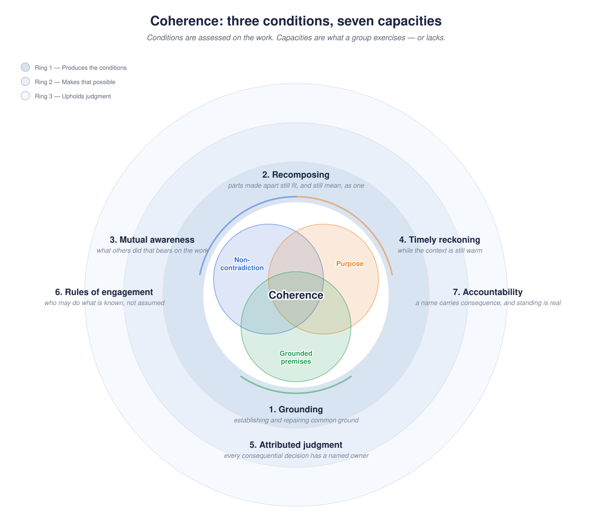
<br/>
<i>
Figure 2: Coherence and what upholds it. The three conditions are properties of the work and must hold at once, so coherence is their intersection. The rings are capacities — what a group exercises or lacks.
</i>
</p>

These are old problems in a new context. What is new is holding all seven at machine pace, under the forces of §1.4, with agents who are intrinsically unaccountable, for work-products no compiler can check.

## **1.3 Trust**

Capacities 6 and 7 are the group's — a group either has known rules and real consequence, or it does not. What changes with agents is what has to carry them. Collaboration is social, and social activity runs on **guardrails**: assurances that protect the shared product and make it rational to participate.

Guardrails sit at almost every layer. Humans have social convention and hierarchy; law has contracts; institutions have controls and review boards; processes have four-eyes rules; applications have permissions; models are steered through training, prompting and filters. The substrate presently is the exception: the layer that actually holds the work ships bare. A file store enforces nothing about how work lands; a database checks shape, not judgment.

That was acceptable while contributors were human, because whoever misused the bare layer was accountable in person: reputation, sanction, standing. Agents break it. Highly capable and fully unaccountable — no persistent self, nothing to lose, nothing a sanction can grip — they contribute at superhuman volume and pace, and none of the upper layers reaches them.

The social structure goes missing too, and not for want of writing it down. ACLs, RBAC, etc. codify who may touch what; a forge's code owners codify whose assent a change requires. What those encode is capability over resources — *may you write this file* — and never standing in the work — *does your call settle this question*? The remainder travels the periphery: who decides, who reviews, whose sign-off counts. An agent has no periphery. So the substrate carries not only the data the periphery used to carry but the authority structure with it, which is what makes standing a property of the medium rather than a convention of the team (§3.10).

Accountability therefore anchors where it still can: on the **principal**, the party a contribution belongs to — usually a person, sometimes a system, in either case something durable enough to be reached by a consequence (§3.1). The rest must be structural — carried by the substrate rather than asserted around it, through provenance, gates, and traces detailed enough for retroactive accounting (§3.9). This is not the trustless project. Judgment is the content of this work, and no mechanism proves judgment beyond more judgment (§5.7).

## **1.4 The forces**

The domain has intrinsic pressures against the capabilities which complicate any solution. These pressures are **forces** in Alexander's sense — not requirements to satisfy but competing pulls, and a pattern is judged by how it resolves them (1979). A pattern has no arbitrary parts: each element is present at some force's demand, so a configuration missing one leaves a force in conflict. Validity is therefore functional rather than definitional (§1.6). The major forces are:

1. **Concurrency, volume, and pace.** Actors reason and act in parallel, and a reasoning act is discrete against a world that moves while it runs. Agentic speed and volume accelerate this inherent drift – and accelerate the domain's failure cascade (...).

2. **Variable trust and reliability.** Participants are trusted differently and on an evolving continuum. At one end is an agent with no persistent self and nothing a sanction can grip (§1.3). At the other a human with full reputation and authority. Between them are ordinary fallibility cases: an agent steered imperfectly, a human missing a critical detail. Resolved as topology rather than policy — standing degrades into gates and forks, so distrust costs a hop and not an exclusion (§3.10, §5.7).

3. **Delegation.** A principal acts through things — apps that do exactly what was clicked, and agents acting on its behalf. The "who" and "how" matters much more now, because intention and execution can be very different.

4. **Partial visibility.** Privacy law and security dictate that no single actor sees everything. Resolved by audience-scoped trunks and composed views, which make privacy structural rather than procedural — there are no permission flags, only what is mounted (§3.4, §5.6.1).

5. **Absence of ambient context.** Humans coordinate through a periphery of informal channels — a corridor, a glance, a shared history nobody had to state. An agent has none, and perceives exactly what a channel serves it. The social structure travels that same periphery, so it goes missing too (§1.3).

6. **Bounded attention.** Information saturation degrades human judgment and model reasoning alike. Context clarity is a scarce resource, spent by everything irrelevant that stays in view. This bounds not only what an actor can be shown but what it can be asked to reckon with — which is why volume cannot be answered by showing more of it, faster.

7. **Quadratic awareness.** $W$ collaborators attending to one another is $W(W-1)/2$ pairwise relationships (Brooks, 1975). No design repeals it, leaving only questions whether the cost is measurable and the topology can be partitioned (§5.4.2).

The forces pull against another: partial visibility argues for narrow views; mutual awareness argues for wide ones; bounded attention argues for less context; grounded premises argue for more; etc. There are many almost-Sigma-shaped solutions in the world today which address or ignore these forces to different degrees. Git with Git-forges best approximate a robust solution, but not without significant gaps.  Sigma lays out a pattern to competently address all of them.

### **1.4.1 The domain's failure cascade**

Where real-time collaborative editors solved physical line and cursor collisions at human pace, agentic workflows are plagued by a systemic **three-stage failure cascade** (§3.3):

1. **The extended TOCTOU window (temporal gap).** The time-of-check-to-time-of-use question (Bishop & Dilger, 1996), asked at collaboration scale. The classic file-access race is narrow and is an exploit; this window spans **minutes to hours** between an actor reading context (*check*) and submitting work (*use*), and is the ordinary case.
2. **Silent corruption (local failure).** Standard merge mechanisms check for structural or textual line overlap. When an actor works across a wide TOCTOU gap, it produces non-overlapping edits that are syntactically valid and semantically incoherent, and no one is informed. Checking is a duty, not an enforcement.
3. **Silent propagation (systemic blast radius).** Once corrupted state lands on an authoritative history, downstream actors ingest it as ground truth, compounding and propagating into other work products, undetected (Hochschild et al., 2021; Dixit et al., 2021).

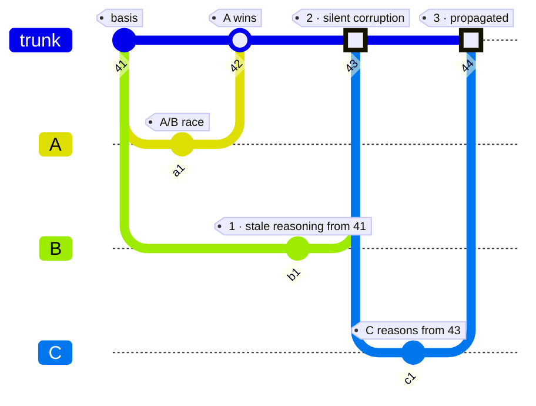
<p align="center" width="80%">
<i>
Figure 3: The cascade. Two contributors work from the same state. A lands first; B, still reasoning from 41, lands work that never overlaps A's lines and contradicts it anyway. C then reasons from the result and carries it further.
</i>
</p>

Between two collaborators in a closed world of give-and-take, this is manageable. Above $W=2$ it becomes a paramount concern (§5.4.2), and the cascade is interrupted at one place only: the moment of entry, by asking a different question of the contribution than whether its lines collided.

## **1.5 The current art**

Shared work is not new, and every medium in use today answers part of this. None answers the whole of it: non-code work-products, mixed human and machine pace, partial visibility. Four media are worth grading against the seven capacities — the editors and version control that most work passes through (§1.5.1), the forge built on top of one of them (§1.5.2), the products serving industries where incoherence is fatal (§1.5.3), and the agent-first entrants of the last year (§1.5.4).

### **1.5.1 Shared editors and version control**

The **shared editor** — Docs, and the OT/CRDT family beneath it — addresses mutual awareness and timely reckoning outright, and does it better than anything else here: every keystroke is visible as it lands, to everyone, immediately. That is the capacity pair the rest of this section struggles with, solved at human pace and solved well.

It leaves open the two that are about the work. Grounding is absent because no contribution ever names what it was made from; the document simply *is* its latest state. Recomposing is defeated by its own success — merge is automatic and total at the character grain, so no divergence is ever presented to anyone, and two passages that never touched can contradict each other with nothing to report it. Attributed judgment exists optionally and coarsely: suggest-mode is a gate and version history is a record, each over a whole document, each switched on by convention. And the guarantees stop at the document boundary; a second document is a second world.

**Version control** — git and its kin — is the real substrate contribution in this list, and its shape is the inverse. It addresses grounding exactly: every commit names the state it was made from, durably and by construction, which is the one thing the editor cannot do. It addresses recomposing through the three-way merge, which surfaces divergence rather than dissolving it, and hands the judgment to a person.

What it leaves open, it leaves open by design. There is no audience — a repository is one visibility, and inside it everyone sees everything. There is no reader — nothing durable records that anyone looked at anything, so mutual awareness and timely reckoning have nowhere to live. There is no gate; a bare repository accepts what is pushed. These are not oversights but the boundary of a tool that was built to track content, and they are precisely what the layer above it exists to supply.

### **1.5.2 The forge**

The forge — git + GitHub and kin — is easily recognized medium. It supports five of the seven capacities outright: grounding in the parent pointer, recomposing by three-way merge with a compiler for a referee, attributed judgment at review, rules of engagement in protected branches and code owners, accountability in blame and the fork-propose-maintain ladder. It fails two capacities: mutual awareness and timely reckoning (§1.2), because **the forge is a writer's system**, and no reader state exists at all. Nothing durable records that anyone read anything; `git log @{1}..` is local. Timely reckoning has no clock on it. Boundaries stop at the repository: inside one, everyone sees everything. Further, the forge is an artifact, built, not a pattern.

The forge's acknowledged strengths are why Sigma's vocabulary rhymes with the forge deliberately, and draws on its writer-side wholesale. As a pattern, Sigma points to *how to balance the forces of collaboration*, without committing to an exact domain subject.

### **1.5.3 Products for regulated industries**

State of the art in maintaining coherence through software is in industries where incoherence kills.

Aerospace and defense run **configuration management** (EIA-649; DO-178C in the air): work is made against a named **baseline**, changes pass a control board, and status accounting keeps the running record of what is approved and what is pending. Requirements management adds the **suspect link**: change a requirement and every artifact traced to it is flagged; the flag clears only when a person re-examines the pair and says so. The obligation to look is created by the change itself, and it is discharged by a named act rather than by anyone's diligence.

Regulated life sciences use quality systems (ISO 13485; 21 CFR Parts 11 and 820). Records answer to **ALCOA+**: Attributable, Legible, Contemporaneous, Original, and Accurate. Electronic signature binds an act to a person, and the audit trail is immutable and inspected by regulators — attributed judgment and timely reckoning arriving as legal obligation rather than as design choice.

These systems exercise all seven capacities, but they fall short of Sigma: they are human-paced by construction; an agent at machine pace has no seat – meaning teams in these industries adopting AI must solve this same problem again locally, outside of these tools. Second: they are enterprise products in niche domains; Sigma provides a pattern which can be adapted and adopted widely.

### **1.5.4 New agent-first entrants**

This is an active space, and the spate of resonating entrants points to Sigma's present relevance.

- Block's **Buzz** (July 2026) unifies chat, forge and agents on one event log. **Addresses** mutual awareness and attributed judgment, against an artifact rather than a feed. **Leaves open** grounding — a log records what happened, never what a contributor reasoned from — timely reckoning, since no reader holds a position, and rules of engagement, with approval gates not yet baked.
- **Cloudflare OS** (August 2026) arrives from the security side: agents start at zero access, resources arrive as typed capability bindings, and opening a gadget is gated on independent entitlement to everything it has read. **Addresses** attributed judgment, rules of engagement and accountability. **Leaves open** mutual awareness (future work) and timely reckoning by design: an unapproved action is *simulated* so the agent may continue, and the human approves in bulk, later.
- **Zed's Delta** (2026) records each edit as it happens — who made it, and where it falls in the thread's history — rather than at a commit, and keeps every participant's checkout in sync from that store. **Addresses** mutual awareness and timely reckoning by construction, and attributed judgment finely: work is reviewable and commentable mid-turn. **Leaves open** grounding — because no write is required to name what it was reasoned from, and the checkout moves underneath an actor while it thinks (§5.4.1).

Each reaches for version control. Buzz integrates a forge. Delta requires the project to be a git repository and leaves commits in git, moving them between machines itself. Cloudflare OS keeps code as real git objects — expressly so that agents may later mount arbitrary repositories with the same tools.

Independent teams arriving at content-addressed history as the foundation under human-agent work.

## **1.6 What is new**

This is a gap unfilled across the bleeding edges of version control, synchronization, storage, and orchestration. As such, Sigma represents novel art — narrow in what it invents and broad in what it applies to: any reasoning actor working with others, or against a moving world.

No primitive here is ours, and each is cited to its owner (§5.1). Two couplings are, because neither lineage can express them alone.

**The pair of pointers is not new; the meaning of the second one is.** Version control holds the lower pointer — every branch knows where it forked from. Others do pair it with an upper one: streaming keeps a consumer offset, and Cloudflare OS gates an accept on having merged all of mainline (§1.5.4). In each, though, the upper pointer records what machinery absorbed. Sigma's advances only on an explicit, attributed act — a named claim to have looked — so the gap between the two measures work taken into an actor's premises and never examined. That gap is debt (§3.8), it is held per reader rather than per branch, and it is the reader every one of them lacks.

**And gate placement becomes a position rather than a property.** A forge's protected branch is review-before, a wiki is review-after, and in each the choice is built into the tool. Here the ledger is unconditional and only the gate moves (§4.4).

The claim is falsifiable in one move: remove a constraint and a capability demonstrated in §3 must collapse. Exhibit a deployment that drops one and loses nothing, or a substrate that holds all six and still absorbs a contribution its author never reckoned with, and the pattern is wrong (§5.2).

Below we detail Sigma, beginning with the constraints that resolve these pulls (§2).

## **2. Sigma**

**Truth is the reconciled sum of contributions, each carrying the basis it was reasoned from.**

There are shared, authoritative lines of history for each audience — **trunks**. Every actor works against a **view**: a composed, scoped projection of one or more trunks, and the system remembers which trunk state the view came from — the actor's **basis**. Views flow out, and work accumulates against them freely — edits are cheap, local, and never interrupted by the world moving. Reconciliation is owed only at the boundaries: when an actor offers work back (a push, a proposal) or deliberately catches its view up (a rebase). The offer carries its basis, which makes it a transaction: _here is my work, and here is what I knew when I did it_. If truth hasn't moved, the contribution lands. If it has, the system does not guess: the divergence surfaces, with the full delta from basis to now, and truth advances only through an explicit, attributable resolution. That is the whole loop:

**view out → reason → contribute against basis → reconcile divergence → truth advances → views update.**

<p align="center" width="80%">
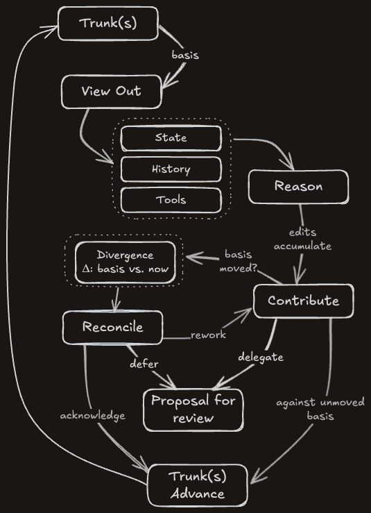
<br/>
<i>
Figure 4: Sigma's core loop. Data flows bidirectionally, and the return path is transactional. Sigma (Σ) is a summation — truth as the running, _reconciled_ sum of everyone's contributions.
</i>
</p>

The **pattern** is the list of constraints below and the discipline for composing them; it is what this paper describes. The pattern applies to a **collaboration substrate**: a logical system between infrastructure and application code and what agents, and humans through apps, work through. A **system** is one deployment of a substrate, with its variation points chosen. The pattern declares a minimal contract on whatever supplies it: an addressable namespace, atomic compare-and-swap at every mutable pointer, and durable history, leaving the rest open (§4.6).

Stated as constraints — the pattern is this list:

1. **Audience-scoped truth.** One authoritative history per audience; many trunks, not one world. **Topology** derive off trunks — forks that track an upstream, branches in a workspace, hierarchies that aggregate. Topology is where contention and partitioned attention are expressed (§3.10).
2. **Composed views.** Every actor reads and writes through a scoped, policy-bearing composition of the trunks it is entitled to. Both the entitlement and the policy are external to the actor's working surface.
3. **Basis-carried contribution.** Every write declares what it was reasoned from. The write is a transaction: work plus premises. Where premises span trunks, so does the basis — what is reasoned about together is pinned together.
4. **Adjudicated reconciliation.** Divergence surfaces with the full basis-to-now delta, and truth advances through an explicit, attributable resolution — never a silent merge.
5. **Explicit currency.** The substrate keeps books on what each actor has acknowledged seeing. Currency is never the default state; it is an explicit act, and the books answer in constant time.
6. **Provenance as contract.** Every change carries who it belongs to (the principal) and what it came through (the agent) — asserted by the substrate, consumed by its own machinery.

Held together, the six yield the **guardrails** §1.3 says the substrate must now carry. They take four forms, and each is a consequence of the constraints rather than a feature beside them:

- **Boundaries** — what a participant can see and touch. What is not reachable cannot be leaked or damaged, and revocation is the withdrawal of a view rather than an appeal to anyone's good behavior. A boundary is a capability, and not only over data: tools arrive as mounts too, so what a participant may *do* and may *see* are one grant (constraints 1–2).
- **Gates** — whether a contribution lands, and how it is received once it has: reviewed before it enters, or landed in the open as a visible debt that every affected reader owes an acknowledgment (constraints 4–5).
- **Standing** — what a participant is trusted to do, held as a granted, graduated, revocable position: read, fork, propose, push. Under distrust the structure degrades rather than expels — an untrusted actor is not removed, it simply works behind more gates (constraints 1, 4).
- **Books** — what is remembered: who contributed what, through which actor, on whose behalf, knowing what. Answerability after the fact is half of what makes any assurance real (constraints 3, 5, 6).

The machinery that enforces these runs inside them. A referee, a validator, a watcher is an actor with a view, a standing and a ledger position like any other — there is no privileged plane from which the guardrails are applied.

After the constraints defining the pattern, everything else is a **variation point**, chosen per deployment and per path: where the review gate sits (before a contribution lands, or after it, as tracked debt); how audiences are arranged (one trunk, or forks tracking forks); how far a writer is trusted (push rights, or proposal-only until verified); how coarse a contribution is.

The sections that follow justify each constraint from the use cases that force it — and show that the familiar machinery of collaboration, the pull request, suggest-mode, the maintainer hierarchy, reappears as configurations of the variation points rather than rivals to the pattern.

## **3. Deriving Sigma from first principles**

> In the following sections we derive each constraint from the forces of §1.4 and the use cases which make them concrete

## **3.1 The collaborators**

Today's collaborators are not a mesh of equal peers. Two words do separate work below. An **actor** is anything that reads and writes through a workspace — an app, an agent, a notifier, a clock. A **collaborator** is an actor with intent in the work. Every collaborator is an actor; the world is not.

**Principals are responsible parties.** Usually a human, acting on the work-product _through_ things: through **apps** — forms, editors, buttons — which are deterministic and do exactly what was clicked; or through delegated **agents** acting on a principal's behalf. A substrate must support non-human principals representing the system itself, or other autonomous contributors. A principal must have **durable answerability** which, in plain language is: it can be sanctioned and/or ejected from the collaboration.

These actors resist nearly all synchronization techniques, while needing to maintain a consistent (if specific) view of world state and behave reactively, often to the _exact_ substance of changes.

Then there is the world and time, forming the **shifting reality** the collaboration stands on: weather, locations, prices, external systems, and critically, shifting goals. They change without consultation, and arrive *ambiently*, which is silent for an agent unless offered through an explicit channel. Out-of-band channels to the collaboration can exist (tools, the harness), but what arrives through them is liability to reckon.

Sigma closes this liability by promoting the world and time as **write-only participants** (§3.8) depositing facts into explicit view: attributed like any other contribution, landing where they can be seen and acknowledged by reasoners. Whether this arrives via a monitor or a tool in the workspace pulls them on demand (§3.4) is a deployment choice.

And nothing about their coordination is ambient. Humans in one space may coordinate through a periphery of informal channels; an agent has none — its context is engineered, and it perceives exactly what a channel serves it.  In this domain every awareness channel is built, and awareness the medium doesn't carry is a liability.


## **3.2 Interface**

It has been argued that "files are all you need" for agents. We agree in part: you need files.¹ The justification is economic, not aesthetic. Teaching a language model a novel interface or schema is prohibitively expensive; the filesystem is natively understood across nearly every model — the path of least resistance and of best performance at once. They serve AI and non-AI equally: semantic-carrying paths, readable and writable with simple tools, arbitrarily structured to the use case.

In this, we take the principle to Plan 9's conclusion: **everything is a read or a write.** A read is a read of a view — scoped, composed, policy-bearing (§3.4). A write lands in durable branch state. A delta is a first-class object with a basis, not the output of an ad-hoc diff. And the verbs — push, reconcile, acknowledge — are writes to control files in the workspace's own namespace, which collapses a client's tool surface to the two operations.

## **3.3 Divergence is information; checking has a price**

Two requirements fall out of the collaborators' chaotic realities.

**First: divergence is information, and reconciliation is a decision.** We typically think of conflict resolution as row-level or line-level, and ideally a mechanical problem. A conflict between reasoning actors may not be localizable mechanically at all, thus the resulting requirement is to make divergence visible, keep its history with metadata, and require a judge — human or machine — at the moment it lands.

**Second: the collaboration unit is the reasoned revision, and the obligation is the lookback.** Real-time editors solved collision avoidance at human pace: your cursor is here, mine is there, we won't collide, with rules by data-type for who wins if we do. The first-class question stops being "can we interleave this data?" and becomes **"does what I reasoned from still hold?"** — a time-of-check-to-time-of-use question (Bishop & Dilger, 1996) asked at collaboration scale. The classic TOCTOU window is microseconds wide and is an exploit; this one occurs between reading context to acting on it, which lasts minutes to hours, and is the ordinary case. The solution is not algorithmic: it is workflow much like a source forge's "dismiss stale reviews" policies.

Economics anchor both requirements. A critical measure of contributions to shared work-products is coherence: the work holding together as a whole — free of contradiction, resting on premises that still hold, serving goals that haven't moved. Two paragraphs that never touch can contradict each other, and no line diff will say so. Thinking over the whole world is often too expensive to spend at every change. The affordable question is smaller: _"what changed since I last looked, and does my work still hold?"_ — drift in the world is drift toward incoherence, and the integration boundary is often the cheapest place to catch it. Timing sharpens the economics: the context behind work — what its author knew, weighed, and rejected — starts decaying the moment the work is done, in humans and agents alike. Rehydrating it later is expensive at best and error-prone always, so a reckoning postponed is a reckoning performed with low context, *even by the original author*. Reintegration is a cadence, not an event.

Reconciliation is not automatic or freely discharged in this pattern. We recognize that incoherence is corruption with the potential to amplify, compounding and propagating into other work products, and scaling in harm similarly while undetected. This is "silent data corruption", where confidently wrong results carry no error signal and surface only as downstream inconsistency, much later (Hochschild et al., 2021; Dixit et al., 2021). Rather than assume corruption as a cost of doing business, or reconciliation as mechanically dischargeable as in conflict-free architectures (examined in §5.4.1) — Sigma places an explicit governance point at the cheapest position on that cost curve: the boundary, where the divergence is measurable, so the cost of discharge can be known in advance. What standard to enforce at that point — reasoned reconciliation, digest review, a mechanical rule, or graceful degradation to re-reading from now — is the implementer's to set against their own cost structure (§3.7). The pattern's demand is only that the point exists, and that whatever governance is exercised there lands on the books.

## **3.4 Audience-scoped truth and composed views (constraints 1–2)**

**Why truth is per-audience (constraint 1).** A collaboration is not one room. The organizer's shared plan, a participant's private preparation, an agent's long-term memory of its principal — each is authoritative for someone, and none is entitled to the others. Splitting truth by topic multiplies coordination; splitting it by audience bounds it. A trunk is one authoritative history and, inseparably, one answer to "who may see this history?" Private material stays private by construction — there is no visibility flag to forget, only an audience that was never granted.

**The audience is a record, not a computation.** Each trunk carries its membership in its own control plane (§3.2) — principals with roles, path-scoped and inherited, in the shape source forges converged on for the same problem: Linux's `MAINTAINERS`, whose tooling computes a patch's recipients from it, and the `approvers`/`reviewers` split of Kubernetes' `OWNERS`. Membership never arrives implicitly through a resolve: a trunk is created with its first grantor, and a workspace opens against membership that already exists. Because admission and revocation are writes, both are attributed, both sit in the log, and both arrive as everyone else's debt (§3.8) — where entitlement computed live from a domain model lets standing vanish with no act to point at.

**Why views are composed (constraint 2).** A reasoning actor's quality is bounded by what is in front of it: context windows are finite, attention is finite, relevance decays. Handing every actor the whole world is sabotage and untenable for security. Plan 9 abandoned the one-global-filesystem view for exactly this shape of reason: every process can be given its own view, assembled per purpose, via a private mount table (Pike et al., 1993). _Everybody gets the right namespace._ Sigma adopts the tenet wholesale: an actor's view is composed — a mount table assembling exactly the slices of shared truth this actor, in this role, needs, from one or more trunks. And a view an actor _works in_ — accumulating branch state, a basis, a ledger position — is its **workspace** (§3.6).

This mechanism thus yields:

1. **An attention budget.** The actor reasons over _its_ representation of the world, not _the_ world — and its token bill reflects exactly that.
2. **A security boundary.** Permissions live on the mount. What isn't mounted can't be read, leaked, or damaged; a view can be revoked without ceremony.

Each mount is a **capability** — a grant that both names and authorizes; the composed view bundles them into one, grantable, attenuable, and revocable as a unit. Authority is reachability — no ambient authority anywhere; revocation is unmounting; attenuation is composing less. A workspace grant is not only data: verbs are writes to control files in the workspace's own namespace (§3.2), and the substrate can serve executables the same way (§3.5) — so tools arrive as mounts through the same authority. This collapses a split every agent deployment lives with today: operational capability granted in harness code, data access policed on another plane, the two drifting apart. Here, what an actor can do in a context is exactly what its view composes, gated by write policy. (To be clear: the substrate cannot police capabilities the harness grants outside it — that remains a platform-security problem.)

From this point, we can treat an agent's working set, a notifier's read-only feed, an app's read-write for UI controllers, and a human's editing view as configurations of this one primitive.

> In practice, the view is a high-leverage instrument which can be combined with policies governing lifecycle, trunk tracking and acknowledgment, sub-tree visibility, data masks, and others. For example: the **accessible surface** and the **view** are different things. Policy on a workspace may entitle a view to more trunks than it composes — the extras excluded by default not for security but for attention, and included dynamically or by request.

## **3.5 Centralized, local-second**

Git is local-first: every clone is a full replica, the network is an occasional inconvenience. With Sigma, this is considered a liability - and replaced in favor of the security affordance of workspaces and mounts, and shallow replicas (§3.4).

Actors are networked by default — non-human reasoning lives where the compute is, delivered via the network.

However, it is possible for a client of a workspace to replicate shallowly locally, and generate a long-disconnected accumulation of changes. Thus Sigma is **partition-tolerant for work, coordinated for truth.** A contribution is a transaction against a basis no matter when it arrives. Only one operation ever needs the coordinator: advancing shared truth, the reconciled push.

Being centrally served also generalizes what the view can carry. Because everything an actor sees arrives through its view, the substrate can serve _computed_ material the same way — summaries, indexes, checks, Plan 9-style controls, derived from the state the actor stands on — governed by the same mounts, permissions, and currency as raw truth.

## **3.6 The basis-carried contribution (constraint 3)**

The write path has two distinct acts, and the distinction carries the constraint.

**Writing to the workspace.** An actor works in its workspace continuously. Edits accumulate on the workspace's local branch of each writable trunk, against the recorded basis. These writes are cheap, private to the workspace, and durable — work-in-progress is real state, not a dirty buffer that dies with the session. Nothing about them touches shared truth.

**Pushing to the trunk.** The push is the transaction, following standard VCS convention. It declares: "here is my accumulated work, **and here is the trunk state I made it from**" — the basis. The declared basis turns the landing into a checkable claim. Doyle (_A Truth Maintenance System_, 1979) identified this as _justification_: the record of which premises the work rests on, so that when one of them moves, everything derived from it is marked for review rather than silently retained. Sigma diverges from truth-maintenance systems on what happens next — the retraction is never propagated automatically; it is owned by the writer (§3.7). If the trunk still stands where the writer stood, the push lands — a pointer advance, compare-and-swap, no locks. If the trunk has moved, the push is refused — and note what triggers the refusal: a stale _basis_, not colliding regions. Two writers may have touched entirely different paragraphs; the second still reconciles, because its premises moved even if its lines didn't. No push ever lands _over_ something its author never saw.

The shape is worth seeing, because the graph a forge draws and the graph Sigma reads are the same graph — and that is precisely the problem. Here is the ordinary landing every forge already performs:

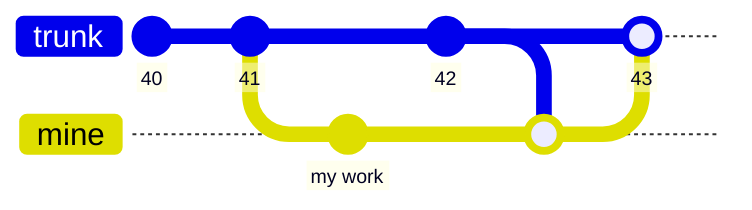

Nothing here is wrong, and nothing here is enough. The merge is clean because no lines collided — a cohesion check answering as a coherence one (Halliday & Hasan, 1976) — and the drawing is identical whether the writer studied 42 or never opened it. The history records what was integrated and is silent on what was *read* — so the one fact that determines whether 43 is coherent is the one fact the graph does not carry.

Now the same moment under a declared basis:

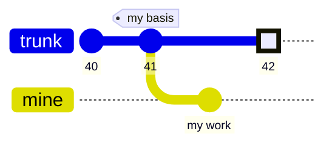

The push says *41*; the trunk says *42*. Refused — and the delta 41→42 travels back with the refusal. Note what never entered the decision: whether 42 and my work touched the same lines, the same file, or the same subject. The claim being checked is about premises, not text.

One basis per writable trunk is the default, and a workspace holding several checks each independently. Where premises genuinely span trunks, a mount may declare the dependency and the basis becomes a vector over the declared set — a variation point, and a topology concern (§3.10.4).

Staleness, not collision, triggers reconciliation, as explained below in §3.7.

## **3.7 Reconciliation is a decision (constraint 4)**

If the trunk has moved under the proposed contribution, the substrate holds everything reconciliation needs: basis, mine, and trunk — a true three-way comparison, surfaced at a useful granularity (regions, not lines).

**The substrate never detects semantic conflict.** This is a renunciation, not a gap we mean to close later. Winograd and Flores argued that meaning arises against a background of shared practice that no formalism captures (1986) and a substrate claiming to compute coherence would be claiming exactly what is beyond it. What a substrate _can_ formalize is the structure of acts — who declared which basis, who resolved, on whose behalf — and that is what Sigma formalizes. Detection is deliberately mechanical — a stale basis is a pointer comparison, standard optimistic concurrency (Kung & Robinson, 1981; §5.1) — and we claim no clever merge. What Sigma adds is not smarter detection but an owed response: nothing merges silently; the full basis-to-now delta is served, and truth advances only through an explicit, attributable act of resolution. _Who_ performs that act — a human, an agent, a policy — is a variation point. That it is performed, recorded, and attributed is not.

This is illustrated below - the condition that forces reconciliation, and the result of a reconcile.

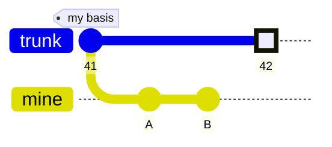

Figure 5: A refused push condition. The trunk has surpassed the writer's basis. This will force reconciliation.


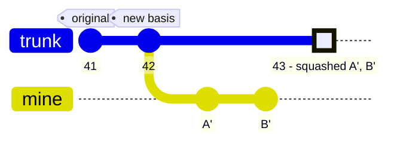
<p align="center">
<i>
Figure 6: Post reconciliation push. On the branch, the chain is re-minted onto 42 — one new commit per old one, author and message preserved. On the trunk, it lands as one squashed, attributable act.
</i>
</p>

Nothing here was integrated by machinery. What changed is which state the work claims to rest on, and a named actor made that claim.

**The landing is one act.** The chain's internal boundaries are an artifact of how the work was made and were never offered for judgment; what the trunk accepts is the validated set. So the grain of the record is not the grain of the judgment, and provenance below act grain is evidence rather than contract (§3.9) — the contributing turns ride in the landing's message.

**The landing keeps a second parent: the chain it was made from.** A forge would read that as a merge and it is not one — the tree was rebased before the commit was minted, so nothing was integrated by it. It is a **provenance edge**, a distinction version control has never had to draw and this pattern does. Two things earn it first-class standing. The pre-landing work stays reachable, which is what makes provenance below act grain retrievable rather than merely promised. And acceptance becomes derivable: work that reached the trunk is an ancestor of it, so no actor asserts acceptance and none can deny it (§4.4). Trunk history stays linear along the first parent; the second is walked only for provenance.


Resolution does not demand forcing agreement. A legitimate outcome — the acting policy's call — is that both writes stand: an intentional tension the collaboration chooses to keep, landed with notice rather than by accident. And because letting-it-stand is an explicit act, it affords compensations automatic merges never gets: flag the inconsistency, annotate the tension for the next reader, by the original author.

**The obligation is constant; the standard of discharge is policy.** Discharge may be mechanical and/or reasoned, and which is appropriate is an implementation decision. Three scenarios illustrate the trade-offs:

- **A group simulation.** Two actors "act" a second apart — like humans starting to talk at once, a mechanical rule (an ordering, both-preserved, a tie-break) discharges. The same collision after a longer stretch of visible debt is different: the actor had notice, and thus should have reflected. The right policy scales with Δt — and because the ledger records what each writer could have known (§3.8), which standard applied is auditable after the fact.
- A legal brief. Coherence is the product: reason at every reconciliation regardless of timing.
- Bots maintaining independent world state. Weather per city, prices per ticker: writers never overlap semantically, and their work embodies no reasoning to lose. Policy may be: land now, or re-derive against now and land.

In each case the substrate's demand is identical: discharge is explicit, attributed, and never silent — and the books show which policy was exercised.

**The grain is a dial; the default is the whole trunk.** What counts as contested is set per mount — any trunk movement (the rule above), the subtree, the path, the hunk. The trunk's write policy sets the floor and a granted mount may only tighten it, so no actor softens its own gate (constraint 2). Loosening has a price: below trunk grain, absorbed drift arrives as debt (§3.8) rather than as a refusal, and the guarantee degrades from *nothing lands over unseen work* to *nothing lands over contested unseen work*. Hunk grain — a line-differ deciding — is defensible only where position carries no meaning: append-only logs, inboxes, per-key world state.

We doubly underline: there is no mechanic in Sigma to enforce "reasoning"; the gate obliges at least performative action. Just as Golang forces error handling ad nauseam and shirks invisible failures, so goes Sigma for conflicts and reconciliation. Thus it is on the actor (and maybe its implementer) owning the workspace to take appropriate action.

## **3.8 The currency ledger (constraint 5)**

Lookback (§3.3) needs bookkeeping. Every workspace tracks a **high-water mark**: the last trunk state this actor has acknowledged seeing. The gap between the high-water mark and the trunk's head is the actor's **debt** — the delta it must reckon with before its context is trustworthy again. Both are pointers, so "am I current?" costs a comparison, in constant time, however large the world has grown. Debt is retired by an explicit **acknowledgment** — never automatic, attributed to the actor that made it, and refused outright while conflicts stand. An acknowledgment can be shallow — no ledger can force a reader to think — but it is never invisible: currency is always someone's named, timestamped claim. Requirements management arrived at this shape from the other end and decades earlier: a suspect link is debt raised against an artifact by the change that invalidated it, cleared only by a person who re-examines and signs (§1.5.3). What differs is where the obligation is held. A suspect flag is a property of the link, so it answers whether a pair has been re-examined; a high-water mark is a property of the reader, so it answers whether *this actor* has reckoned with what moved.

Two pointers on one line of history, and the space between them is the whole idea:

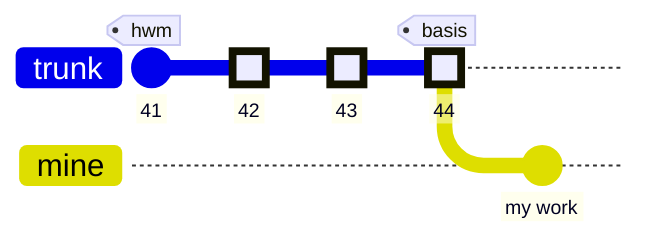

My work rests on 44 — a rebase absorbed 42, 43 and 44 under it, which is what made them mine to answer for. My acknowledgment reaches only to 41. The three commits in between are the debt: taken into my premises, never examined. A forge has the lower pointer — every branch knows where it forked from — and has no name at all for the upper one.

Discharging it moves nothing:

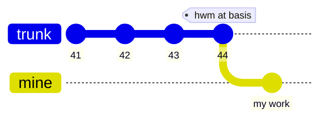

Same graph, same content, no commit minted, nothing merged. One pointer advanced, attributed to whoever advanced it and stamped with when. That is the entire mechanism, and it is the piece with no counterpart in any version control system we know of: the books record not just what happened, but who has answered for it.

Together, reconciliation-as-decision (§3.7) and the currency ledger carve out a Goldilocks zone between CRDTs and pull requests. CRDT-style sync is too fast: changes interleave at wire speed and nobody is obliged to notice. Likewise, it aims for self-policing rather than intra-team policing like a pull request (addressed in §4.4). Between them, Sigma lets contributions land at machine pace while tracking every actor's obligation to notice — cheap to check, impossible to discharge silently.

**The obligation is a property of the mount, not of the change.** The mount policies of §3.4 are where the ledger is tuned, on two dials. A view may be _pinned_ — frozen at basis until the actor deliberately advances, right for the artifact being edited — or _live_, always current, right for reference material. Observation may be _acked_ — inbound change demands acknowledgment — or _silent_, for material where staleness is tolerable and attention is better spent elsewhere.

The consequence is that one landing produces different obligations for different readers, and does so by composition. A price feed mounted _acked_ by the pricing agent and _silent_ by the copy editor lands once and is owed by one of them. Nothing in the commit says which; the mount tables do, and they are set in advance rather than negotiated at write time (§4.6).

Two useful shapes then fall out of the dials instead of being built. An actor whose mounts are all _silent_ is **write-only**: it contributes, and it never owes anyone a look. That is what lets the shifting reality take a seat (§3.1) — a monitor deposits a price, a forecast, a moved deadline onto a trunk; its landings raise debt for whoever mounted that trunk _acked_; and it acknowledges nothing in return because it observes nothing. Full participant on the write path, absent from the read path, which is what an unequal peer looks like in the books. At the opposite setting, an actor whose every mount is _pinned_ and _acked_ never meets a change it has not consciously taken on — expensive, and right for the few surfaces where drift is intolerable.

### **Concurrent editors**

We now walk the machinery of §3.6–3.8 end to end. Editors A and B — one may be human, one an agent; the pattern does not care — share a working trunk at head 41, and both hold basis 41. They edit the same trunk (possibly the same file), and while B works, the trunk moves. Access to the trunk is moderated through a centralized system holding the respective workspaces (§3.5).

<p align="center" width="80%">
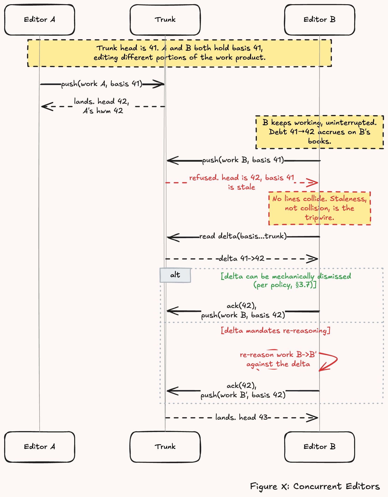
<br/>
<i>
Figure 7: Concurrent editors. A and B share a working trunk at head 41 and both hold basis 41; while B works, the trunk moves.
</i>
</p>

Note what the walkthrough does not contain: a race. Ordering decides only who reconciles — never whether, and never silently. The editor arriving second is refused with the exact basis-to-now delta, owes exactly one explicit acknowledgment, and lands through an attributed resolution; had A and B swapped places, the same obligations would have fallen the other way. No interleaving goes unrecorded, no outcome hangs on the clock, and the books read the same under every schedule.

This is the ordinary case, and it should look unremarkable: B was doing a job; the world moved; doing the job _right_ means reckoning with the movement before contributing. The substrate does not make B diligent — it makes the reckoning an obligation and keeps the receipt.

Conflicts and contention are addressed further in sections §4.5 and §5.4.

## **3.9 Provenance as contract (constraint 6)**

Our diverse crew of actors and modes requires _who_, _for whom_, and _by what means_ as first class information. A human editing a plan via a form, the same human directing an assistant, and an autonomous agent making the same edit are three different facts, and downstream actors need all three kept straight. Sigma records these on every change: the **principal** — who the work belongs to and answers for it — the **agent** — whatever acted on the principal's behalf, a deterministic app or an autonomous one — and **the workspace** it came through, and the **basis** the write declared (§3.6). The four together are **basis provenance**: what state the work was produced against, and on whose authority. *Agent* is meant in its plain sense: a trusted delegate acting for someone else, which a form is as much as a model. The guarantee is at the grain of the landing, which is the grain at which the change was judged (§3.7); anything finer is retrievable, not contracted.

None of this is a new demand — it is the demand ALCOA+ already makes of a regulated record, where *attributable* and *contemporaneous* are inspected rather than encouraged, and an electronic signature binds the act to a person (§1.5.3). What a regulator obtains by statute, within one industry and at the pace a signature can be collected, the substrate here obtains by construction.

Whereas VCS commits can store this information, Sigma makes this obligatory. A commit arrives through a workspace to a trunk — the agent is authenticated through the workspace. This information flows back into:

- Enforced permissions — an actor can only write to its principal's trunk(s) (§3.4).
- An actor's reconciliation of inbound changes — "Who am I colliding with? Human or delegate?" (§3.7)
- The calculation of debt – "Am I out of date?" If only your changes are new: no. (§3.8)

One rule we had to learn: **provenance is not endorsement.** Knowing who made a change tells you nothing about whether anyone else has accepted it. This leads to the next sections (§3.10 and §4.4).

## **3.10 Topologies: trunks, branches, forks, and hierarchical integration**

### **3.10.1 Structure**

Sigma assumes one or more trunks, composed into a workspace, with read-only or read-write permissions (§3.4). Writes are tracked by the workspace, which maintains its basis and its head (§3.6). A push attempts to append the workspace's changes to the trunk, and falls back to reconciliation if the trunk head has moved beyond the workspace's basis (§3.7). Seen this way, every writable trunk in a workspace acquires a workspace-local branch, and its own basis, on its first write.

A **fork** extends the same machinery one level. A fork is a trunk created from another trunk, retaining a tracking relationship to it. It has its own audience and its own write policy. That audience may not exceed its upstream's, except where the upstream's policy grants widening: otherwise fork-and-share is a route around the boundary §3.4 constructs. Because membership is a record, the containment is checkable rather than aspirational. Upstream movement arrives as the fork's debt, reconciled down by the fork's side (§3.8); the fork's accumulated work goes upstream exactly as a workspace's does — landed, or offered where the gate sits ahead of the landing (§3.6, §3.7, §4.4). This is a near analog to source forges: a fork is your own copy, your own permissions, a pull request to carry work back. Two differences in Sigma: tracking is an obligation with bookkeeping — a fork cannot silently fall three hundred commits behind, because the gap is debt on its books — and forking is not an exceptional act but the ordinary process.

Concretely: Bob is a participant in a shared project. Bob gets a fork of the plan trunk. The fork's audience is Bob's side of the table — Bob, Bob's agents, Bob's async notifiers. His assistant branches off _his fork_, not off the shared trunk. Everything in flight on Bob's side is invisible upstream by construction: privacy is the audience boundary itself (§3.4), not a visibility flag.

Figure 8 articulates a complex topology for Bob.

<p align="center" width="80%">
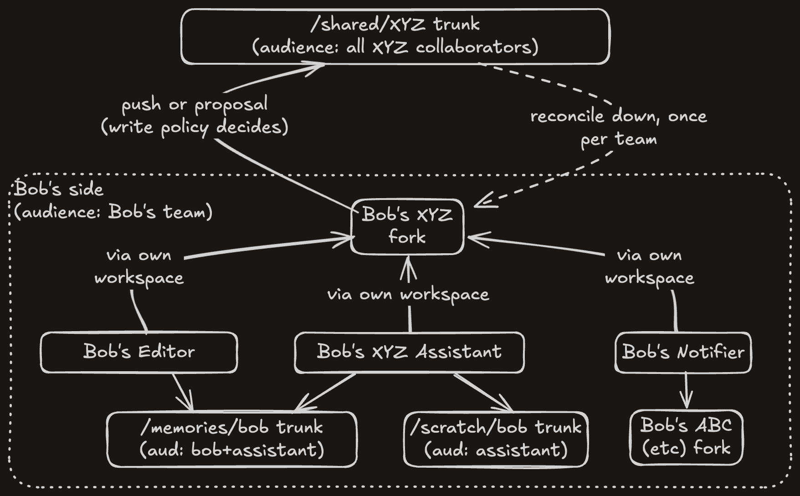
<br/>
<i>
Figure 8: Hierarchical topology. Bob's fork, his workspace, and his assistant's, each branching from the fork rather than from the shared trunk.
</i>
</p>

### **3.10.2 Basic mechanics**

Read as a commit graph, the topology's cost is visible: work crosses a trust boundary by landing again, with its own basis and its own gate, rather than by being replicated across it.

This is much like git with better bookkeeping:

- **Downstream — the pull.** When the shared trunk moves, Bob's fork reconciles it down _once_, and everyone on Bob's side catches up against the fork, locally. With them, N reconciliations at the top and M cheap local ones below. This is analog to the Linux kernel's maintainer tree.
- **Upstream — the push, or the proposal.** Bob pushes if he holds write rights on the shared trunk; he proposes if he doesn't (§4.4). Same work, same fork, same gesture — the trunk's write policy decides how to land it.

Thus, Sigma delivers **trust as a write policy.** An unverified party gets the same fork and works normally — everything attributed, everything private to their side — but with proposal-only rights upstream. Their work accumulates as a standing proposal, and verification simply opens the gate it was waiting at. Nothing to stash, nothing to replay, no second-class mode to build.

### **3.10.3 Complex mechanics**

The relation nests. A fork of a fork aggregates its own side's work and reconciles once at each boundary, so a large collaboration integrates in tiers instead of contending on one trunk — which is what makes keeping $W$ small an operation on the topology rather than a reorg (§5.4.2).


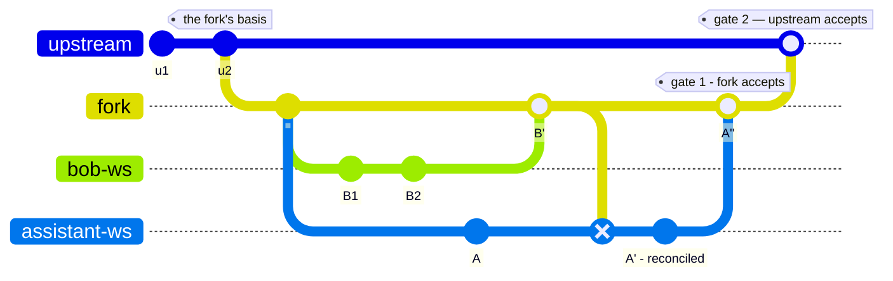

<p align="center">
<i>
Figure 9: Working on forks. The upstream never sees the interstitial commits, never holds an actor's half-finished reasoning, and answers to exactly one contributor — the fork owner itself. That is what "every hop a gate" buys, and it is the same push machinery.
</i>
</p>

When a fork's work is stale against its upstream, the reconciliation lies with the fork's side, because the obligation is a property of the mount and the fork is what tracks (§3.8). Who may discharge it is read from the fork's own membership — its approvers, and never wider than the upstream's audience allows (§3.4). The rework lands as one attributable act by whoever performed it, with the chain it was made from riding along as a second parent, so the original authorship stays retrievable even though answerability now sits at the landing (§3.7, §3.9). Bob's landing then makes his assistant's workspace stale against the fork, and the same rule applies one hop down. Debt travels one boundary at a time and no hop reaches past its neighbor, which is what keeps the topology's cost linear rather than quadratic (§5.4.2).

### **3.10.4 When premises span trunks**

The topology above runs vertically: a fork tracks an upstream, and debt travels one boundary at a time. Sibling trunks in one workspace are the horizontal case, and by default they are unrelated — each carries its own basis (§3.10.1), so a push checks one basis against one trunk and says nothing about the others. That is right when the trunks are independent and wrong when they are not: an actor that read the plan and the memory, then writes to the plan, has premises in both.

So a mount may declare its dependencies, and the basis becomes a vector over the declared set — taken, checked and landed at once.

```
/plan,rw#depends=/memory,/world
```

This is a **variation point**, and requires the substrate to support atomic commit across the declared refs and a consistent read to take the vector from, rather than compare-and-swap over one pointer. Trunks declared together must therefore share a transaction domain. This is a small step up: §3.5 trades partition tolerance for consistency, allowing transactions to ride on that.

The deployment sets this, never the actor, as with the contestedness grain (§3.7): an actor declaring its own premises is self-reporting. Independence stays the default because coupling costs — contention returns along the declared edges (§5.4.2).

Requirements management reached the same conclusion from the other end. In IBM Rational DOORS a baseline captures one module, but its links resolve to whatever the target says *now*, so a baselined requirement silently follows its target as it moves and the record preserves a relationship that no longer holds. The fix is a **baseline set** — pin the whole relationship or pin nothing (Aragon et al., 2014).


## **4. Usage**

## **4.1 Sigma as databus**

Sigma surpasses industry solutions for collaboration precisely because it functions as an effective databus with the affordances needed for reasoning actors.

The standard messaging shapes fall out of mount configuration, delivered through a network filesystem. Broadcast is a trunk many actors mount live, with fan-out as one push landing as debt across every workspace that mounts the trunk. One-to-one is a trunk whose audience is two. A queue is a trunk observed _acked_, consumption recorded as acknowledgment.  Each shape arrives with the bookkeeping the pattern already guarantees: provenance on every message, basis on every write, a per-consumer ledger of what has been seen.

A caveat: these structures are not conceived for high throughput — a reasoning actor's consumption rate is bounded by thinking, not by the bus; for tick streams, use a stream (§5.2).

## **4.2 W=1 and so on**

Sigma is relevant at $W=1$: a single reactive agent and its changing world are already a collaboration — the world writes with no judgment and no basis (§3.1), while the agent reasons over moving premises. On the substrate: sensor mounts _pin_ for the duration of a reasoning episode, so the agent thinks against a consistent snapshot while change accrues as debt; at episode's end, one constant-time check — does the debt intersect my basis? — decides whether to re-reason, over the delta rather than the world. A killed agent resumes as a collaborator with a stale basis — interruption, resumption, and collaboration are one operation — and every act is a basis-carrying push: what it did, and what it knew. A reactive _system_ is message-driven; a reactive _reasoner_ is basis-driven. (Deliberative band only: episodes of seconds to minutes, not millisecond control loops.)

Interacting safely with the world, like through a tool that sends mail or moves money, transactionally can be addressed by **read-only** participants: an effector that mounts a trunk, notified by debt, and acts on what lands there — a scheduler consuming a written schedule, a dispatcher consuming a written message. The effect becomes a contribution first and an action second. The cost is one hop and the loss of immediacy.


It scales from there: a shared truth per audience; a scoped, composed view per actor; contributions carrying what they were reasoned from; divergence surfaced as information; reconciliation as a decision; history kept, with provenance.

## **4.3 Content Derivatives**

When every object carries a basis, every change is attributed, and every actor's currency is on the books — then the commit graph becomes a reliable trigger surface. Sigma's VCS patterns allow for CI-style derivative artifacts to be created and served back into the namespace as governed views (§3.5), not bolted beside it. Pre-commit, the substrate can gate; post-commit, it can derive — summaries, indexes, embeddings, projections; continuously, it can watch. We think this active layer — watchers, summarizers, referees living over the trunks — is where the pattern compounds, and it is where our future work points.

## **4.4 Where did the pull request go?**

A pull request is not a primitive in Sigma, it is three things - a place to show proposed work, a review of it, and a gate before it lands.

**The gate became a dial.** In Sigma, gate placement is a write policy, set per mount: **review-before-landing** — propose, be accepted, land, like a protected branch — or **review-after-landing** — the push lands immediately, and every reader owes it an acknowledgment; the landing is reviewed as debt (§3.8). Both positions are reviews. The difference is whether judgment sits ahead of the landing or behind it, and the ledger is unconditional either way — only the gate moves. Note the asymmetry in what the policy governs: it sets where review is _mandatory_, never where it is possible. An actor holding push rights can still propose — the same gesture, offered rather than landed. Asking for eyes is always available; the gate is about when the substrate insists.

Gates have three outcomes, and one prohibition. A gate refuses, lands the work, or lands it with notice on the books — both writes standing and tension annotated (§3.7). Refusal preserves the content: the branch is published to the gate's audience as a proposal, so nothing is discarded and the writer is told. What a gate may not do is *re-target* — quietly landing the work somewhere narrower than it was offered. The write would survive and land silently to the author, which is constraint 4's silent merge mirrored onto the write path.

**A proposal is a branch that acquired an audience.** A workspace branch is private; a refused push publishes it, and a history with an audience of its own is a trunk that tracks its upstream — a fork (§3.10). One object, promoted. The substrate mints the record in the trunk's control plane, and its audience is computed from membership at the paths proposed — nothing is authored, which is what keeps propose and push one gesture. A proposal is extended, reworked, retracted; accepting it is an ordinary landing upstream, and the fork persists either way. Acceptance is then read off the ancestry rather than asserted (§3.7) — rejection and retraction are not, because the absence of a landing is not a decision.

Consider Google Docs as a model: suggest-mode is gate-before; direct edits with visible history are gate-after.

The dial is visible in the graph. Gate-before: the work is published as a proposal, acquires reviewers, and lands only once accepted — nothing reaches the trunk unjudged.

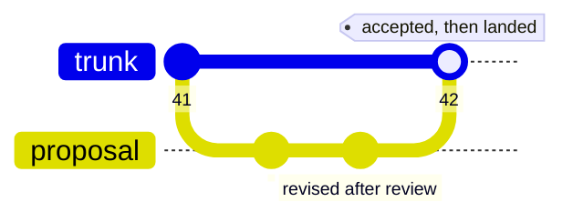

Gate-after: the same work lands on contact, and the judgment that gate-before spent in advance is now owed by every reader as debt (§3.8). The obligation did not disappear; it moved downstream of the landing.

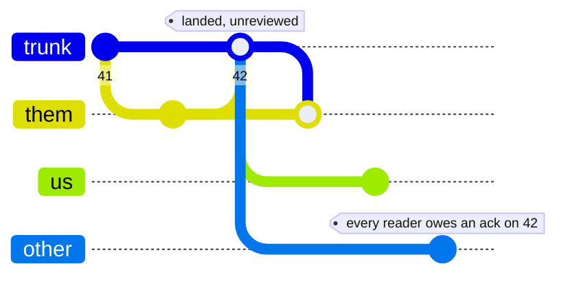

Choosing a position is a question of blast radius, and can be enforced by policy. Live, loud, cheaply reverted content wants gate-after: a project under active discussion, where an agent's edit should appear immediately and its principal should edit right on top of it. Durable, quiet, compounding content wants gate-before: an agent proposing long-term memory, where a wrong entry corrupts silently.

**The proposal is a branch that acquired an audience.** Publish your workspace to reviewers and it behaves as a small trunk: reviewers hold acknowledgment state against it, so an approval records the exact head it endorsed — and when the proposal moves, stale approvals identify themselves. (Forges offer "dismiss stale reviews" as a checkbox; here it is bookkeeping.)

There is a second answer to this problem worth contrasting, because it is the opposite one. Zed's Delta identifies the same failure — comments attach to a snapshot and fall out of date the moment the code moves — and repairs it by *anchoring*: the comment tracks the code as it evolves, so it stays pointed at the right place. Sigma repairs it by *pinning*: the approval records the exact head it endorsed, and lets the drift surface. The distinction is what each treats as the durable fact. Anchoring preserves the comment's **location** and keeps it looking current; pinning preserves the reviewer's **claim** and makes its staleness visible. Both are legitimate, and they are not substitutes: an anchored comment on drifted code still reads as endorsement of work its author never saw, which is precisely the silent absorption this pattern exists to refuse. The right composition is probably both — anchor for legibility, pin for accountability — and only the second needs to be a substrate guarantee. The review page itself — the diff, the out-of-date warning, the mergeability check, the approvals — is a computed view over facts the substrate already holds.

Review needs a conversation to live somewhere. The model extends naturally: annotations attached to a proposal's heads — git-notes-like — themselves versioned, attributed, and carried with the object they discuss. We treat the feedback channel as an extension of the pattern, not a seventh constraint.

## **4.5 Operating under contention**

What happens when the trunk is busy? Contention is a feature of collaboration: stepping on toes, too many cooks in the kitchen, etc. Addressing contention here is recognizably human.

First: a collision costs one of two things.

- (a) If the landed change does not touch what was relied on, you acknowledge it and push again — the retry costs a dismissal plus an acknowledgment (§5.4.2): milliseconds at best; in complex cases the dismissal check may be significant and a point of optimization; a livelock would need landings arriving faster than that round-trip.
- (b) If the landed change does touch what was relied on: re-process immediately, postpone, or push with open disclosure (note to others or to self to check later). If reprocessed immediately or postponed, the catching up costs the size of the *net* change, not the number of landings: ten edits to one paragraph read as one paragraph.

The pattern will not prevent an overcrowded trunk. The books measure landing rate and delta sizes — and from there, there are six dials:

- **Small-audience trunks.** A deployment may have many collaborators, but few share any one subject — and subject boundaries are natural trunk boundaries (constraint 1). A trunk with two writers has no fan-out problem.
- **Batch.** Land coherent units, not keystrokes; catch up once per episode, not once per landing.
- **Wait.** An actor may simply delay while churn is high — what a considerate human does when a document is under active rework. Delay is legal because nothing forces activation.
- **Vary the activation.** A landing wakes nothing by itself: the pattern does not declare exact activation mechanics. Whether an actor reacts to every landing, on a schedule, or whenever it next looks — push, poll, or pull — is an application decision, made per consumer.
- **Move the gate, or redesign the flow.** A surface too hot for review-before-landing runs review-after as debt (§4.4). Topologies can aggregate locally and flow one direction (§3.10, §4.1), so a hot trunk never fans out to a large audience.
- **Choreography.** Leveraging all of the tools above, use explicit choreography (signal turn taking, honor-system locks, etc) to prevent races.

A reasoner that is always in debt because relevant change outpaces thinking means it is past what engineering can absorb — see §5.4.2 for further exploration of practical limits.

## **4.6 Integration**

Two integration surfaces exist. The **data plane** is the namespace itself: read a view, write branch state, speak the verbs through control files (§3.2). This is the entire surface an agent ever touches — files, which every model and every tool already speak. An application does its _work_ on the same plane (§3.1) — typically through a thin client. An agent may mount its view as a virtual file system; this is a function of the client's deployment topology, not the pattern.

The second surface is the **control plane**: minting workspaces, composing mounts, setting read and write policies, binding identity. This is an application or operations level concern, and where a deployment expresses its governance (§3.7, §4.4) — provisioning, exercised at the edges of work, not during it. The data plane holds no control verbs: an actor cannot soften its own gates or mint its own authority.

The plane split flows from constraint 2. The data plane is the surface the actor works through; the control plane is where entitlement and policy are granted. Neither a mount nor a gate is self-serve — not because a rule forbids it, but because the working surface carries no verbs for it.

Transport is deliberately unspecified; our implementation happens to serve both planes over ordinary HTTP.

## **5. Analysis**

## **5.1 Sigma's conceptual lineage**

As alluded prior: **version control is almost all you need.** The market feels the gap — a wave of systems (ElectricSQL, Jazz, and kin) now layers versioning and sync over application databases, each recovering a piece of the ensemble.

Sigma's response is to compose the pieces from first principles. From **version control**: durable divergence, the three-way reconcile, history as first-class truth. From **Plan 9**: the composed, per-actor namespace. From **optimistic concurrency** (Kung & Robinson, 1981): the basis-carried write. From the streaming world's **consumer offsets**: the reader's currency ledger. From the **forge**: gates and proposals. From **truth maintenance** (Doyle, 1979): the declared justification — and its deliberate contrast, since a TMS propagates retraction and Sigma refuses to (§3.7). None of these mechanisms is ours; we cite the owners deliberately.

Sigma is to VCS and the forge what REST was to HTTP: the pattern extracted from the one place it already works, stated as constraints to be instantiated where it doesn't yet.

§1.6 states the test; here it is itemised, now that §3 has shown the mechanics. Remove the basis and reasoning is lost to retries. Remove composed views and attention and security collapse to the repository grain. Remove the ledger and divergence goes unnoticed at machine pace. Remove adjudication and merges silently corrupt. Remove audience scoping and the fork topology — privacy included — is inexpressible. Remove the provenance contract and no policy can tell a click from an inference.

## **5.2 What Sigma is not**

Sigma is a composition of patterns and features as an ensemble for one setting — reasoning actors, shared work-products, mixed human and machine pace. The boundaries, explicitly:

1. **Not consensus.** One authoritative trunk per audience; actors are authenticated, and no Byzantine tolerance is claimed (Lamport, Shostak & Pease, 1982; §5.5). Cooperation, however, is not presumed blindly: distrust degrades into topology — an untrusted actor works behind a fork with proposal-only rights, every hop a gate (§3.10, §5.7).
2. **Not conflict-free.** Conflicts _surfacing_ is the feature (§5.4.1).
3. **Not real-time co-editing.** Two humans typing in one paragraph is a solved problem; presence and operational transforms remain right at human pace.
4. **Not "streams are obsolete."** Delivery still wants queues; analytics still wants unidirectional pipelines. Sigma claims the shared-work-product layer, nothing else.
5. **Not a replacement for code on a forge.** Code on a forge is Sigma's degenerate case, already well served.
6. **Not a universal hammer.** But a very good one.

## **5.3 Experience**

TODO - synthesize lessons learned.
<!--
**This section is held open.** The pattern is argued by construction and against prior art. A reference implementation is underway — a substrate carrying all six constraints, and on completion the first worked example of one system holding every force of §1.4 at once. When it stands, this section reports what Fielding reported of REST in the standards work: what the pattern cost to build, where it bent under a real deployment, and which variation points turned out to bear weight (Fielding, 2000). Lessons, not metrics — a pattern does not admit them.
-->

## **5.4 Contention**

Sigma is what one could call conflict-prone by design, which could theoretically lead to denial of service or extra costs. Contention here is not unique to Sigma – rather a property of shared-work collaborations - even in "conflict-free" architectures, as described below.

Here we look at CRDT's approach to resolving contention and the theoretic breaking points of Sigma.

### **5.4.1 Conflict-free by construction?**

CRDTs claim "conflict-free" and it is achieved by construction in one of two ways.

- **By destruction.** A deterministic rule by data-type — last-writer-wins, a tie-break lattice, and others — selects a survivor. The losing write is lost silently.
- **By multiverse.** Multi-value registers, Automerge-style DAGs, DefraDB — preserve every divergent branch and surface them for resolution "when convenient." Divergence is kept. What remains unspecified: _who_ must look, _by when_, with _what information_, and _where the resolution is recorded_. Reconciling the multiverse is a property of each implementation, not of the CRDT pattern.

Sigma takes a principled stance on these points as stated by the pattern: who owes the look (constraint 5), what is served (the basis-to-now delta, constraint 4), where the resolution lands (attributed, constraint 6). Composed this way, gates-as-dials, privacy, and governance follow (§4).

A third position is emerging that the two above do not quite cover: **replicate the draft itself.** Zed's Delta keeps every participant's worktree live-synced during the work, so the in-flight state is shared rather than private, and the question "did we diverge?" is answered by never letting divergence accumulate. The pattern here takes the opposite bet deliberately: the workspace is **private** and divergence is **durable** (§3.6), because an actor reasoning against a snapshot that mutates underneath it is the failure, not the fix. Live replication makes everyone nominally current at the cost of making "what did you reason from?" unanswerable. Which bet is right is a function of how long an actor reasons before it acts: seconds favors replication, minutes favors a basis.

We observe here that even with a multiverse model – attention to divergence is always due – usually at read, never at push, as with Sigma. This said, the obligation Sigma imposes at push is minimal as highlighted in §4.5 — and re-examined below.

### **5.4.2 Denial of service**

A reasoning actor is slow — seconds to minutes. If the trunk moves while it thinks, its push is refused. Does contention on a trunk starve slow writers?

Declared cross-trunk dependencies (§3.10.4) re-couples what topology partitions: a trunk named in many declared sets serializes all of them. Best practice is to declare dependencies narrowly.

The staleness check is a detector forcing the consumer to answer "does this landing affect my work?". The design choice is stated up front: the detector is built for **perfect recall**, never missing — at the cost of false alarms, which the design makes cheap to triage. Consider the confusion matrix.

- **True negatives cost nothing.** The trunk did not move against the actor's basis; the push lands.
- **False negatives cannot occur at the substrate.** Every landing that moved the basis surfaces as debt; nothing lands silently (constraint 4). If all collaboration flows through trunks — no back channels — a meaningful update cannot be *missed*, only *misjudged*.
- **True positives are not overhead.** The delta intersects the actor's premises; re-reasoning is the work to be done. Mitigating races on this is operating discipline, not architecture (§4.5).
- **False positives are the price of perfect recall** — a dismissal plus an acknowledgment, with the cost detailed in §4.5.

<p align="center" width="80%">
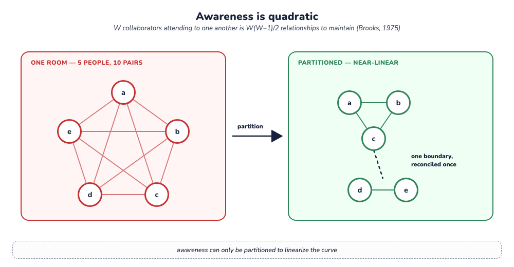
<br/>
<i>
Figure 10: Awareness is quadratic. A full mesh of $W(W-1)/2$ pairs, partitioned into near-linear clusters with one reconciled boundary between them — which is what a fork topology buys (§3.10).
</i>
</p>

The limit this imposes is real: contention is bounded by trunk granularity, so work that genuinely must share a trunk contends, and no partitioning removes that. Finer-grained basis calculation would reduce false positives — cheaper acknowledgments, not a different guarantee — and is the natural extension (§6).

This limit is native to the domain: W writers attending to one another is W(W−1)/2 conversations — Brooks's quadratic, charged against large teams (Brooks, 1975). No design repeals pairwise attention, because that is what collaboration *is*. What the pattern changes is that the cost is measurable — landing rates and debt – and they are partitionable. The old remedy — split the team (keep W small) — is a first-class operation on the topology (§3.10), not a reorg.

## **5.5 Concurrence, not consensus**

This architecture diverges from modern approaches to distributed work in that it offers no consensus mechanism. As a substrate for distributed work, this appears a glaring omission. "Consensus" is formally two things:

- **Replication consensus** — Paxos, Raft, and kin. This is orthogonal to the pattern, and can be provided at the authoritative hub (§5.6.3).
- **Validation consensus** — a quorum determining whether a contribution may become truth. Sigma refuses this.

Sigma opts for **concurrence**: proposal → acceptance. Consensus is symmetric and anonymous — validators are interchangeable, and the outcome carries no one's name. Concurrence is asymmetric and attributed — a named contributor's discharge meets a named acceptor at the gate, and the books record both. Where consensus produces one global value, concurrence is view-local: the acceptor judges from its own view, which is all anyone is entitled to.

There are two reasons for refusing consensus.

First: **there is nothing a vote can verify.**

In consensus, the vote is a verification instrument: every honest validator computes the same deterministic check — agree on the rules, agree on the content — so the tally exposes the faulty. Nothing prevents polling a panel on a contribution; the question is what the tally would mean. A work-product's validity is not a predicate fixed in advance — it is the collaborators' own evolving judgment — and honest judges may disagree with none of them wrong. That is the background problem wearing a quorum's clothes: validity rests on shared practice no validator can recompute from the artifact alone (Winograd & Flores, 1986). A tally would then measure the panel, not the contribution: N opinions, averaged, with the names removed. A merge rule deterministic enough for a quorum to verify would make Sigma unnecessary; where Sigma is necessary, the quorum has nothing to recompute.

The second is on security grounds: **third-party validators may not look.**

Consensus assumes verifiers can check a contribution — by seeing its inputs, or, in zero-knowledge designs, by checking a proof against a predicate fixed in advance. Here neither path exists: the question has no fixed predicate (the first point), and truth is audience-scoped — the premises behind a contribution can be private by construction. When a participant writes "I'm not available," no other actor is entitled to open their calendar and check. If the date changes while they answer, their push is refused, the change since their basis is shown, and they decide — from their own view alone — whether the answer still holds. Nothing else can decide it.


## **5.6 Security orientation**

Sigma is a pattern driven by many interleaved security concerns (§3), realized almost transparently through the constraints. Restated through a security lens:

### **5.6.1 Confidentiality**

The mount is the boundary. What is not mounted cannot be read, leaked, or damaged, and a view can be revoked without administrative ceremony (§3.4). Audience-scoped trunks make privacy structural rather than procedural: there are no permission flags. The fork topology extends the same boundary to work in flight — everything on a participant's side is invisible upstream by construction (§3.10). And per constraint 2 (§2.2), no actor can widen its own entitlement or soften its own gate.

### **5.6.2 Integrity**

Nothing mutates truth silently: every landing is gated, basis-carried, and attributed (constraints 3, 4, 6). The property is fail-stop (Schlichting & Schneider, 1983) applied to meaning: a failure that halts visibly is worth more than cascading corruption. Auditability (§3.8–3.9) serves non-repudiation — the books answer who landed what, knowing what, on whose behalf; answerability after the fact is half of what makes any assurance real. Tamper-resistance is cheap to layer on through content-addressed history, signed commits, and externally anchored heads.

How far a writer is trusted is a granted, graduated, revocable position on the topology (§3.10) — fork, propose, push — thus distrust degrades into more gates. The pattern does not assume inherently good or bad actors; topology details are a deployment and configuration choice.

### **5.6.3 Availability**

The pattern trades global liveness for local autonomy. Actors can materialize views locally and work through divergence: a partitioned actor keeps reading, reasoning, and writing locally, and reconciles when it reconnects (§3.5) — interruption and resumption are the same operation as collaboration itself (§4.2). The authoritative hub replicates with ordinary crash-fault machinery beneath the pattern; no quorum ever sits between an actor and its own work.

## **5.7 Trust, not trustlessness**

Sigma is not the "trustless" project. *Judgment is the content* of this kind of work, and no mechanism proves judgment beyond more judgment. Meaning lives in the practice of the collaborators, not in any formalism (Winograd & Flores, 1986) — so a substrate that promises to eliminate trust can guarantee only mechanistic collaboration (§5.5).

## **6. Future work**

Two extensions strike us as worth pursuing; neither is a constraint of the pattern.

**Dependency evidence.** Track what an actor actually _read_ during an episode — or let it cite its premises outright — and use the trace to sharpen the basis rather than to replace it. Reads both over- and under-state dependence: an actor that searched for something absent from the trunk depended on everything (the absence was a premise); an actor that skimmed a mounted file may have depended on nothing in it; and caching blurs what was read at all. The rule that follows is positional rather than qualitative: **an incomplete artifact may inform a judgment, but may never carry a guarantee.** In predicate position — deciding whether a push refuses — incompleteness produces false negatives, and a false negative is silence, the one failure this design refuses (§5.4.2). In evidentiary position it produces only a weaker hint, and the act it informs stays loud and attributed. Two positions earn it: at the dismissal step (§3.8), a trace answers "did this landing touch what you cited?" and lowers the cost of a false positive without changing what triggers one; post facto, it narrows the blast radius when a bad landing must be traced downstream, where the books otherwise yield every actor who acknowledged past it and rank them not at all. Detection can grow finer; _mattering_ stays judged.

**Commitment-typed channels.** The proposal and annotation channels (§4.4) carry pragmatics today only by convention. Speech act theory (Searle, 1969), routed into system design by Winograd and Flores' Coordinator (1986; Winograd, 1987), suggests typing them explicitly: a proposal is already a request for commitment; an acceptance is a declaration; a review comment is an assertion with standing. Typed this way, write policy could see the pragmatics of a contribution, not merely its content — and the feedback channel would gain the same auditability as the work itself.

## **7. Gravity**

The shift to human-AI virtual collaborations at scale breaks our assumptions about how we do work together, and it is undeniably the future. What we see from existing toolchains, new entrants, and literature at large, is that innovative teams are reaching (§1.5.4), but needing much much more.

Sigma is a conjecture which articulates the "much much more" and the path to it. Sigma approaches collaboration with batteries- and security-included. This document is massive on that account: understanding and balancing all the forces in this collaboration is a daunting task and the dance is nuanced, even for veterans of the underlying patterns.

An easy critique of Sigma is that it is complex. We agree. We also point to the void of solutions that treat coherent collaboration as first class – instead we've built toolchains and workflows which do the job, but also fall short of what we need from agents: rigor, alignment, traceability – in behavior and the work products themselves. Ad hoc solutions are and will be found, and wrapped deeply with their niche domain.

We see systems produced in just the past few months like Block's Buzz or Cloudflare OS and Zed's Delta as validation that collaboration is this future – and for their innovations, they leave the full spectrum of forces wanting. We expect, and as evidenced by their own declarations, these teams will keep reaching toward Sigma's design.

<p align="center" style="font-size: 6em">
/Σ
</p>

---

¹ A Sigma consuming versioned-database rows instead of files is a valid design — git-style versioned databases exist. But rows serve schema-ful data, and our domain is the semi-structured remainder (§1), where the file is the natural container. Ergonomics selects among valid designs; it selects the file.
